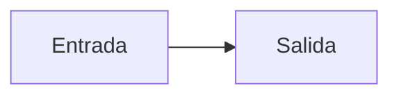
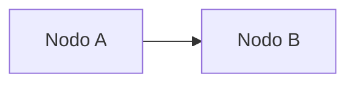
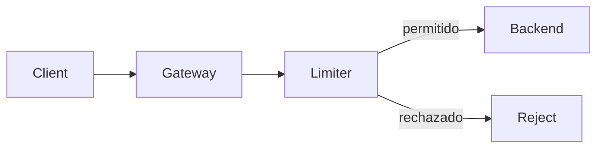

# Estándar de escritura dual (personas y agentes)

## Resumen

Este documento define cómo se escriben los documentos de `docs/` para que una persona los
entienda y un agente de IA los consuma sin reinterpretación. La regla central es una sola:
**los hechos van en tablas, las razones en prosa**. Todo lo demás —frontmatter obligatorio,
esqueleto fijo de seis secciones, vocabulario de estado cerrado, acompañamiento textual de los
diagramas, rutas canónicas, identificadores y fuente canónica declarada— existe para hacer
cumplir esa regla de forma verificable. El estándar aplica a todos los documentos de `docs/` y a
los documentos de la raíz del repositorio; no aplica a `openspec/`, que se mantiene como está.
Este apartado es la versión completa y autosuficiente: no requiere consultar ningún otro
documento para escribir un documento de dominio nuevo.

## Estado

Aplicación del vocabulario de estado a este propio documento. Ninguna fila usa términos fuera
del vocabulario de la sección c.

| Elemento de este documento | Estado | Evidencia |
| :--- | :--- | :--- |
| `docs/DOC-STANDARD.md` (documento completo) | `entregado` | El archivo existe y contiene las seis secciones canónicas |
| Reglas a–h de `## Detalle` | `entregado` | Cada regla incluye su comando de comprobación |
| Plantillas (i)–(iv) | `entregado` | Las cuatro plantillas están completas y son copiables |
| Ejemplo resuelto | `entregado` | Incluye frontmatter, seis secciones, diagrama y acompañamiento |
| Aplicación del estándar a los documentos de dominio | `planificado` | T1–T12 del plan están definidas y no ejecutadas |
| `docs/skill-style-guide.md` dentro de `docs/` | `descartado` | Sale de `docs/` y pasa a `.agents/skill-style-guide.md` |

## Detalle

Cada regla se presenta con tres partes: la regla, el motivo por el que existe y el modo de
comprobarla mecánicamente. Si una regla no se puede comprobar con un comando, no pertenece a
este estándar.

### a) Esquema de frontmatter

**Regla.** Todo documento abre con un bloque YAML delimitado por `---` que contiene los campos
de la tabla siguiente. Los campos marcados como obligatorios están siempre presentes, incluso
cuando su valor es una lista vacía (`[]`).

| field | required | type | purpose |
| :--- | :--- | :--- | :--- |
| `doc_id` | sí | string con formato `<dominio>/<fichero>` | Identificador estable del documento. Los demás documentos lo referencian por este valor, no por su ruta, porque las rutas cambian y los identificadores no |
| `title` | sí | string | Título legible. Repite el H1 del documento para que un índice pueda listarlo sin abrir el cuerpo |
| `domain` | sí | uno de `product`, `architecture`, `data`, `integrations`, `quality`, `process`, `traceability`, `governance` | Dominio al que pertenece el documento. `governance` agrupa el estándar y el índice maestro |
| `audience` | sí | lista de `human` y `agent` | Declara para quién está escrito. Un documento con solo `human` puede permitirse más prosa; uno con `agent` obliga a tablas |
| `status` | sí | uno de los seis términos de la sección c | Estado del contenido descrito, no del archivo. Es el campo que impide que un diseño no implementado se lea como vigente |
| `source_of_truth_for` | sí | lista de string (vacía si no aplica) | Declara los hechos de los que este documento es la única fuente canónica (sección g) |
| `supersedes` | no | lista de `doc_id` | Registra qué documentos reemplaza. Permite seguir una cadena de reemplazos sin abrir el historial de git |
| `last_verified` | sí | fecha ISO 8601 (`YYYY-MM-DD`) | Fecha de la última comprobación del contenido contra la realidad |
| `verified_against` | sí | hash corto de commit (7 caracteres hexadecimales) | Commit del **estado de código** verificado, no el commit que introduce el documento: al escribir el frontmatter ese hash todavía no existe. Mientras una rama solo modifique documentación, el valor se mantiene en la base de la rama, que es el estado de código estable. Es la mitad del control de vigencia: `status` dice qué es, `verified_against` dice desde cuándo |

**Por qué.** El problema central de la documentación del proyecto fue que documentos escritos
para una versión futura del producto se leían como descripciones del producto entregado.
`status` y `verified_against` convierten esa confusión en un dato consultable y comparable.
`doc_id` desacopla la referencia de la ruta, de modo que el renombrado de ficheros deja de romper
la trazabilidad. La fuente canónica del diagnóstico es `docs/plan-reorganizacion.md` (secciones
2.3 y 3.4).

**Verificación mecánica.**

```bash
for k in doc_id title domain audience status source_of_truth_for last_verified verified_against; do
  grep -q "^$k:" docs/DOC-STANDARD.md && echo "OK: $k" || echo "FALLO: $k"
done
```

```bash
# El estado declarado pertenece al vocabulario cerrado
grep -qE '^status: (entregado|parcial|latente|descartado|planificado|mixto)$' docs/DOC-STANDARD.md \
  && echo "OK: status válido" || echo "FALLO: status fuera del vocabulario"
```

```bash
# Ningún documento del árbol declara un estado fuera del vocabulario
grep -rn '^status:' docs --include='*.md' \
  | grep -Ev 'entregado|parcial|latente|descartado|planificado|mixto' \
  && echo "FALLO" || echo "OK: todos los estados son válidos"
```

### b) Esqueleto fijo de seis secciones

**Regla.** Todo documento contiene estas seis secciones, en este orden relativo y con estos
títulos exactos. El documento abre con un H1 igual al campo `title`. Se permiten secciones
adicionales intercaladas siempre que no alteren el orden relativo de las seis.

| Orden | Sección | Qué contiene | Audiencia que la consume |
| :---: | :--- | :--- | :--- |
| 1 | `## Resumen` | Un párrafo. Primero la conclusión; después el alcance y el límite. Sin listas ni tablas | Persona y agente |
| 2 | `## Estado` | Tabla que aplica el vocabulario de estado al contenido del documento, con una columna de evidencia por fila. Puede llevar una columna opcional `permanencia` con los valores `temporal` o `definitivo` | Agente |
| 3 | `## Detalle` | Prosa para las razones y tablas para los hechos. Es la sección más extensa y la única que puede crecer sin límite | Ambas |
| 4 | `## Decisiones` | **Solo** las decisiones cuyo documento canónico es este, con identificadores `DEC-<DOM>-xx` y los campos fecha, decisión, contexto, alternativas, elección, motivo y estado. Si el documento no decide nada, lo dice y apunta al registro canónico | Agente |
| 5 | `## Cómo verificar este documento` | Checklist con comandos ejecutables y el resultado esperado de cada uno | Agente |
| 6 | `## Referencias` | Rutas canónicas relativas a la raíz del repositorio, cada una con una línea de qué aporta | Ambas |

**`## Decisiones` no es un resumen del registro.** Un documento de dominio solo lista en ese
apartado las decisiones **que él mismo toma**, es decir, aquellas de las que es fuente canónica. Si
no toma ninguna, el apartado lo declara y apunta al registro que sí las tiene. Proyectar o repetir
las filas de otro documento rompe la regla de fuente canónica única: la misma decisión quedaría
escrita en dos sitios y empezaría a divergir, que es exactamente el problema que este estándar
corrige. La sección existe siempre para que un agente la encuentre en una posición fija; lo que
varía es su contenido.

**Por qué.** Un agente localiza la información por posición y por encabezado, no por lectura
secuencial. Con un esqueleto fijo puede pedir «el estado de este documento» y obtener siempre una
tabla en el mismo lugar. La persona conserva la prosa del `## Resumen` y del `## Detalle` como
puerta de entrada. Este repositorio ya tenía un precedente de estructura marcada con bucle de
autoverificación en la guía de estilo de skills; este estándar adopta esa disciplina y conserva
la narrativa.

**Verificación mecánica.** Estas comprobaciones ignoran el contenido de los bloques de código:
este documento contiene plantillas con encabezados dentro de bloques, y un `grep` directo daría
un falso positivo.

```bash
for s in '## Resumen' '## Estado' '## Detalle' '## Decisiones' '## Cómo verificar este documento' '## Referencias'; do
  awk -v s="$s" '/^```/{f=!f; next} !f && index($0,s)==1{found=1} END{exit !found}' docs/DOC-STANDARD.md \
    && echo "OK: $s" || echo "FALLO: $s"
done
```

```bash
# Orden relativo: los números de línea deben ser crecientes
awk '/^```/{f=!f; next} !f && /^## /{print NR": "$0}' docs/DOC-STANDARD.md
```

```bash
# El H1 existe y coincide con el campo title
awk '/^```/{f=!f; next} !f && /^# /{print NR": "$0}' docs/DOC-STANDARD.md
```

**Alcance de la regla: documentos de dominio frente al resto.** El esqueleto obligatorio aplica
a los **documentos de dominio**, que son las puertas de entrada de cada dominio
(`product/prd.md`, `architecture/overview.md`). Todo lo demás conserva su estructura propia, porque
su forma es parte de su función: una historia de usuario se lee como narración y criterios de
aceptación, y una nota de ubicación existe para explicar por qué hay una carpeta.

| Tipo | Frontmatter | Esqueleto de seis secciones | Estructura propia |
| :--- | :--- | :--- | :--- |
| Documento de dominio | Obligatorio | Obligatorio | Libre dentro de `## Detalle` |
| Registro (US, TSK, decisión) | Obligatorio | No aplica | Conserva la suya |
| Nota de ubicación (README de carpeta) | Obligatorio | No aplica | Breve: resumen, motivo y referencias |

Los tres tipos comparten el resto de reglas: vocabulario de estado, rutas canónicas,
identificadores y fuente canónica declarada. Un archivo sin frontmatter no cumple el estándar; un
registro o una nota con el esqueleto de seis secciones lo cumple de más, y esa redundancia no
aporta.

**Verificación mecánica.**

```bash
# Los registros declaran frontmatter aunque no sigan el esqueleto
for f in $(git ls-files 'docs/product/user-stories/**/*.md'); do
  grep -q '^doc_id:' "$f" || echo "REGISTRO SIN FRONTMATTER: $f"
done
```

### c) Vocabulario de estado único

**Regla.** El estado se declara únicamente con estos seis términos. No se admiten sinónimos ni
matices añadidos al término.

| Término | Significado | Cómo se comprueba |
| :--- | :--- | :--- |
| `entregado` | Existe en el producto y funciona | La ruta o el comando citado en la tabla de estado resuelve y pasa |
| `parcial` | Existe con alcance reducido o incompleto | La evidencia existe, pero cubre solo parte de lo declarado; se indica qué falta |
| `latente` | Pendiente, con vía de retorno abierta | Se cita la decisión `DEC-<DOM>-xx` que mantiene la vía abierta |
| `descartado` | No se hará; sin vía de retorno | Se cita la decisión `DEC-<DOM>-xx` del descarte y, si existe, la mitigación conservada |
| `planificado` | Previsto, sin trabajo iniciado | No existe ruta ni comando que lo demuestre; se cita la tarea que lo abordaría |
| `mixto` | El documento cubre más de un estado y lo declara por secciones | Cada fila de la tabla de `## Estado` usa un término distinto de `mixto` |

**Temporal no es un estado.** Que algo esté entregado y a la vez sea provisional no se expresa con
un término nuevo —el vocabulario es cerrado— sino con la columna opcional `permanencia` de
`## Estado`: `temporal` cuando está previsto sustituirlo, `definitivo` cuando no. Así el estado
sigue siendo comparable entre documentos y la provisionalidad no se pierde por el camino. Un
documento que declare `permanencia: temporal` debe decir en `## Detalle` **qué lo sustituiría** y
qué falta para decidirlo.

**Cuándo un documento es `mixto`.** El `status` del frontmatter describe el documento **entero**; las
filas de `## Estado` describen su **contenido**. No son lo mismo:

| Caso | `status` del documento |
| :--- | :--- |
| Describe el producto entregado y menciona alternativas descartadas como contexto | `entregado` |
| Su materia abarca varios estados: un registro, un historial de evolución, un informe con parte histórica | `mixto` |

Un documento `entregado` puede tener filas `descartado` o `latente` en `## Estado` sin dejar de ser
`entregado`: esas filas declaran el estado de lo que describe, no el suyo. Lo que obliga a `mixto` es
que el documento **trate** varios estados, no que los **mencione**.

**Expresiones que este vocabulario sustituye.** Estas fórmulas fueron las que produjeron el
desfase documental del proyecto: no permiten decidir si algo existe.

| Expresión ambigua | Por qué no sirve | Sustituto |
| :--- | :--- | :--- |
| «previsto» | No distingue trabajo iniciado de trabajo no iniciado | `planificado` o `latente` |
| «se usará» | Mezcla intención y hecho; no dice si ya está en el producto | `entregado`, `planificado` o `latente` |
| «está definido» | Describe una decisión escrita, no su implementación | `planificado` si no hay código; `entregado` si lo hay |
| «planificado para» | Fija una fecha sin compromiso verificable | `planificado`, más una entrada `DEC-<DOM>-xx` si la fecha importa |
| «se implementará» | Promesa sin sujeto ni plazo | `planificado` o `latente` |
| «descartado» con vía de retorno | Es una contradicción: si hay retorno, no está descartado | `latente` |
| `[Pending]` | Marca de trabajo interno que convive con el `status` del frontmatter y puede contradecirlo | El término del vocabulario; si el archivo no existe, `[no implementado]` |
| `Ready` o `📝 Ready` | Estado de tablero ágil, no del producto: no dice si algo existe | El término del vocabulario |

**Por qué.** Un vocabulario cerrado convierte el estado en un dato comparable entre documentos y
detectable con `grep`. Las expresiones ambiguas obligan a la persona a inferir y al agente a
adivinar, que es exactamente el fallo que este estándar corrige.

**Verificación mecánica.**

```bash
# Fuera de este estándar no debe aparecer ninguna expresión ambigua *en uso*.
# Se excluyen dos falsos positivos:
#   - DOC-STANDARD.md, que las cita como contraejemplos;
#   - las menciones entre «guillemets» o entre backticks, que son citas, no afirmaciones.
grep -rniE 'previsto|se usará|está definido|planificado para|se implementará|\[Pending\]|\bReady\b' docs --include='*.md' \
  --exclude=DOC-STANDARD.md \
  | grep -viE '«|»|`' \
  && echo "FALLO: expresión ambigua" || echo "OK: sin expresiones ambiguas en uso"
```

```bash
# El término 'mixto' solo puede aparecer en frontmatter y en la tabla de estado,
# nunca como estado de una fila de contenido
grep -rn '`mixto`' docs --include='*.md' --exclude=DOC-STANDARD.md
```

### d) Acompañamiento textual de los diagramas

**Regla.** Todo bloque Mermaid va seguido inmediatamente por una tabla o lista que contenga los
mismos nodos y las mismas relaciones que el diagrama. El acompañamiento se marca con la línea
`<!-- mermaid-companion: <id> -->` para que sea localizable de forma mecánica. Los nombres de los
nodos del diagrama coinciden con los del código y con los del texto que los rodea.

**Por qué.** Un agente puede no renderizar Mermaid. Sin acompañamiento, el contenido del diagrama
se pierde por completo y el documento queda incompleto para una de sus dos audiencias. El
marcador existe además para que la regla sea contable: sin él, comprobar el cumplimiento exige
interpretar el Markdown.

````markdown


<!-- mermaid-companion: ejemplo-minimo -->

| Nodo | Descripción |
| :--- | :--- |
| `A` | Punto de entrada |
| `B` | Punto de salida |

| Origen | Relación | Destino |
| :--- | :--- | :--- |
| `A` | alimenta | `B` |
````

**Verificación mecánica.**

```bash
# Un acompañamiento por cada diagrama, en todo el árbol de documentación
for f in $(find docs -name '*.md'); do
  m=$(grep -c '^```mermaid' "$f")
  c=$(grep -c '^<!-- mermaid-companion' "$f")
  [ "$m" = "$c" ] && echo "OK $f: $m/$c" || echo "FALLO $f: $m diagramas / $c acompañamientos"
done
```

```bash
# La tabla de acompañamiento repite los nodos del diagrama
for n in Client Gateway Limiter Backend Reject; do
  grep -q "\`$n\`" docs/DOC-STANDARD.md && echo "OK: $n" || echo "FALLO: $n"
done
```

### e) Rutas canónicas

**Regla.** Toda referencia a un archivo del repositorio se escribe **relativa a la raíz**, nunca
subiendo directorios con `../../`. Hay dos formas según el soporte:

| Soporte | Forma | Ejemplo |
| :--- | :--- | :--- |
| Ruta de código en texto o en un bloque de código | Relativa a la raíz, **sin** barra inicial | `frontend/src/lib/scan/` |
| Enlace Markdown | Relativa a la raíz, **con** barra inicial | `[overview](/docs/architecture/overview.md)` |

La barra inicial no es decorativa. Un enlace `docs/architecture/overview.md` **sin** ella se resuelve
respecto al directorio del archivo que lo contiene, así que desde
`docs/product/user-stories/epic-1-core/` apunta a una ruta inexistente y el renderizador devuelve
404; y un script que compruebe la ruta desde la raíz del repositorio lo dará por bueno. Esa
discrepancia es peor que un enlace roto, porque pasa desapercibida. Las anclas de línea (`#L12`) no
se usan: no son resolubles y se eliminan.

**Por qué.** El renombrado de la reorganización cambia la profundidad de las carpetas y rompe los
enlaces relativos. La prueba concreta es que ese renombrado rompió las rutas relativas de las 42
historias de usuario: repararlas es el objeto de T10 del plan y no es opcional. Una ruta relativa
a la raíz sobrevive a cualquier movimiento de carpetas; una ruta que sube directorios, no. La
fuente canónica de este hecho es `docs/plan-reorganizacion.md` (secciones 2.6 y 3.3).

**Referencias a archivos que no existen.** Un registro cuyo `status` no sea `entregado` puede
referenciar archivos que nunca se crearon, y eso es contenido legítimo: documenta lo que se
planificó. No se marcan uno por uno; lo declara el `status` del registro. Lo que **no** se admite es
una ruta que sitúe un artefacto en la capa equivocada —por ejemplo, un archivo de backend escrito
bajo `frontend/`—, porque entonces la ruta afirma algo falso sobre dónde vive el código. La
verificación comprueba la capa y lista las rutas no resueltas, para que la persona decida.

**Registro entregado con layout planificado.** Cuando la capacidad de un registro se entregó pero
con un **árbol de ficheros distinto del planificado**, el registro no puede dejar las rutas del plan
como si fueran las reales. Debe llevar un bloque de correspondencia antes de su contenido, con una
tabla de dos columnas —`ruta planificada en este registro` y `ruta entregada`— y decir «Ninguna»
con el motivo cuando un artefacto no tenga contraparte. El bloque cierra declarando que el estado
del registro se refiere a la **capacidad**, no a los ficheros. No es un caso de archivo inexistente:
es un registro entregado cuyas rutas apuntan a un plan que no se siguió.

**Verificación mecánica.**

```bash
# Fuera de este estándar no debe existir ningún enlace que suba directorios
grep -rn '](\.\./' docs --include='*.md' --exclude=DOC-STANDARD.md \
  && echo "FALLO: enlace relativo profundo" || echo "OK: sin enlaces relativos profundos"
```

```bash
# Toda ruta citada en Referencias empieza por una carpeta real del repositorio
grep -oE '`[a-zA-Z0-9._/-]+\.md`' docs/DOC-STANDARD.md | tr -d '`' | sort -u \
  | while read -r p; do [ -e "$p" ] && echo "OK: $p" || echo "PENDIENTE: $p"; done
```

### f) Identificadores

**Regla.** Los elementos del proyecto se nombran con los prefijos de la tabla siguiente. Un
identificador se define una sola vez, en el documento que es su fuente canónica.

| Prefijo | Uso | Formato | Ejemplo real del proyecto |
| :--- | :--- | :--- | :--- |
| `DEC-<DOM>-xx` | Decisión de arquitectura o alcance | `DEC-` + dominio en mayúsculas + `-` + dos dígitos | `DEC-PROD-01`, `DEC-ARCH-01` |
| `F-xx` | Función del producto | `F-` + dos dígitos | `F-01`, `F-12` |
| `US-xx` | Historia de usuario | `US-` + dos dígitos | `US-01`, `US-15` |
| `TSK-x.y` | Tarea técnica | `TSK-` + número de epic + `.` + número de tarea | `TSK-1.3`, `TSK-4.2` |
| `RISK-xx` | Riesgo | `RISK-` + dos dígitos | `RISK-08` |
| `doc_id` | Documento | `<dominio>/<fichero>` | `architecture/overview` |

**Por qué el dominio va dentro del identificador.** `DEC-01` no dice a qué dominio pertenece y
colisiona en cuanto dos documentos numeran desde cero. El prefijo de dominio hace el identificador
único y citable desde cualquier documento sin tener que consultar dónde se definió.

**Por qué.** El proyecto ya sufrió una colisión de identificadores `TSK` entre dos documentos
(`TSK-2.1`, `TSK-3.1`) y la existencia de un `TSK-5.1` que no pertenecía a ningún epic. Un
formato fijo y único por documento de origen hace que esa colisión sea detectable antes de
consolidar. La fuente canónica del diagnóstico es `docs/plan-reorganizacion.md` (secciones 2.6 y
6.2, ficha T2).

**Verificación mecánica.**

```bash
# Inventario de identificadores en uso, para detectar formatos fuera de norma
grep -rnoE '\b(DEC-[0-9]{2}|F-[0-9]{2}|US-[0-9]{2}|TSK-[0-9]+\.[0-9]+|RISK-[0-9]{2})\b' docs --include='*.md' \
  | awk -F: '{print $3}' | sort | uniq -c | sort -rn
```

```bash
# Ningún identificador definido dos veces con significados distintos
grep -rn '^| `TSK-' docs --include='*.md' | sort -t'|' -k2 | uniq -d -f1
```

### g) Fuente canónica declarada

**Regla.** Cada hecho tiene exactamente un documento canónico, declarado en su
`source_of_truth_for`. Los demás documentos referencian ese `doc_id`; no repiten el hecho.

**Por qué.** En este proyecto el contrato de datos estaba triplicado y se autocontradecía, el
contrato de API estaba duplicado con dos diseños distintos y las 14 historias de usuario estaban
duplicadas literalmente entre el backlog y el directorio de historias, ya divergentes. Declarar la
fuente canónica es lo que permite borrar la copia sin perder el hecho. La fuente canónica del
diagnóstico es `docs/plan-reorganizacion.md` (secciones 2.6 y 3.4.g).

**Verificación mecánica.**

```bash
# Qué declara cada documento como propio
grep -rn -A8 '^source_of_truth_for:' docs --include='*.md'
```

```bash
# Un hecho declarado por más de un documento: cualquier salida es una violación
grep -rh -A8 '^source_of_truth_for:' docs --include='*.md' \
  | grep -E '^[[:space:]]*-[[:space:]]' | sed 's/^[[:space:]]*-[[:space:]]*//' | sort | uniq -d
```

### h) Regla de balanceo: hechos en tablas, razones en prosa

**Regla.** Todo hecho verificable —qué existe, con qué identificador, desde cuándo, con qué valor—
va en una tabla. Toda razón —por qué se decidió, qué alternativas había, qué consecuencia tuvo— va
en prosa. Un hecho que solo existe en un párrafo obliga al agente a interpretar; una razón que
solo existe en una tabla obliga a la persona a descifrar.

**Ejemplo incorrecto.** Hecho y razón mezclados en el mismo párrafo: el agente no puede extraer el
valor sin leer, y la persona no obtiene el contexto completo.

```markdown
La caché de resultados se descartó en la revisión de marzo porque añadía una dependencia sin
reducir la latencia medida, así que el servicio consulta el origen en cada petición y el tiempo
de respuesta medio es de 180 ms.
```

**Ejemplo correcto.** Primero el hecho, aislado y extraíble; después la razón, en prosa.

```markdown
| Hecho | Valor |
| :--- | :--- |
| Caché de resultados | `descartado` |
| Estrategia de lectura | Consulta directa al origen en cada petición |
| Latencia media | 180 ms |

La caché se descartó porque añadía una dependencia sin reducir la latencia medida. La decisión
se revisó en marzo y queda registrada en `DEC-DOC-02`.
```

**Por qué.** El estándar no pide documentos más densos ni más narrativos, sino que cada cosa esté
donde se puede consumir. Es además la mitigación del riesgo de sobreestructurar los documentos
hasta hacerlos ilegibles para una persona.

**Verificación mecánica.**

```bash
# Proporción de tablas frente a prosa por documento: un documento sin tablas
# no puede transportar hechos de forma consumible por un agente
for f in $(find docs -name '*.md'); do
  t=$(grep -c '^| ' "$f"); l=$(wc -l < "$f")
  echo "$f: $t filas de tabla / $l líneas"
done
```

```bash
# Todo término de estado en prosa debe existir también en una tabla
grep -rn '`entregado`\|`parcial`\|`latente`\|`descartado`\|`planificado`' docs --include='*.md'
```

### Límites de la verificación mecánica

Regla de cierre: si una regla no se puede comprobar con un comando, no pertenece a este estándar.
Los tres límites siguientes no son reglas nuevas; son los puntos donde la comprobación de una
regla existente es parcial y exige lectura humana. Se declaran para que nadie confunda un
`OK` de `grep` con una revisión completa.

| Regla | Qué es mecánico | Qué exige lectura humana | Por qué no es totalmente mecánico |
| :--- | :--- | :--- | :--- |
| (d) Acompañamiento de diagramas | El recuento de diagramas y de acompañamientos, y la presencia de cada nombre de nodo | Que cada arista del diagrama aparezca con el mismo origen, relación y destino en la tabla | La sintaxis de Mermaid cambia según el tipo de diagrama (`graph`, `erDiagram`, `sequenceDiagram`, `classDiagram`); un extractor genérico de aristas produce falsos negativos |
| (c) Expresiones ambiguas | La ausencia de las expresiones en uso, con el filtro de citas | Que una frase marcada como cita sea realmente una cita y no una afirmación disfrazada | Distinguir uso de mención es una cuestión de intención del autor; el filtro de «guillemets» y backticks es una heurística |
| (h) Balanceo hechos/razones | La proporción de filas de tabla frente a líneas de prosa por documento | Que cada hecho concreto esté en la tabla correcta y cada razón en la prosa correcta | Requiere comprender el contenido; ningún comando decide qué es un hecho y qué es una razón |

## Plantillas

Cuatro plantillas copiables. Cada una es autosuficiente: se copia, se rellenan los huecos
`<...>` y el resultado cumple el estándar sin consultar nada más.

### (i) Plantilla: documento de dominio

````markdown
---
doc_id: <dominio>/<nombre-de-fichero>
title: <Título legible>
domain: <product | architecture | data | integrations | quality | process | traceability | governance>
audience: [human, agent]
status: <entregado | parcial | latente | descartado | planificado | mixto>
source_of_truth_for:
  - <hecho del que este documento es la única fuente canónica>
supersedes:
  - <doc_id reemplazado, si existe>
last_verified: <YYYY-MM-DD>
verified_against: <hash corto del commit>
---

# <Título legible>

## Resumen

<Un párrafo. Primera frase: la conclusión. Después, el alcance y el límite.>

## Estado

| Área | Estado | Evidencia |
| :--- | :--- | :--- |
| <área> | <término del vocabulario> | <ruta o comando que lo demuestra> |

## Detalle

<Prosa para las razones. Tablas para los hechos. Cada hecho con su comando de comprobación.>



<!-- mermaid-companion: <id del diagrama> -->

| Nodo | Descripción |
| :--- | :--- |
| `A` | <qué representa> |
| `B` | <qué representa> |

| Origen | Relación | Destino |
| :--- | :--- | :--- |
| `A` | <relación> | `B` |

## Decisiones

| id | fecha | decisión | contexto | alternativas | elección | motivo | estado |
| :--- | :--- | :--- | :--- | :--- | :--- | :--- | :--- |
| `DEC-<DOM>-01` | <YYYY-MM-DD> | <decisión> | <contexto> | <alternativas consideradas> | <elección> | <motivo> | <término del vocabulario> |

## Cómo verificar este documento

- [ ] `<comando ejecutable>` → <resultado esperado>
- [ ] `<comando ejecutable>` → <resultado esperado>

## Referencias

- `<ruta/desde/la/raiz.md>` — <qué aporta>
````

### (ii) Plantilla: documento índice

````markdown
---
doc_id: index
title: Índice de documentación
domain: governance
audience: [human, agent]
status: <entregado | parcial | latente | descartado | planificado | mixto>
source_of_truth_for:
  - mapa de documentos y dominios
last_verified: <YYYY-MM-DD>
verified_against: <hash corto del commit>
---

# Índice de documentación

## Resumen

<Un párrafo: qué es este índice, qué cubre y qué queda fuera.>

## Estado

| Dominio | Documentos | Estado | Qué contiene |
| :--- | :--- | :--- | :--- |
| <dominio> | `<doc_id>`, `<doc_id>` | <término del vocabulario> | <una línea> |

## Detalle

<Prosa: cómo se navega el conjunto y qué distingue el alcance entregado del evolutivo.>

| Advertencia | Alcance | Documentos afectados |
| :--- | :--- | :--- |
| <texto de la advertencia> | <entregado o evolutivo> | `<doc_id>` |

## Decisiones

| id | fecha | decisión | contexto | alternativas | elección | motivo | estado |
| :--- | :--- | :--- | :--- | :--- | :--- | :--- | :--- |
| `DEC-<DOM>-01` | <YYYY-MM-DD> | <decisión de organización> | <contexto> | <alternativas> | <elección> | <motivo> | <estado> |

## Cómo verificar este documento

- [ ] `find docs -name '*.md' | wc -l` → coincide con el número de documentos listados
- [ ] `grep -c '^| ' <este-archivo>` → la tabla de dominios tiene tantas filas como dominios

## Referencias

- `<ruta/desde/la/raiz.md>` — <qué aporta>
````

### (iii) Plantilla: registro de decisiones

````markdown
---
doc_id: architecture/decisions
title: Registro de decisiones
domain: architecture
audience: [human, agent]
status: <entregado | parcial | latente | descartado | planificado | mixto>
source_of_truth_for:
  - decisiones de arquitectura y de alcance
last_verified: <YYYY-MM-DD>
verified_against: <hash corto del commit>
---

# Registro de decisiones

## Resumen

<Un párrafo: qué decisiones recoge este registro y qué queda fuera.>

## Estado

| Ámbito de decisión | Estado | Evidencia |
| :--- | :--- | :--- |
| <ámbito> | <término del vocabulario> | <ruta o comando> |

## Detalle

<Tabla resumen. Una fila por decisión; el desarrollo va debajo, en prosa, solo para las
decisiones cuyo motivo no cabe en la tabla.>

| id | fecha | decisión | elección | estado |
| :--- | :--- | :--- | :--- | :--- |
| `DEC-<DOM>-01` | <YYYY-MM-DD> | <decisión> | <elección> | <término> |

## Decisiones

| id | fecha | decisión | contexto | alternativas | elección | motivo | estado |
| :--- | :--- | :--- | :--- | :--- | :--- | :--- | :--- |
| `DEC-<DOM>-01` | <YYYY-MM-DD> | <qué se decidió> | <qué situación lo motivó> | <opciones consideradas> | <opción elegida> | <por qué esa y no otra> | <término del vocabulario> |
| `DEC-<DOM>-02` | <YYYY-MM-DD> | <qué se decidió> | <qué situación lo motivó> | <opciones consideradas> | <opción elegida> | <por qué esa y no otra> | <término del vocabulario> |

## Cómo verificar este documento

- [ ] `grep -o 'DEC-[0-9][0-9]' <este-archivo> | sort -u | wc -l` → número de decisiones distintas
- [ ] `grep -n 'DEC-' <este-archivo> | wc -l` → ningún identificador aparece dos veces como definición

## Referencias

- `<ruta/desde/la/raiz.md>` — <qué aporta>
````

### (iv) Plantilla: documento de dominio con estado mixto

````markdown
---
doc_id: <dominio>/<nombre-de-fichero>
title: <Título legible>
domain: <dominio>
audience: [human, agent]
status: mixto
source_of_truth_for:
  - <hecho del que este documento es la única fuente canónica>
last_verified: <YYYY-MM-DD>
verified_against: <hash corto del commit>
---

# <Título legible>

## Resumen

<Un párrafo. Debe decir explícitamente que el documento cubre más de un estado y que la
separación está en la tabla de estado.>

## Estado

| Área | Estado | Evidencia |
| :--- | :--- | :--- |
| <área entregada> | `entregado` | <ruta o comando que lo demuestra> |
| <área parcial> | `parcial` | <ruta o comando; y qué parte falta> |
| <área pendiente con retorno> | `latente` | `DEC-<xx>` mantiene la vía abierta |
| <área no realizada> | `descartado` | `DEC-<xx>` registra el descarte y la mitigación |
| <área no iniciada> | `planificado` | <tarea que la abordaría> |

## Detalle

<Prosa para las razones. Tablas para los hechos. Cada área de la tabla de estado tiene su
subapartado y no se mezclan estados dentro de un mismo subapartado.>


<!-- mermaid-companion: <id del diagrama> -->

| Nodo | Descripción |
| :--- | :--- |
| `A` | <qué representa> |
| `B` | <qué representa> |

| Origen | Relación | Destino |
| :--- | :--- | :--- |
| `A` | <relación> | `B` |

## Decisiones

| id | fecha | decisión | contexto | alternativas | elección | motivo | estado |
| :--- | :--- | :--- | :--- | :--- | :--- | :--- | :--- |
| `DEC-<DOM>-01` | <YYYY-MM-DD> | <decisión sobre el área entregada> | <contexto> | <alternativas> | <elección> | <motivo> | `entregado` |
| `DEC-<DOM>-02` | <YYYY-MM-DD> | <decisión sobre el área descartada> | <contexto> | <alternativas> | <elección> | <motivo> | `descartado` |

## Cómo verificar este documento

- [ ] `grep -c '^| ' <este-archivo>` → la tabla de estado tiene una fila por área declarada
- [ ] `grep -n '\`mixto\`' <este-archivo>` → `mixto` solo aparece en el frontmatter

## Referencias

- `<ruta/desde/la/raiz.md>` — <qué aporta>
````

## Ejemplo resuelto

Documento completo de ejemplo. Es **ilustrativo y ficticio**: describe un servicio inventado,
`AcmeGateway`, y no representa ningún componente real del proyecto. El archivo al que apuntan los
comandos de verificación no existe en el repositorio; los comandos se muestran tal como deben
escribirse y son ejecutables.

````markdown
---
doc_id: integrations/acme-gateway-contracts
title: Contratos de integración de AcmeGateway (ejemplo ilustrativo)
domain: integrations
audience: [human, agent]
status: mixto
source_of_truth_for:
  - contrato de la API de AcmeGateway
supersedes:
  - integrations/legacy-contracts
last_verified: 2026-09-22
verified_against: 35ca80c
---

# Contratos de integración de AcmeGateway (ejemplo ilustrativo)

## Resumen

AcmeGateway expone un único punto de entrada HTTP para el envío de eventos y aplica un límite de
cuota por cliente. El envío de eventos está entregado y en uso; los reintentos automáticos están
implementados solo para errores de red; los webhooks de salida están planificados; la
autenticación por clave compartida quedó descartada y sustituida por token de corta duración. Este
documento es la fuente canónica del contrato de la API y cubre, por tanto, más de un estado: la
separación está en la tabla de `## Estado`.

## Estado

| Área | Estado | Evidencia |
| :--- | :--- | :--- |
| Envío de eventos (`POST /events`) | `entregado` | `docs/integrations/acme-gateway-contracts.md` describe el contrato vigente; el servicio lo atiende |
| Límite de cuota por cliente | `entregado` | Cabeceras `X-RateLimit-*` presentes en toda respuesta |
| Reintentos automáticos | `parcial` | Cubre errores de red; no cubre respuestas 5xx del servicio de informes |
| Webhooks de salida | `planificado` | Sin trabajo iniciado; lo abordaría la tarea de integración de webhooks |
| Autenticación por clave compartida | `descartado` | `DEC-DOC-02` registra el descarte y la mitigación conservada |

## Detalle

El punto de entrada es único para simplificar el control de cuota: con varios puntos de entrada,
el límite tendría que replicarse y podría desincronizarse entre ellos.



<!-- mermaid-companion: acme-gateway-flow -->

| Nodo | Descripción |
| :--- | :--- |
| `Client` | Cliente que envía eventos |
| `Gateway` | Punto de entrada único; valida el token y normaliza la petición |
| `Limiter` | Aplica el límite de cuota por cliente |
| `Backend` | Servicio de informes que procesa el evento admitido |
| `Reject` | Respuesta de rechazo con código 429 |

| Origen | Relación | Destino |
| :--- | :--- | :--- |
| `Client` | envía la petición a | `Gateway` |
| `Gateway` | consulta la cuota en | `Limiter` |
| `Limiter` | deriva la petición admitida a | `Backend` |
| `Limiter` | devuelve el rechazo por | `Reject` |

| Hecho | Valor |
| :--- | :--- |
| Punto de entrada | `POST /events` |
| Autenticación | Token de corta duración en `Authorization` |
| Límite por defecto | 600 peticiones por minuto y cliente |
| Cabeceras de cuota | `X-RateLimit-Limit`, `X-RateLimit-Remaining`, `X-RateLimit-Reset` |
| Respuesta de rechazo | Código 429 con `Retry-After` en segundos |
| Reintentos | Solo para errores de red; máximo 3 intentos con retroceso exponencial |
| Formato del evento | JSON con `id`, `type`, `occurred_at` y `payload` |

El límite se aplica en el `Gateway` y no en cada servicio consumidor porque el consumidor no
conoce la identidad del cliente. Los reintentos se limitan a errores de red porque reintentar un
5xx del servicio de informes amplifica un fallo interno en lugar de absorberlo.

## Decisiones

| id | fecha | decisión | contexto | alternativas | elección | motivo | estado |
| :--- | :--- | :--- | :--- | :--- | :--- | :--- | :--- |
| `DEC-ACME-01` | 2026-03-04 | Punto de entrada único para el envío de eventos | Varios consumidores internos necesitaban validar la cuota y no conocían la identidad del cliente | Un punto de entrada único; un punto por consumidor | Punto de entrada único | El límite se aplica en un solo lugar y no puede desincronizarse entre consumidores | `entregado` |
| `DEC-ACME-02` | 2026-05-19 | Sustituir la clave compartida por un token de corta duración | La clave compartida no permitía revocar el acceso de un cliente concreto | Clave compartida con rotación manual; token de corta duración | Token de corta duración | Permite revocar un cliente sin afectar al resto; la rotación manual era el punto de fallo más frecuente | `descartado` |
| `DEC-ACME-03` | 2026-06-02 | Reintentar solo errores de red | Se observaron reintentos que agravaban caídas del servicio de informes | Reintentar todo; reintentar solo red; no reintentar | Reintentar solo red | Reintentar un 5xx amplifica un fallo interno en lugar de absorberlo | `parcial` |

## Cómo verificar este documento

- [ ] `for k in doc_id title domain audience status source_of_truth_for last_verified verified_against; do grep -q "^$k:" docs/integrations/acme-gateway-contracts.md && echo "OK: $k" || echo "FALLO: $k"; done` → ocho líneas `OK`
- [ ] `for s in '## Resumen' '## Estado' '## Detalle' '## Decisiones' '## Cómo verificar este documento' '## Referencias'; do grep -qF "$s" docs/integrations/acme-gateway-contracts.md && echo "OK: $s" || echo "FALLO: $s"; done` → seis líneas `OK`
- [ ] `m=$(grep -c '^```mermaid' docs/integrations/acme-gateway-contracts.md); c=$(grep -c '^<!-- mermaid-companion' docs/integrations/acme-gateway-contracts.md); echo "$m/$c"` → `1/1`
- [ ] `grep -n '](\.\./' docs/integrations/acme-gateway-contracts.md` → sin salida
- [ ] `grep -o 'DEC-[0-9][0-9]' docs/integrations/acme-gateway-contracts.md | sort -u | wc -l` → `3`
- [ ] `for n in Client Gateway Limiter Backend Reject; do grep -q "\`$n\`" docs/integrations/acme-gateway-contracts.md && echo "OK: $n" || echo "FALLO: $n"; done` → cinco líneas `OK`
- [ ] `grep -c '^| ' docs/integrations/acme-gateway-contracts.md` → al menos 20 filas de tabla

## Referencias

- `docs/plan-reorganizacion.md` — plan de la reorganización; define la estructura de dominios
- `docs/DOC-STANDARD.md` — este estándar; la fuente canónica del esquema y del esqueleto
````

## Decisiones

Decisiones que este estándar fija. Su origen es el apartado 3.4 de `docs/plan-reorganizacion.md`;
la columna `fuente` lo registra.

| id | fecha | decisión | contexto | alternativas | elección | motivo | estado |
| :--- | :--- | :--- | :--- | :--- | :--- | :--- | :--- |
| `DEC-DOC-01` | 2026-09-22 | Referenciar los documentos por `doc_id` y no por ruta | El renombrado de carpetas rompió los enlaces relativos de las 42 historias de usuario | Referencia por ruta relativa; referencia por `doc_id` | `doc_id` estable en el frontmatter | Una ruta cambia con cada movimiento de carpeta; un identificador no | `entregado` |
| `DEC-DOC-02` | 2026-09-22 | Esqueleto fijo de seis secciones en todo documento | Cada documento del proyecto ordenaba su contenido de forma distinta y el mismo dato aparecía en lugares diferentes | Esqueleto libre; esqueleto fijo de seis secciones | Seis secciones fijas en orden relativo constante | Un agente localiza la información por posición y encabezado, no por lectura secuencial | `entregado` |
| `DEC-DOC-03` | 2026-09-22 | Vocabulario de estado cerrado de seis términos | Expresiones como «previsto» o «está definido» no permitían decidir si algo existía en el producto | Vocabulario libre; vocabulario cerrado | Seis términos cerrados: `entregado`, `parcial`, `latente`, `descartado`, `planificado`, `mixto` | Convierte el estado en un dato comparable y detectable con `grep` | `entregado` |
| `DEC-DOC-04` | 2026-09-22 | Acompañamiento textual obligatorio de cada diagrama, marcado con `<!-- mermaid-companion: <id> -->` | Un agente puede no renderizar Mermaid y el contenido del diagrama se pierde | Confiar en el renderizado; acompañamiento obligatorio | Acompañamiento obligatorio con marcador | Sin marcador la regla no es contable; con él, la comprobación es un `grep` | `entregado` |
| `DEC-DOC-05` | 2026-09-22 | `openspec/` queda fuera del alcance del estándar | `openspec/` se mantiene exactamente como está por decisión del proyecto | Aplicar el estándar a `openspec/`; excluirlo | Excluirlo | Evita reescribir artefactos con su propio contrato de formato | `descartado` |

## Cómo verificar este documento

Checklist ejecutable. Se ejecuta desde la raíz del repositorio. Cada comando imprime `OK` o
`FALLO`; cualquier `FALLO` invalida la entrega del documento.

- [ ] Frontmatter completo:

```bash
for k in doc_id title domain audience status source_of_truth_for last_verified verified_against; do
  grep -q "^$k:" docs/DOC-STANDARD.md && echo "OK: $k" || echo "FALLO: $k"
done
```

- [ ] Estado dentro del vocabulario cerrado:

```bash
grep -qE '^status: (entregado|parcial|latente|descartado|planificado|mixto)$' docs/DOC-STANDARD.md \
  && echo "OK: status" || echo "FALLO: status"
```

- [ ] Las seis secciones canónicas están presentes (el filtro `awk` ignora el contenido de los
  bloques de código, donde las plantillas repiten encabezados):

```bash
for s in '## Resumen' '## Estado' '## Detalle' '## Decisiones' '## Cómo verificar este documento' '## Referencias'; do
  awk -v s="$s" '/^```/{f=!f; next} !f && index($0,s)==1{found=1} END{exit !found}' docs/DOC-STANDARD.md \
    && echo "OK: $s" || echo "FALLO: $s"
done
```

- [ ] Las seis secciones respetan el orden relativo; los números de línea deben ser crecientes:

```bash
awk '/^```/{f=!f; next} !f && /^## /{print NR": "$0}' docs/DOC-STANDARD.md
```

- [ ] El H1 existe y repite el campo `title`:

```bash
awk '/^```/{f=!f; next} !f && /^# /{print NR": "$0}' docs/DOC-STANDARD.md
```

- [ ] Hay un acompañamiento textual por cada diagrama Mermaid del documento:

```bash
m=$(grep -c '^```mermaid' docs/DOC-STANDARD.md)
c=$(grep -c '^<!-- mermaid-companion' docs/DOC-STANDARD.md)
[ "$m" = "$c" ] && echo "OK: $m/$c" || echo "FALLO: $m diagramas / $c acompañamientos"
```

- [ ] Las vallas de bloque de código están balanceadas (el recuento debe ser par):

```bash
grep -c '^```' docs/DOC-STANDARD.md
```

- [ ] La fuente canónica declarada no está vacía:

```bash
grep -A8 '^source_of_truth_for:' docs/DOC-STANDARD.md | grep -c '^  - '
```

- [ ] Las referencias apuntan a rutas relativas a la raíz, sin retrocesos de directorio:

```bash
grep -n '](\.\./' docs/DOC-STANDARD.md && echo "FALLO" || echo "OK: sin rutas relativas profundas"
```

- [ ] El resto del árbol de documentación no usa expresiones ambiguas en uso (las citas entre
  «guillemets» o backticks no cuentan):

```bash
grep -rniE 'previsto|se usará|está definido|planificado para|se implementará' docs --include='*.md' \
  --exclude=DOC-STANDARD.md | grep -viE '«|»|`' \
  && echo "FALLO" || echo "OK"
```

## Referencias

- `docs/plan-reorganizacion.md` — plan de la reorganización documental. Contiene el resumen
  normativo de este estándar (sección 3.4) y la ficha de la tarea T0 que lo crea. Es la fuente
  canónica del diagnóstico, de la estructura de dominios y del backlog de tareas.
- `docs/README.md` — índice maestro de la documentación, puerta de entrada por dominios. Se crea
  en T1 y enlaza este estándar.
- `.agents/skill-style-guide.md` — guía de estilo de las skills del repositorio. Es el precedente
  del esqueleto con secciones marcadas y bucle de autoverificación. En el momento de escribir
  este documento vive en `docs/skill-style-guide.md`; su traslado a `.agents/` corresponde a T1.
