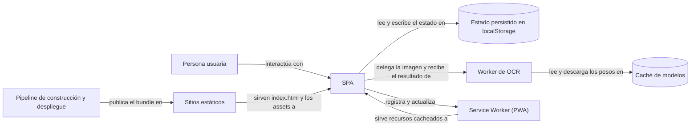
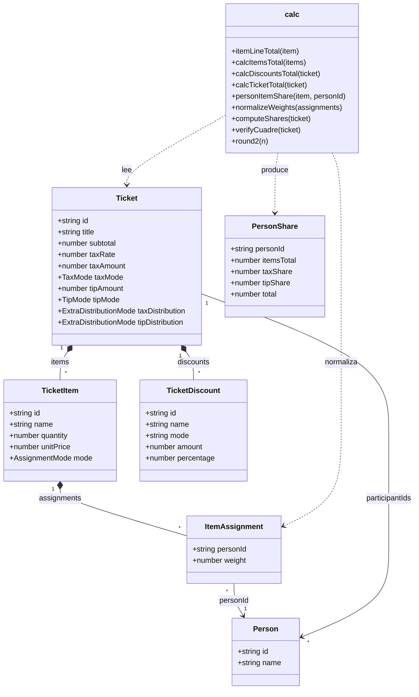

# Arquitectura del sistema SplitEat (producto entregado)

## Resumen

SplitEat es una PWA de cliente sin backend: todo el sistema se ejecuta en el navegador del
dispositivo y se compone de una SPA de React, un worker de OCR en dispositivo y la persistencia
local del navegador. Este documento describe esa arquitectura con las vistas de contexto,
contenedores, componentes y código del modelo C4, más la cadena de construcción y despliegue, y es
la fuente canónica de la vista de contenedores y componentes y del algoritmo de reparto al
céntimo. Queda fuera de su alcance el detalle del modelo de datos (`data/local-model`) y la
justificación de cada tecnología (`architecture/stack`). El documento anterior describía una
arquitectura de nube con Firebase, Firestore, Dexie y Google Cloud Vision que no se entregó; sus
cuatro diagramas se conservan íntegros como registro histórico en `docs/data/scope-evolution.md` y
aquí solo aparecen nodos y aristas con correspondencia real en el código.

## Estado

| Área | Estado | Evidencia |
| :--- | :--- | :--- |
| SPA de cliente sin backend | `entregado` | `grep -ril firebase frontend/src` → 0 archivos; entrada en `frontend/src/main.tsx` |
| Persistencia local del navegador | `entregado` | `frontend/src/lib/store.ts` (Zustand `persist`, clave `spliteat-app-v1`, `createJSONStorage(() => localStorage)`) |
| Worker de OCR en dispositivo | `entregado` | `frontend/src/workers/ocr.worker.ts` y `frontend/src/lib/scan/` |
| Capa de dominio y cálculo del reparto | `entregado` | `frontend/src/lib/calc.ts` |
| PWA y service worker | `entregado` | `frontend/public/sw.js` (caché `cuadra-app-v3`), `frontend/public/manifest.webmanifest` |
| Cadena de construcción y despliegue | `entregado` | `.github/workflows/` (5 flujos), `frontend/vite.config.ts`, `frontend/netlify.toml`, `frontend/vercel.json` |
| Motor OCR `'server'` | `latente` | `DEC-ARCH-09` mantiene la vía abierta; el motor sigue declarado en `frontend/src/lib/types.ts` y `frontend/src/workers/ocr.worker.ts`, sin servicio que lo atienda |
| Backend de nube (Firebase Auth, Firestore, Cloud Functions) | `descartado` | `DEC-ARCH-04` registra el descarte; `backend/` no contiene código: solo `.keep` y una nota de ubicación |
| `dexie` como capa de persistencia | `descartado` | `DEC-ARCH-04`; declarado en `frontend/package.json` y sin ninguna importación (`grep -rn "from 'dexie'" frontend/src` → 0 líneas) |
| Firebase Hosting | `descartado` | `DEC-ARCH-07` registra el descarte; el despliegue real son Netlify y Vercel |
| Google Cloud Vision y generador de QR de Bizum | `descartado` | `DEC-ARCH-03` y `DEC-PROD-06`; no existen en `frontend/src` ni en `backend/` |

## Detalle

La arquitectura del producto entregado se explica con una sola decisión de fondo: el MVP se define
como 100 % local, sin cuenta de usuario y sin nube, de modo que toda la computación pesada cabe en
el dispositivo. Esa decisión es la que elimina el backend y arrastra las demás: la persistencia
pasa al navegador, el OCR se ejecuta en un worker y el reparto se resuelve en funciones puras. Cada
vista de esta sección enumera nodos y aristas que resuelven a un archivo o a una API real. Los
nodos y las aristas que no existen no se describen aquí; su versión planificada está en el registro
histórico de `docs/data/scope-evolution.md`.

### Nivel 1 — Contexto

En el contexto solo hay una persona, un sistema propio, la plataforma del navegador y dos servicios
externos reales: el origen de los modelos ONNX que se descargan la primera vez y la plataforma que
sirve el sitio estático. No hay sistema de terceros para OCR ni para pagos: el OCR corre en el
dispositivo y el producto no ejecuta pagos.

| Nodo | Descripción |
| :--- | :--- |
| `Persona usuaria` | Quien fotografía el ticket y reparte la cuenta. El producto no tiene cuentas ni roles: la identidad de cada comensal se declara en el propio dispositivo |
| `SplitEat` | PWA de cliente que digitaliza el ticket, asigna cada línea y calcula el reparto |
| `Navegador del dispositivo` | Plataforma que aporta la cámara, `localStorage`, `OffscreenCanvas`, WebGPU o WASM y Service Worker |
| `CDN de modelos ONNX` | Origen remoto de los pesos de Florence-2 (`onnx-community/Florence-2-base`) y del modelo NER; se descargan la primera vez y quedan en la caché del navegador |
| `Plataforma de despliegue estático` | Netlify y Vercel: sirven el bundle estático compilado por Vite |

| Origen | Relación | Destino |
| :--- | :--- | :--- |
| `Persona usuaria` | captura el ticket y consulta el reparto en | `SplitEat` |
| `SplitEat` | se ejecuta sobre | `Navegador del dispositivo` |
| `SplitEat` | descarga los pesos ONNX desde | `CDN de modelos ONNX` |
| `Plataforma de despliegue estático` | entrega el bundle estático a | `Navegador del dispositivo` |

### Nivel 2 — Contenedores

Los contenedores son siete y todos viven en el dispositivo, salvo los dos de servicio estático. La
separación entre `SPA` y `Worker de OCR` existe porque el reconocimiento de imagen bloquea el hilo
principal: el worker recibe la imagen y devuelve datos estructurados por Comlink, sin compartir el
DOM. El nodo `Persona usuaria` del diagrama siguiente es el actor de la vista de contexto,
descrito en el nivel 1; los demás nodos son los contenedores de la tabla.



<!-- mermaid-companion: contenedores-entregados -->

| Contenedor | Descripción | Ubicación |
| :--- | :--- | :--- |
| `SPA` | Aplicación React 18 con TypeScript, empaquetada por Vite y montada sobre `createBrowserRouter` | `frontend/src/main.tsx` |
| `Estado persistido en localStorage` | Estado de la aplicación (personas, grupos, tickets, perfil, ajustes y banderas) serializado en JSON y versionado | `frontend/src/lib/store.ts` |
| `Worker de OCR` | Web Worker expuesto con Comlink que ejecuta preprocesado, motores de OCR, NER y parseo | `frontend/src/workers/ocr.worker.ts` |
| `Caché de modelos` | Cache Storage del navegador donde Transformers.js guarda los pesos ONNX, más la marca `cuadra-florence-cached` en `localStorage` | `frontend/src/lib/scan/capabilities.ts`, `frontend/src/lib/scan/storage-manager.ts` |
| `Service Worker (PWA)` | Precarga el shell y responde a las navegaciones desde caché cuando no hay red | `frontend/public/sw.js` |
| `Sitios estáticos` | Dos destinos de despliegue del mismo bundle estático: Netlify y Vercel | `frontend/netlify.toml`, `frontend/vercel.json` |
| `Pipeline de construcción y despliegue` | Cinco flujos de GitHub Actions que ejecutan lint, build, test, despliegue y release | `.github/workflows/` |

| Origen | Relación | Destino |
| :--- | :--- | :--- |
| `Persona usuaria` | interactúa con | `SPA` |
| `SPA` | lee y escribe el estado en | `Estado persistido en localStorage` |
| `SPA` | delega la imagen y recibe el resultado de | `Worker de OCR` |
| `Worker de OCR` | lee y descarga los pesos en | `Caché de modelos` |
| `SPA` | registra y actualiza | `Service Worker (PWA)` |
| `Service Worker (PWA)` | sirve recursos cacheados a | `SPA` |
| `Pipeline de construcción y despliegue` | publica el bundle en | `Sitios estáticos` |
| `Sitios estáticos` | sirven `index.html` y los assets a | `SPA` |

Dos contenedores que el documento anterior declaraba no existen: no hay base de datos sobre
IndexedDB (`dexie` está declarado en `frontend/package.json` y no se importa) ni backend serverless
(`backend/` solo contiene `.keep`, con su `README.md` explicando el motivo). La base de datos del
producto **sí existe**: vive en `localStorage` y es `temporal`, y su modelo canónico es
`data/local-model`.

### Nivel 3 — Componentes

#### 3.1 Componentes de la SPA

| Componente | Responsabilidad | Ubicación |
| :--- | :--- | :--- |
| `Router` | Resuelve la URL y monta la vista correspondiente, incluido el asistente de ticket nuevo en rutas anidadas | `frontend/src/main.tsx` |
| `AppShell` | Envoltura de las vistas con la navegación inferior y las transiciones | `frontend/src/components/layout/AppShell` |
| `Vistas` | Pantallas del producto: inicio, tickets, asistente de captura, contactos, grupos, detalle de ticket y ajustes | `frontend/src/views/` |
| `Estado global` | Fuente única del estado, con `persist` hacia `localStorage` y migración de datos antiguos en `merge` | `frontend/src/lib/store.ts` |
| `Capa de dominio` | Cálculo de importes, reparto por persona y verificación del cuadre | `frontend/src/lib/calc.ts` |
| `Pipeline de escaneo (cliente)` | Crea el worker como singleton, transfiere la imagen y expone el progreso por `Comlink.proxy` | `frontend/src/components/camera/CameraScanFlow.tsx`, `frontend/src/views/NewTicketCaptureView.tsx` |
| `Selector de motor` | Presenta los motores disponibles y su coste de descarga y elige uno por defecto | `frontend/src/components/scan/ScanEngineSelector.tsx`, `frontend/src/lib/scan/capabilities.ts` |
| `Primitivas de interfaz` | 47 componentes de estilo shadcn sobre 27 paquetes `@radix-ui/*`, más el auxiliar `cn()` con `clsx` y `tailwind-merge` | `frontend/src/components/ui/`, `frontend/src/lib/utils.ts` |

| Origen | Relación | Destino |
| :--- | :--- | :--- |
| `Router` | monta | `Vistas` |
| `AppShell` | envuelve | `Vistas` |
| `Vistas` | leen y mutan | `Estado global` |
| `Vistas` | componen la interfaz con | `Primitivas de interfaz` |
| `Vistas` | calculan importes y reparto con | `Capa de dominio` |
| `Estado global` | reutiliza los cálculos de importe de | `Capa de dominio` |
| `Vistas` | delegan el escaneo en | `Pipeline de escaneo (cliente)` |
| `Pipeline de escaneo (cliente)` | envía la imagen a | `Worker de OCR` |
| `Vistas` | muestran las opciones de | `Selector de motor` |

#### 3.2 Componentes del worker de OCR

Un único worker expone dos operaciones —`processImage` y `processSections`— y dentro ejecuta el
orquestador, que es quien decide el motor. La decisión de motor es en cascada: Florence-2 cuando
hay WebGPU y el modelo está cacheado, Tesseract + NER cuando hay WASM, Tesseract solo como último
recurso en dispositivo, y el motor `'server'` cuando hay red, aunque no tiene servicio que lo
atienda (`DEC-ARCH-09`).

| Componente | Responsabilidad | Ubicación |
| :--- | :--- | :--- |
| `orchestrator` | Encadena preprocesado, motor y parseo, y decide el motor y su reserva | `frontend/src/lib/scan/orchestrator.ts` |
| `capabilities` | Detecta WebGPU, WASM y conexión, y publica la lista de motores con su costo | `frontend/src/lib/scan/capabilities.ts` |
| `preprocessor` | Corrige y binariza la imagen con `OffscreenCanvas` y `createImageBitmap` | `frontend/src/lib/scan/preprocessor.ts` |
| `tesseract-engine` | OCR en WASM sobre Tesseract.js | `frontend/src/lib/scan/tesseract-engine.ts` |
| `ner-engine` | Modelo NER en español sobre Transformers.js | `frontend/src/lib/scan/ner-engine.ts` |
| `tesseract-ner-engine` | Combina la salida de Tesseract con el NER para mejorar comercio y líneas | `frontend/src/lib/scan/tesseract-ner-engine.ts` |
| `florence-engine` | VLM Florence-2 en dispositivo, con WebGPU cuando está disponible | `frontend/src/lib/scan/florence-engine.ts` |
| `mini-agent` | Clasifica la intención para elegir el modelo NER | `frontend/src/lib/scan/mini-agent.ts` |
| `receipt-parser` | Parser determinista de tickets españoles: líneas, descuentos, IVA, total y fecha | `frontend/src/lib/scan/receipt-parser.ts` |
| `model-manager` | Mantiene un solo modelo pesado en memoria a la vez | `frontend/src/lib/scan/model-manager.ts` |
| `storage-manager` | Consulta cuota y cachés de modelos del dispositivo | `frontend/src/lib/scan/storage-manager.ts` |
| `download-tracker` | Agrega el progreso de descarga de varios archivos | `frontend/src/lib/scan/download-tracker.ts` |
| `imageQualityAssessor` | Estima nitidez y contraste antes de escanear | `frontend/src/lib/scan/imageQualityAssessor.ts` |
| `multiSectionMerger` | Fusiona los resultados de varios recortes en un solo ticket | `frontend/src/lib/scan/multiSectionMerger.ts` |

| Origen | Relación | Destino |
| :--- | :--- | :--- |
| `orchestrator` | consulta las capacidades en | `capabilities` |
| `orchestrator` | preprocesa con | `preprocessor` |
| `orchestrator` | invoca uno de | `tesseract-engine`, `tesseract-ner-engine`, `florence-engine` |
| `tesseract-ner-engine` | combina Tesseract con | `ner-engine` |
| `florence-engine` | carga el modelo con | `model-manager` |
| `model-manager` | verifica el espacio con | `storage-manager` |
| `model-manager` | informa el progreso con | `download-tracker` |
| `orchestrator` | mide la calidad de la imagen con | `imageQualityAssessor` |
| `orchestrator` | fusiona recortes con | `multiSectionMerger` |
| `tesseract-engine`, `florence-engine` | delegan la interpretación del texto en | `receipt-parser` |
| `orchestrator` | elige el modelo NER con | `mini-agent` |

### Nivel 4 — Código: algoritmo de reparto al céntimo

El algoritmo de reparto no es una jerarquía de objetos: `frontend/src/lib/calc.ts` son funciones
puras sobre estructuras de datos planas. El documento anterior dibujaba un
`BillSplittingController` con `Allocation` y `AllocationUpdate` que nunca existieron; el
equivalente real es `ItemAssignment` para el peso de cada persona dentro de una línea y
`PersonShare` para el resultado por persona. El cuadre no se resuelve con un ajuste de céntimos
aparte: se resuelve verificando que la suma de las partes coincide con el total del ticket dentro
de una tolerancia de un céntimo (`verifyCuadre`, `Math.abs(diff) < 0.01`), y el redondeo de
presentación es `round2`, que opera sobre `Math.round` a dos decimales.



<!-- mermaid-companion: calc-penny-adjustment -->

| Nodo | Descripción | Definición real |
| :--- | :--- | :--- |
| `Ticket` | Ticket completo con sus líneas, descuentos, participantes, impuestos y propina | `frontend/src/lib/types.ts` |
| `TicketItem` | Línea del ticket: cantidad, precio unitario y el reparto de esa línea | `frontend/src/lib/types.ts` |
| `ItemAssignment` | Peso relativo de una persona dentro de una línea | `frontend/src/lib/types.ts` |
| `TicketDiscount` | Descuento del ticket, por importe o por porcentaje | `frontend/src/lib/types.ts` |
| `Person` | Comensal del dispositivo; el ticket lo referencia por `id` en `participantIds` | `frontend/src/lib/types.ts` |
| `PersonShare` | Resultado del reparto para una persona: líneas netas, IVA, propina y total | `frontend/src/lib/types.ts` |
| `calc` | Módulo de funciones puras que calcula importes, reparto y cuadre | `frontend/src/lib/calc.ts` |

| Origen | Relación | Destino |
| :--- | :--- | :--- |
| `Ticket` | contiene | `TicketItem` |
| `Ticket` | aplica | `TicketDiscount` |
| `TicketItem` | reparte entre | `ItemAssignment` |
| `ItemAssignment` | referencia por `personId` a | `Person` |
| `Ticket` | referencia por `participantIds` a | `Person` |
| `calc` | lee | `Ticket` |
| `calc` | normaliza | `ItemAssignment` |
| `calc` | produce | `PersonShare` |

| Función de `calc` | Firma | Qué resuelve |
| :--- | :--- | :--- |
| `itemLineTotal` | `(item: TicketItem) => number` | Importe de la línea: `quantity × unitPrice` |
| `calcItemsTotal` | `(items: TicketItem[]) => number` | Suma de las líneas, sin descuentos |
| `calcDiscountsTotal` | `(ticket: Ticket) => number` | Descuentos del ticket, por importe o porcentaje sobre las líneas |
| `calcTicketTotal` | `(ticket: Ticket) => number` | Total a pagar: subtotal más IVA añadido más propina; con IVA incluido no lo suma |
| `personItemShare` | `(item: TicketItem, personId: string) => number` | Parte de una persona en una línea: `peso / suma de pesos × importe de la línea` |
| `normalizeWeights` | `(assignments: ItemAssignment[]) => ItemAssignment[]` | Reescala los pesos para que sumen 1 conservando proporciones |
| `computeShares` | `(ticket: Ticket) => PersonShare[]` | Reparto completo en cuatro pasos: líneas, descuentos proporcionales al consumo, IVA y propina |
| `verifyCuadre` | `(ticket: Ticket) => { ok, sumShares, ticketTotal, diff }` | Cuadre: `ok` cuando `Math.abs(diff) < 0.01` |
| `round2` | `(n: number) => number` | Redondeo a dos decimales para presentación |
| `itemsFullyAssigned` | `(ticket: Ticket) => { allAssigned, unassignedItems }` | Líneas sin asignar, base de las alertas de huérfanos |

El reparto de `computeShares` se apoya en dos reglas de negocio que sí están en el código: los
descuentos se prorratean por consumo de cada persona y el IVA y la propina se reparten o bien a
partes iguales o bien en proporción al consumo neto, según `taxDistribution` y `tipDistribution`.
La única diferencia entre modos de propina y de IVA es esa: `'equal'` divide entre el número de
participantes y `'proportional'` usa el peso del consumo. Con `taxMode = 'included'` el IVA ya está
dentro de las líneas, así que el total por persona no vuelve a sumarlo; esa condición es la que
evita el doble cómputo que el documento anterior atribuía a un motor de redondeo separado. El
ajuste de `settings.roundingMode`, con valor por defecto `'cents'`, está declarado en
`frontend/src/lib/types.ts` y no alimenta ningún cálculo de esta capa: el único redondeo efectivo
es `round2`.

### Cadena de construcción y despliegue

El bundle se construye con Vite y se publica en dos destinos distintos desde el mismo repositorio.
No hay despliegue de backend porque no hay backend.

| Nodo | Descripción |
| :--- | :--- |
| `Código fuente` | Aplicación completa bajo `frontend/src/` |
| `Build de Vite` | `pnpm build` ejecuta `tsc -b && vite build` y deja el resultado en `frontend/dist` |
| `Sitio estático` | Netlify y Vercel sirven el contenido de `frontend/dist` |
| `Navegador del dispositivo` | Descarga el bundle y lo ejecuta como aplicación de cliente |

| Origen | Relación | Destino |
| :--- | :--- | :--- |
| `Código fuente` | se empaqueta en | `Build de Vite` |
| `Build de Vite` | publica `frontend/dist` en | `Sitio estático` |
| `Sitio estático` | sirve el bundle a | `Navegador del dispositivo` |

| Flujo de GitHub Actions | Disparador | Qué hace |
| :--- | :--- | :--- |
| `ci.yml` | push y pull request a `feature/feature-entrega2-ADLC` | lint, build con typecheck y test sobre `frontend/` |
| `deploy-netlify.yml` | push con cambios en `frontend/**` o ejecución manual | construye y despliega en Netlify desde `frontend/dist` |
| `deploy-vercel.yml` | push con cambios en `frontend/**` o ejecución manual | construye y despliega en Vercel |
| `release-staging.yml` | push a `release/**` o ejecución manual | prueba y publica la release de staging |
| `release.yml` | etiquetas `v*` o ejecución manual | crea la release de GitHub |

### Limitaciones conocidas del producto entregado

Cuatro defectos del código entregado que la documentación debe registrar en lugar de ocultar. No se
corrigen en esta rama: son cambios de código, no de documentación.

| Limitación | Evidencia | Efecto sobre el usuario |
| :--- | :--- | :--- |
| El listado de historial no es alcanzable | **Ningún archivo navega a `'/tickets'`.** La navegación real (`frontend/src/components/layout/AppShell.tsx`) va a `/`, `/contacts`, `/tickets/new`, `/groups` y `/settings`; `frontend/src/views/HomeView.tsx` enlaza a `/tickets/new` y a `/tickets/:id` | `frontend/src/views/TicketsListView.tsx` existe y está enrutada, pero ninguna pantalla lleva a ella. Los tickets concretos sí se alcanzan desde el inicio; el listado completo, no |
| `frontend/src/components/Drawer.tsx` es código muerto | **Ningún archivo lo importa.** Declara cinco enlaces —`/scan`, `/allocation`, `/billing`, `/wheel`— y ninguno es una ruta de `frontend/src/main.tsx` | No afecta al usuario porque nunca se renderiza, pero describe una navegación que no existe y aparenta una ruleta del pagador que no se implementó (`US-08`, `descartado`) |
| `settings.roundingMode` no tiene efecto | Declarado en `frontend/src/lib/types.ts:222` y persistido en `frontend/src/lib/store.ts:91`; **no alimenta ningún cálculo** | Un ajuste que se puede configurar y no cambia nada; el redondeo es siempre a céntimos |
| `frontend/src/hooks/useBlocker.ts` es código muerto | **Ningún archivo lo importa**: el módulo exporta `useBlocker` y solo se referencia en comentarios. `ScrollRestoration` no se usa en ninguna parte | El bloqueo de navegación con cambios sin guardar no está conectado, así que el asistente de ticket nuevo no advierte al salir |

### Registro histórico de la arquitectura de nube

Los cuatro diagramas de nube del documento anterior no se han borrado: se han trasladado con sus
nodos y sus aristas a `docs/data/scope-evolution.md`, dentro del apartado «Diagramas históricos de
la arquitectura de datos y nube». Allí se declara explícitamente que describen una arquitectura
que no se entregó, y se conserva el motivo del descarte. La razón de conservarlos es que las
alternativas y los motivos no se pueden reconstruir leyendo el código, y son el contenido que hace
útil un registro de arquitectura.

## Decisiones


Este documento no toma decisiones propias: describe el sistema que resulta de ellas. El registro
canónico es `architecture/decisions`, con los identificadores `DEC-ARCH-xx` y su contexto,
alternativas descartadas y motivo.

## Cómo verificar este documento

- [ ] `for k in doc_id title domain audience status source_of_truth_for last_verified verified_against; do grep -q "^$k:" docs/architecture/overview.md && echo "OK: $k" || echo "FALLO: $k"; done` → ocho líneas `OK`
- [ ] ``m=$(grep -c '^```mermaid' docs/architecture/overview.md); c=$(grep -c '^<!-- mermaid-companion' docs/architecture/overview.md); [ "$m" = "$c" ] && echo "OK: $m/$c" || echo "FALLO: $m/$c"`` → `OK: 2/2`
- [ ] ``for n in "Persona usuaria" SPA "Estado persistido en localStorage" "Worker de OCR" "Caché de modelos" "Service Worker (PWA)" "Sitios estáticos" "Pipeline de construcción y despliegue"; do grep -qF "\`$n\`" docs/architecture/overview.md && echo "OK: $n" || echo "FALLO: $n"; done`` → ocho líneas `OK`: los ocho nodos del diagrama de contenedores aparecen en su acompañamiento
- [ ] ``sed -n '/^```mermaid/,/^```$/p' docs/architecture/overview.md | grep -niE 'firebase|firestore|cloudfunctions|dexie|syncmanager|bizum|vision|billSplitting|allocationUpdate'`` → sin salida: ningún nodo del diagrama es inexistente
- [ ] `grep -nE '^\| .(FirebaseAuth|Firestore|CloudFunctions|DexieDB|LocalDBRepo|SyncManager|BizumHandler|VisionAPI|GoogleVision|BizumQRCode|BillSplittingController|Allocation|AllocationUpdate)' docs/architecture/overview.md` → sin salida: ninguna tabla de nodos define un nodo inexistente
- [ ] `grep -n '](\.\./' docs/architecture/overview.md` → sin salida
- [ ] `grep -c '^| ' docs/architecture/overview.md` → al menos 40 filas de tabla

## Referencias

- `docs/DOC-STANDARD.md` — estándar de escritura dual; fuente canónica del esquema, del esqueleto y del vocabulario de estado
- `docs/architecture/decisions.md` — registro canónico de las decisiones `DEC-ARCH-xx` y sus alternativas descartadas
- `docs/architecture/stack.md` — stack entregado y motivo de cada elección tecnológica
- `docs/data/scope-evolution.md` — registro histórico de los cuatro diagramas de nube descartados y su motivo
- `docs/data/local-model.md` — modelo de datos real sobre `localStorage` y Zustand
- `docs/plan-reorganizacion.md` — plan de la reorganización documental; ficha T3
- `frontend/src/lib/calc.ts` — capa de dominio del reparto y del cuadre
- `frontend/src/lib/scan/` — pipeline de OCR en dispositivo: orquestador, motores y parser
- `frontend/src/workers/ocr.worker.ts` — worker de OCR expuesto con Comlink
- `frontend/src/lib/store.ts` — estado global y persistencia en `localStorage`
- `frontend/src/main.tsx` — enrutado de la SPA con `createBrowserRouter`
- `.github/workflows/` — cadena real de construcción, despliegue y release
