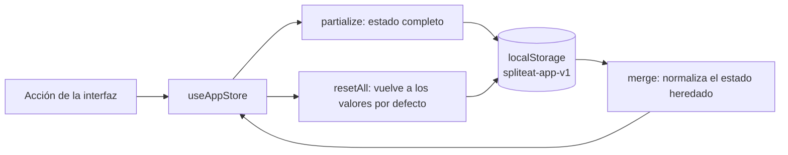

# Modelo de datos local

## Resumen

La capa de datos del producto entregado es una **base de datos que vive en el navegador**:
`localStorage` a través del middleware `persist` de Zustand, con una única clave
`spliteat-app-v1` que guarda una instantánea JSON del estado completo de la aplicación. Este
documento es la fuente canónica de ese esquema persistido, del motor, de la clave, de la
serialización, del ciclo de vida y de los límites de la base de datos, tomados de
`frontend/src/lib/store.ts` y de los tipos que ese archivo importa. Su permanencia es `temporal`
y no `definitivo`: el sustituto duradero está identificado como candidato y sigue sin decidirse,
y `## Detalle` enumera ese candidato y lo que falta para decidirlo. Quedan fuera el alcance de
nube y el motor Dexie, que están descartados y se documentan en `data/scope-evolution`, y la
decisión canónica de persistencia, que se registra como `DEC-ARCH-04` en `architecture/decisions`.

## Estado

| Área | Estado | Permanencia | Evidencia |
| :--- | :--- | :--- | :--- |
| Base de datos del cliente: `localStorage` con la clave `spliteat-app-v1` mediante Zustand `persist` | `entregado` | `temporal` | `frontend/src/lib/store.ts:462-464` declara `name: 'spliteat-app-v1'` y `storage: createJSONStorage(() => localStorage)` |
| Esquema persistido: `people`, `groups`, `tickets`, `profile`, `settings`, `featureFlags`, `version` y `draftTicketId` | `entregado` | `temporal` | `frontend/src/lib/store.ts:465-475` (`partialize`) |
| Ciclo de vida: semilla, hidratación, normalización al arrancar, actualización y borrado | `entregado` | `temporal` | `frontend/src/lib/store.ts:80-100`, `:478-514`, `:425-429` |
| Copia de seguridad en JSON del historial local (F-11) | `entregado` | `definitivo` | `frontend/src/lib/store.ts:432-460`; interfaz en `frontend/src/views/SettingsView.tsx:179-200` |
| Claves auxiliares de `localStorage` ajenas a los datos de la aplicación | `entregado` | `temporal` | `frontend/src/hooks/useTheme.ts:21` (clave `theme`); `frontend/src/lib/scan/capabilities.ts:32` (clave `cuadra-florence-cached`) |
| Sustituto duradero de la base de datos | `latente` | — | `DEC-DATA-01` mantiene la vía abierta; el candidato y lo que falta para decidirlo están en `## Detalle` |
| Base de datos de nube y motor Dexie sobre IndexedDB | `descartado` | — | `DEC-ARCH-04` registra el descarte; `grep -rn "from 'dexie'" frontend/src` → 0 líneas y `grep -ril firebase frontend/src` → 0 archivos |

La columna `permanencia` distingue lo que se documenta como entrega estable de lo que se
documenta como entrega provisional. `temporal` señala que hay un sustituto identificado y que la
decisión que lo fija sigue abierta; `definitivo` señala que no hay sustitución identificada para
ese elemento. El estado de la capa entregada no cambia por ser `temporal`: funciona y es lo que el
producto usa hoy.

## Detalle

La razón por la que esta capa se documenta como base de datos y no como ausencia de base de datos
es que **es la base de datos del producto**: guarda el historial completo de tickets, los
contactos, los grupos, los ajustes y el borrador del asistente, y lo hace sin servidor. La
documentación anterior del dominio de datos describía un esquema Dexie y un esquema de Firestore
como vigentes y, al mismo tiempo, trataba el almacenamiento del cliente como un detalle sin
entidad; el resultado fue que el lector suponía una base de datos de nube que nunca existió y
perdía de vista los límites reales del almacén que sí existe. La decisión de fondo está registrada
en `DEC-DATA-01` y la elección canónica del motor, en `DEC-ARCH-04`.

### Qué es la base de datos

Es el almacén clave-valor del navegador, escrito por el middleware `persist` de Zustand. El motor
es `localStorage`; el acceso pasa siempre por el estado global de Zustand, no por una capa de
repositorios ni por consultas directas al almacén.

| Hecho | Valor | Evidencia |
| :--- | :--- | :--- |
| Motor de almacenamiento | `localStorage` del navegador | `frontend/src/lib/store.ts:464` |
| Biblioteca de acceso | Zustand 4.5.7 con el middleware `persist` y `createJSONStorage` | `frontend/src/lib/store.ts:4`, `:463-464`; `frontend/package.json:68` |
| Clave de la base de datos | `spliteat-app-v1` | `frontend/src/lib/store.ts:463` |
| Serialización | JSON: el valor es un sobre con `state` (el estado parcializado) y la versión del middleware | `frontend/src/lib/store.test.ts:454` escribe ese mismo sobre para simular un estado heredado |
| Granularidad | Una sola entrada con la instantánea completa del estado, no una entrada por entidad | `frontend/src/lib/store.ts:465-475` |
| Versión del estado | `version: 1`, dentro del propio estado | `frontend/src/lib/store.ts:99`; `frontend/src/lib/types.ts:235` |
| Versión del sobre | El middleware no declara la opción `version`: solo `name`, `storage`, `partialize` y `merge` | `frontend/src/lib/store.ts:462-478` |
| Claves auxiliares del mismo origen | `theme` y `cuadra-florence-cached`; no forman parte de los datos de la aplicación | `frontend/src/hooks/useTheme.ts:21`; `frontend/src/lib/scan/capabilities.ts:32` |



<!-- mermaid-companion: ciclo-de-persistencia-local -->

| Nodo | Descripción |
| :--- | :--- |
| `UI` | Cualquier componente que invoca una acción del estado global |
| `Store` | El estado global `useAppStore`, creado con Zustand y envuelto por `persist` |
| `Partialize` | La función que recorta el estado a datos serializables antes de escribir |
| `LS` | La entrada `spliteat-app-v1` de `localStorage`, con el sobre JSON |
| `Merge` | La función que fusiona el estado persistido con el actual y normaliza formas heredadas |
| `Reset` | La acción `resetAll`, que devuelve el estado a los valores por defecto |

| Origen | Relación | Destino |
| :--- | :--- | :--- |
| `UI` | invoca una acción de | `Store` |
| `Store` | entrega el estado a | `Partialize` |
| `Partialize` | escribe el sobre JSON en | `LS` |
| `LS` | alimenta la hidratación de | `Merge` |
| `Merge` | devuelve el estado normalizado a | `Store` |
| `Store` | borra el historial con | `Reset` |
| `Reset` | reescribe los valores por defecto en | `LS` |

### Modelo de entidades

Las entidades persistidas son las ocho claves que devuelve `partialize`. Los tipos provienen de
`frontend/src/lib/types.ts`, importados por `frontend/src/lib/store.ts:5-14`.

| Clave persistida | Tipo | Qué guarda | Evidencia |
| :--- | :--- | :--- | :--- |
| `people` | `Person[]` | Contactos del usuario | `frontend/src/lib/store.ts:466`; `frontend/src/lib/types.ts:8-16` |
| `groups` | `Group[]` | Grupos de personas | `frontend/src/lib/store.ts:467`; `frontend/src/lib/types.ts:19-27` |
| `tickets` | `Ticket[]` | Tickets completos, con sus líneas, descuentos y metadatos | `frontend/src/lib/store.ts:468`; `frontend/src/lib/types.ts:156-205` |
| `profile` | objeto | Nombre, correo opcional y marca de cuenta local | `frontend/src/lib/store.ts:469`; `frontend/src/lib/types.ts:213-218` |
| `settings` | objeto | IVA por defecto, propina por defecto, modo de redondeo y motor de OCR preferido | `frontend/src/lib/store.ts:470`; `frontend/src/lib/types.ts:219-226` |
| `featureFlags` | objeto | `showOcrReview`, `verboseLogs` y `useMiniAgent` | `frontend/src/lib/store.ts:471`; `frontend/src/lib/types.ts:227-234` |
| `version` | `number` | Versión del esquema persistido; hoy `1` | `frontend/src/lib/store.ts:472`; `frontend/src/lib/types.ts:235` |
| `draftTicketId` | `ID \| null` | Puntero al ticket borrador del asistente de ticket nuevo | `frontend/src/lib/store.ts:474` y `:29` |

#### Entidades y campos

| Entidad | Campos | Evidencia |
| :--- | :--- | :--- |
| `Person` | `id`, `name`, `color`, `initials`, `createdAt` | `frontend/src/lib/types.ts:8-16`; creación en `frontend/src/lib/store.ts:138-149` |
| `Group` | `id`, `name`, `color`, `memberIds`, `createdAt` | `frontend/src/lib/types.ts:19-27`; creación en `frontend/src/lib/store.ts:181-192` |
| `Ticket` | `id`, `title`, `date`, `merchant?`, `image?`, `items`, `discounts`, `subtotal`, `taxRate`, `taxAmount`, `taxMode`, `tipMode`, `tipAmount`, `tipPercentage?`, `taxDistribution`, `tipDistribution`, `participantIds`, `paidBy?`, `status`, `createdAt`, `updatedAt`, `metadata?`, `scan?` | `frontend/src/lib/types.ts:156-205`; creación en `frontend/src/lib/store.ts:217-265` |
| `TicketItem` | `id`, `name`, `quantity`, `unitPrice`, `mode`, `assignments` | `frontend/src/lib/types.ts:43-51`; creación en `frontend/src/lib/store.ts:294-306` |
| `ItemAssignment` | `personId`, `weight` | `frontend/src/lib/types.ts:36-40` |
| `TicketDiscount` | `id`, `name`, `mode`, `amount`, `percentage?` | `frontend/src/lib/types.ts:54-63`; creación en `frontend/src/lib/store.ts:330-338` |
| `TicketMetadata` | `exif?` | `frontend/src/lib/types.ts:115-117` |
| `ExifNamespace` | `gps`, `timestamp`, `device`, `orientation` | `frontend/src/lib/types.ts:105-110` |
| `ScanMetadata` | `engine`, `rawText`, `confidence?`, `preprocessedImageDataUrl?`, `processedAt`, `qualitySummary?`, `sectionCount?`, `adjustmentsSummary?` | `frontend/src/lib/types.ts:131-154`; escritura en `frontend/src/views/NewTicketCaptureView.tsx:196-210` |

| Tipo enumerado | Valores | Evidencia |
| :--- | :--- | :--- |
| `AssignmentMode` | `single`, `shared`, `weighted` | `frontend/src/lib/types.ts:30-34` |
| `TaxMode` | `included`, `added` | `frontend/src/lib/types.ts:65` |
| `TipMode` | `fixed`, `percentage`, `none` | `frontend/src/lib/types.ts:66` |
| `ExtraDistributionMode` | `proportional`, `equal` | `frontend/src/lib/types.ts:67` |
| `TicketStatus` | `draft`, `balanced`, `closed` | `frontend/src/lib/types.ts:70` |
| `settings.preferredEngine` | `server`, `tesseract`, `tesseract-ner`, `florence2` | `frontend/src/lib/types.ts:225` |

#### Lo que no se persiste

| Elemento | Por qué no se persiste | Evidencia |
| :--- | :--- | :--- |
| Las funciones de acción del estado (`addPerson`, `updateTicket`, `resetAll`, …) | `partialize` solo devuelve datos; el middleware serializa su resultado | `frontend/src/lib/store.ts:465-475` |
| El EXIF leído de la imagen original | Se descarta en el límite de persistencia: `updateTicket` nunca lo recibe | `frontend/src/lib/types.ts:92-94` |
| `Ticket.metadata` | El campo está declarado en el tipo, pero ningún camino de código lo escribe | `frontend/src/lib/types.ts:198`; `grep -rn "metadata:" frontend/src` → 0 coincidencias |
| La imagen previa al preprocesado | Solo se persiste la imagen comprimida y, para tickets escaneados, la imagen preprocesada de la primera sección | `frontend/src/components/camera/CameraCapture.tsx:159-161`; `frontend/src/views/NewTicketCaptureView.tsx:200` |

### Ciclo de vida

| Fase | Qué ocurre | Evidencia |
| :--- | :--- | :--- |
| Semilla | Antes del primer cambio de estado no existe la clave: el estado en memoria parte de `DEFAULT_DATA` | `frontend/src/lib/store.ts:80-100` |
| Creación de la entrada | El primer cambio de estado hace que `persist` escriba el sobre JSON completo en `spliteat-app-v1` | `frontend/src/lib/store.ts:462-475` |
| Hidratación al cargar | `persist` lee la clave, parsea el sobre y entrega `state` a `merge`, que lo fusiona sobre el estado actual | `frontend/src/lib/store.ts:478-479` |
| Normalización de formas heredadas | `merge` asegura `draftTicketId` (nulo si falta), añade `discounts` a los tickets antiguos con `mode` por defecto `amount`, añade `settings.preferredEngine` con valor `tesseract-ner` y añade `featureFlags` con sus valores por defecto | `frontend/src/lib/store.ts:480-512` |
| Actualización | Cada acción llama a `set` y `persist` reescribe la instantánea completa; los cambios de líneas y descuentos actualizan además `updatedAt` | `frontend/src/lib/store.ts:266-273`, `:280-292`, `:350-359` |
| Borrado en cascada | `deletePerson` retira a la persona de los grupos, de los participantes del ticket, de las asignaciones de cada línea y del campo `paidBy` | `frontend/src/lib/store.ts:162-179` |
| Borrado de la base de datos | `resetAll` devuelve el estado a los valores por defecto y borra el puntero del borrador, lo que reescribe la clave con los valores por defecto | `frontend/src/lib/store.ts:425-429`; invocación en `frontend/src/views/SettingsView.tsx:220` |
| Borrado por el navegador | Si el usuario borra los datos del sitio o el navegador desaloja el almacenamiento del origen, la clave desaparece y la aplicación vuelve a arrancar desde los valores por defecto | `docs/process/technical-plan.md:55-59` |

### Capacidades y límites como base de datos

La base de datos se comporta como un almacén clave-valor de un solo documento: guarda y devuelve
la instantánea completa del estado, y todo lo demás —buscar, filtrar, ordenar, relacionar— ocurre
en memoria, sobre los arrays que el estado ya tiene cargados.

| Capacidad o límite | Valor real | Evidencia |
| :--- | :--- | :--- |
| Índices | Ninguno: el almacén guarda cadenas bajo claves y la aplicación usa una sola clave | `frontend/src/lib/store.ts:463-475` |
| Consultas | Ninguna consulta sobre el almacén; las búsquedas son recorridos en memoria sobre los arrays del estado | `frontend/src/lib/store.ts:520-532` |
| Transacciones | Ninguna: cada acción reescribe la instantánea completa, sin atomicidad entre entidades ni reversión | `frontend/src/lib/store.ts:465-475` |
| Concurrencia entre pestañas | Ninguna coordinación: no hay escucha del evento `storage` ni canal entre pestañas, de modo que dos pestañas abiertas compiten por la misma clave y gana la última que escribe | `grep -rn "addEventListener('storage'\|BroadcastChannel" frontend/src` → 0 líneas |
| Capacidad | Del orden de 5 MB por origen según el navegador; **no medida en este repositorio** | `frontend/src/lib/scan/storage-manager.ts:22-37` estima la cuota del origen para los modelos de OCR y no tiene consumidores |
| Solicitud de almacenamiento persistente | No existe: el origen no se marca como persistente ante el navegador | `grep -rn "storage.persist" frontend/src` → 0 líneas |
| Desalojo del navegador | iOS y Android pueden borrar el almacenamiento del origen si el sitio no se visita en 7-14 días o si el dispositivo se queda sin espacio | `docs/process/technical-plan.md:55-59` |
| Dispositivos | Uno solo: no hay cuentas, ni sincronización, ni servidor | `grep -ril firebase frontend/src` → 0 archivos; `db/` y `backend/` no contienen código: solo `.keep` y una nota de ubicación |
| Coste por escritura | La instantánea completa se serializa y se escribe en cada cambio de estado | `frontend/src/lib/store.ts:465-475` |
| Durabilidad | Los datos viven en el perfil del navegador, no en un archivo del usuario: no se pueden abrir, copiar ni versionar sin pasar por la exportación | `frontend/src/lib/store.ts:464` |
| Peso dominante del payload | La imagen del ticket, guardada como data URL base64, más la imagen preprocesada de la primera sección en los tickets escaneados | `frontend/src/lib/types.ts:164` y `:139`; `frontend/src/views/NewTicketCaptureView.tsx:200` |

### Mitigaciones entregadas

| Mitigación | Qué cubre | Evidencia |
| :--- | :--- | :--- |
| Copia de seguridad en JSON (F-11) | Pérdida por desalojo o borrado: exporta el estado completo a un archivo y lo vuelve a importar con validación estructural del contenido | `frontend/src/lib/store.ts:432-460`; `frontend/src/views/SettingsView.tsx:179-200`; `docs/product/prd.md:82` |
| Validación del backup al importar | Rechaza JSON malformado y cargas que no tengan la forma de `AppData`, y deja el estado intacto cuando rechaza | `frontend/src/lib/store.ts:112-127`, `:442-459` |
| Payload ligero: imagen comprimida | Reduce el componente dominante del tamaño: la imagen se redibuja en un lienzo a 1600 px de lado mayor y se guarda como JPEG con calidad 0.85 | `frontend/src/components/camera/CameraCapture.tsx:159-161`, `:397-433` |
| Payload ligero: EXIF fuera de la base de datos | Evita guardar ubicación y metadatos del dispositivo junto al ticket | `frontend/src/lib/types.ts:92-94` |
| Borrado completo desde ajustes | Permite vaciar la base de datos por decisión del usuario, sin herramientas externas | `frontend/src/lib/store.ts:425-429`; `frontend/src/views/SettingsView.tsx:220` |

| Punto no mitigado | Consecuencia | Evidencia |
| :--- | :--- | :--- |
| Medición de la cuota ocupada por los datos | La aplicación no sabe cuánto ocupa su base de datos ni avisa antes de agotarla; el módulo que estima la cuota existe y no tiene consumidores | `frontend/src/lib/scan/storage-manager.ts:22-37` |
| Solicitud de almacenamiento persistente | El origen queda expuesto al desalojo del navegador | `grep -rn "storage.persist" frontend/src` → 0 líneas |
| Coordinación entre pestañas | Dos pestañas abiertas escriben la misma clave y la última en escribir descarta los cambios de la otra | `grep -rn "addEventListener('storage'\|BroadcastChannel" frontend/src` → 0 líneas |
| Migración por número de versión | No hay función `migrate` ligada a `version`; la compatibilidad con formas heredadas se resuelve de forma estructural en `merge` | `frontend/src/lib/store.ts:478-514` |
| Campo `Ticket.metadata` | El tipo declara metadatos EXIF de ticket que ningún camino de código escribe | `grep -rn "metadata:" frontend/src` → 0 coincidencias |

### El sustituto duradero y lo que falta para decidirlo

La permanencia de esta base de datos es `temporal` por una razón concreta: `localStorage` no
ofrece durabilidad ni consulta. El candidato que se mantiene para sustituirla es un **almacén
duradero en el navegador con índices y transacciones** —IndexedDB, con o sin una biblioteca por
encima—, que resolvería los cuatro límites de la tabla anterior sin abrir una capa remota. La
alternativa de un almacén remoto con cuenta de usuario no está sobre la mesa: el producto descartó
el registro y la sincronización multi-dispositivo (`DEC-PROD-05`, `DEC-PROD-06`) y descartó la
nube y Dexie como motor local (`DEC-ARCH-04`). Lo que quedó descartado es la **base de datos de
nube** y **Dexie como motor**, no la idea de tener una base de datos ni la de un almacén local
duradero.

| Qué falta para decidir el sustituto | Por qué bloquea la decisión | Evidencia |
| :--- | :--- | :--- |
| Medir el supuesto A-02 («el almacenamiento local del navegador es suficiente y no se limpia de forma agresiva») | El supuesto está declarado `parcial` y sin medir; sin ese dato no hay umbral que diga si hace falta durabilidad | `docs/product/prd.md:153` |
| Medir el tamaño real del payload persistido | La instantánea se reescribe completa en cada cambio y el peso lo dominan las imágenes en base64; sin la distribución de tamaños no se puede comparar seguir en `localStorage` con migrar de motor | `frontend/src/lib/store.ts:465-475`; `frontend/src/lib/types.ts:164` |
| Medir el desalojo real en los navegadores móviles objetivo | La evidencia disponible es una advertencia general sobre iOS y Android, no una medición del producto | `docs/process/technical-plan.md:55-59` |
| Decidir si el producto abre la cuenta de usuario y varios dispositivos | Es lo que determina si el sustituto es solo local o incluye una capa remota; hoy ambas vías están descartadas | `DEC-PROD-05`, `DEC-PROD-06` |
| Definir la migración del formato | La base de datos actual no tiene migración por número de versión y el sobre JSON de `persist` es el único formato de lectura; cambiar de motor exige leer el sobre actual y escribir en el nuevo | `frontend/src/lib/store.ts:462-478` |
| Asignar la tarea que ejecute el cambio de motor | El plan de reorganización documental no incluye ninguna tarea de cambio de motor: T4 documenta la situación, no la resuelve | `docs/plan-reorganizacion.md` (ficha T4) |

Mientras esas mediciones y decisiones no existan, el estado de la capa entregada sigue siendo
`entregado` con `permanencia: temporal`, y la mitigación operativa sigue siendo la copia en JSON
de F-11.

## Decisiones

| id | fecha | decisión | contexto | alternativas | elección | motivo | estado |
| :--- | :--- | :--- | :--- | :--- | :--- | :--- | :--- |
| `DEC-DATA-01` | 2026-09-22 | Documentar la capa de datos entregada como una base de datos de cliente y declararla `temporal` | La documentación anterior del dominio de datos describía un esquema Dexie y un esquema de Firestore como vigentes y trataba el almacenamiento del cliente como una ausencia; la persistencia real es `localStorage` con Zustand `persist` sobre `spliteat-app-v1`, que es lo que el producto usa hoy | Seguir describiendo la persistencia como ausencia de base de datos; declararla base de datos entregada y `temporal`; declararla base de datos definitiva | Base de datos de cliente, `entregado`, con `permanencia: temporal` | Es la base de datos que el producto usa hoy: sin declararla, sus capacidades y sus límites quedan invisibles y el lector supone una base de datos de nube que nunca existió. Se declara `temporal` porque `localStorage` no ofrece durabilidad ni consulta y el sustituto duradero sigue sin decidirse | `entregado` |
| `DEC-DATA-02` | 2026-09-22 | Fijar `data/local-model` como fuente canónica del esquema persistido | El contrato de datos estaba repartido en varios documentos y se autocontradecía, y el esquema descrito no correspondía a ningún almacén real | Mantener el esquema en varios documentos; declarar una única fuente canónica | `data/local-model` como única fuente del esquema persistido; los demás documentos citan su `doc_id` | Un hecho con un solo documento canónico permite detectar la divergencia con `grep`; repartirlo garantiza que vuelva a separarse | `entregado` |
| `DEC-DATA-03` | 2026-09-22 | Conservar la copia de seguridad en JSON como mitigación independiente del motor de almacenamiento | El supuesto A-02 está declarado `parcial` y sin medir, y el navegador puede vaciar el almacenamiento del origen sin avisar al usuario | Depender de una sincronización remota; conservar la exportación e importación manual en JSON | Exportación e importación manual en JSON, declarada `definitivo` en la tabla de estado | Es la mitigación que sobrevive al cambio de motor y no depende de `localStorage`: se apoya en el estado serializable, de modo que un sustituto duradero la conserva sin rehacerla | `entregado` |

Las decisiones de arquitectura que fijan el motor actual y el descarte de la nube y de Dexie no se
repiten aquí: su documento canónico es `architecture/decisions`, donde están registradas como
`DEC-ARCH-04`. Del mismo modo, el alcance de producto que descarta la cuenta de usuario y la
sincronización multi-dispositivo vive en `product/prd` como `DEC-PROD-05` y `DEC-PROD-06`.

## Cómo verificar este documento

- [ ] `for k in doc_id title domain audience status source_of_truth_for last_verified verified_against; do grep -q "^$k:" docs/data/local-model.md && echo "OK: $k" || echo "FALLO: $k"; done` → ocho líneas `OK`
- [ ] `awk '/^```/{f=!f; next} !f && /^# /{print NR": "$0}' docs/data/local-model.md` → un H1, `# Modelo de datos local`, igual al campo `title`
- [ ] `for s in '## Resumen' '## Estado' '## Detalle' '## Decisiones' '## Cómo verificar este documento' '## Referencias'; do grep -qF "$s" docs/data/local-model.md && echo "OK: $s" || echo "FALLO: $s"; done` → seis líneas `OK`
- [ ] `grep -n '^| Área | Estado | Permanencia | Evidencia |' docs/data/local-model.md` → una coincidencia: la tabla de estado lleva la columna `permanencia`
- [ ] `awk '/^## Estado/{f=1; next} /^## Detalle/{f=0} f && /^\| /' docs/data/local-model.md | grep -c 'temporal'` → `4` filas de la tabla de estado con permanencia `temporal`, una con `definitivo` y dos sin permanencia aplicable
- [ ] `m=$(grep -c '^```mermaid' docs/data/local-model.md); c=$(grep -c '^<!-- mermaid-companion' docs/data/local-model.md); [ "$m" = "$c" ] && echo "OK: $m/$c" || echo "FALLO: $m/$c"` → `OK: 1/1`
- [ ] `for n in UI Store Partialize LS Merge Reset; do grep -q "\`$n\`" docs/data/local-model.md && echo "OK: $n" || echo "FALLO: $n"; done` → seis líneas `OK`: el acompañamiento repite los nodos del diagrama
- [ ] `grep -oE 'DEC-DATA-[0-9]{2}' docs/data/local-model.md | sort -u | tr '\n' ' '` → `DEC-DATA-01 DEC-DATA-02 DEC-DATA-03 `
- [ ] `grep -c 'DEC-ARCH-04' docs/data/local-model.md` → al menos 3 menciones en prosa, ninguna como fila de la tabla de `## Decisiones`
- [ ] `grep -n '](\.\./' docs/data/local-model.md` → sin salida
- [ ] `grep -rniE 'previsto|se usará|está definido|planificado para|se implementará|\[Pending\]|\bReady\b' docs/data/local-model.md | grep -viE '«|»|`'` → sin salida
- [ ] `grep -rn "from 'dexie'" frontend/src | wc -l` → `0`, y `grep -ril firebase frontend/src | wc -l` → `0`: el esquema documentado no depende de ninguna de las dos
- [ ] `grep -c '^| ' docs/data/local-model.md` → al menos 60 filas de tabla

## Referencias

- `docs/DOC-STANDARD.md` — estándar de escritura dual; fuente canónica del esquema de frontmatter, del esqueleto de secciones, del vocabulario de estado y de la columna `permanencia`
- `docs/architecture/decisions.md` — registro canónico de las decisiones `DEC-ARCH-xx`, incluida `DEC-ARCH-04`, que fija el motor de persistencia y descarta la nube y Dexie
- `docs/data/scope-evolution.md` — alcance planificado y descartado de la capa de datos, con los diagramas históricos de la arquitectura de nube
- `docs/product/prd.md` — funciones del producto (F-11 es la copia de seguridad), supuesto A-02 y decisiones `DEC-PROD-xx`
- `docs/process/technical-plan.md` — caso límite documentado de pérdida de datos por limpieza del navegador
- `docs/plan-reorganizacion.md` — plan de la reorganización documental; secciones 4 y 8.1, y ficha T4
- `frontend/src/lib/store.ts` — estado global, middleware `persist`, clave, esquema persistido, ciclo de vida y copia de seguridad en JSON
- `frontend/src/lib/types.ts` — declaración de las entidades y los tipos enumerados persistidos
- `frontend/src/lib/store.test.ts` — pruebas del contrato de persistencia, de la normalización heredada y del backup
- `frontend/src/views/SettingsView.tsx` — interfaz de exportación, importación y borrado de datos
- `frontend/src/components/camera/CameraCapture.tsx` — compresión de la imagen que se persiste con el ticket
- `frontend/src/lib/scan/storage-manager.ts` — estimación de la cuota del origen y limpieza de cachés de modelos
- `frontend/package.json` — versiones declaradas de `zustand` y de `dexie`
