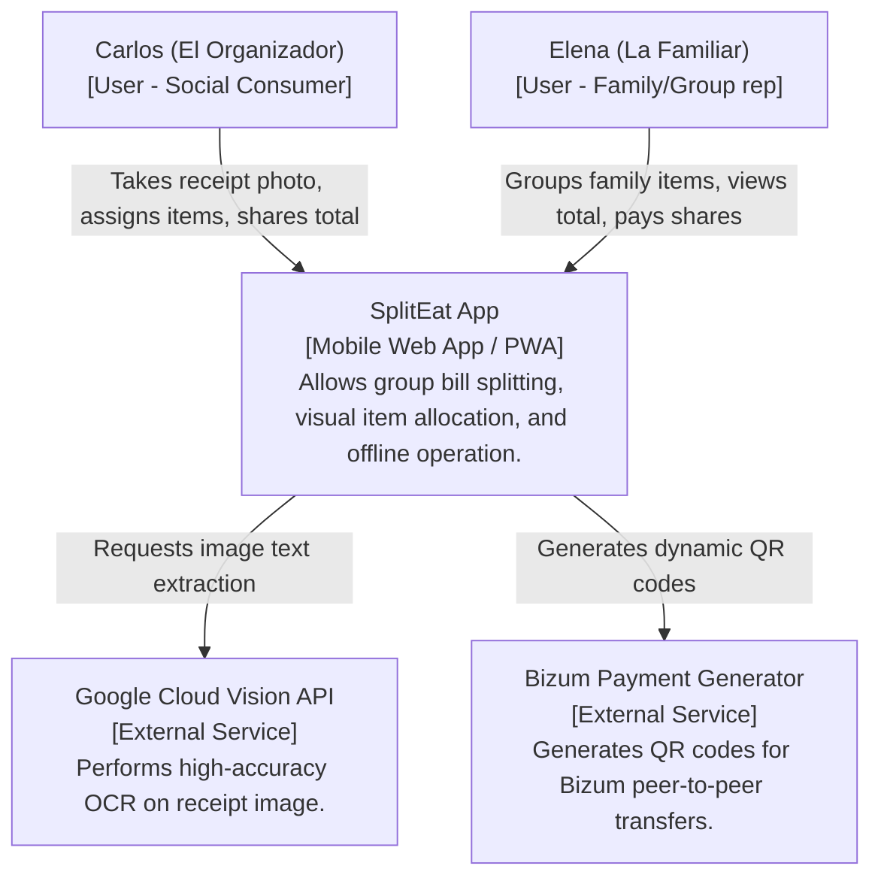
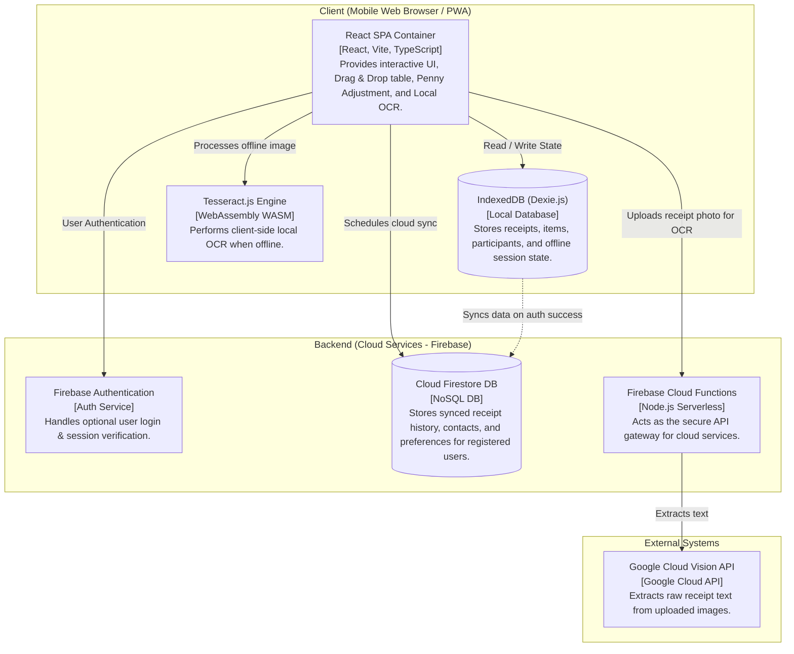
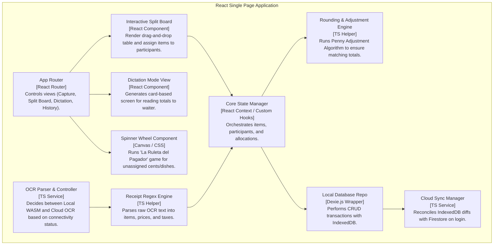
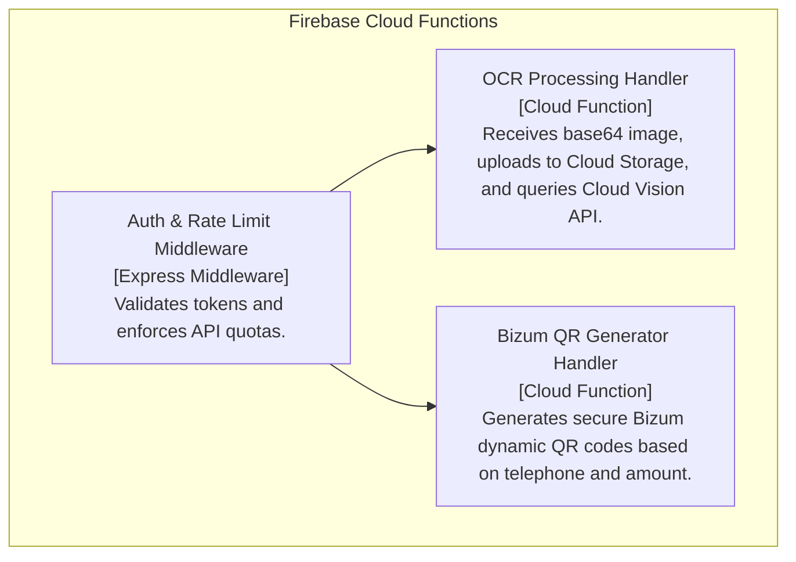

# Evolución del alcance de datos

## Resumen

La base de datos del producto entregado es local y provisional: `localStorage` a través de Zustand
`persist`, con su esquema documentado en `data/local-model`. Este documento conserva el alcance de
datos que se planificó y se descartó: la **base de datos de nube** —Cloud Firestore, Firebase Auth,
SyncManager y las reglas de Firestore— y **Dexie como motor local** sobre IndexedDB. Lo que sigue
abierto es el sustituto duradero de la base de datos actual, que no está decidido. Es la fuente
canónica del alcance planificado y descartado de la capa de datos y del registro histórico de los
cuatro diagramas de la arquitectura de nube; el modelo entregado se documenta en `data/local-model`
y la arquitectura vigente en `architecture/overview`. El documento cubre más de un estado a la vez
y esa separación está declarada por secciones en la tabla de `## Estado`.

## Estado

| Sección del documento | Área | Estado | Evidencia |
| :--- | :--- | :--- | :--- |
| `## Detalle` › Alcance planificado y descartado | Base de datos de nube: Cloud Firestore, Firebase Auth, SyncManager y reglas de Firestore | `descartado` | `DEC-ARCH-04` registra el descarte; `firestore.rules` nunca existió y `db/` no contiene código: solo `.keep` y una nota de ubicación |
| `## Detalle` › Alcance planificado y descartado | Dexie como motor local sobre IndexedDB | `descartado` | `DEC-ARCH-04` registra el descarte; `frontend/package.json:51` declara `dexie` sin ninguna importación (`grep -rn "from 'dexie'" frontend/src` → 0 líneas) |
| `## Detalle` › Esquema local y sincronización descartados | Esquema Dexie y estrategia de sincronización con resolución por última escritura | `descartado` | Las tablas de esa subsección describen un diseño sin correspondencia en el código |
| `## Detalle` › Diagramas históricos de la arquitectura de datos y nube | Cuatro diagramas de la arquitectura planificada, conservados íntegros | `entregado` | `grep -c '^```mermaid' docs/data/scope-evolution.md` → 4, con cuatro acompañamientos textuales |
| `## Detalle` › La base de datos vigente y el reemplazo duradero | Base de datos del cliente entregada: `localStorage` con Zustand `persist` | `entregado` | `frontend/src/lib/store.ts:462-475`; su detalle canónico está en `data/local-model` |
| `## Detalle` › La base de datos vigente y el reemplazo duradero | Copia de seguridad en JSON del historial local (F-11) | `entregado` | `frontend/src/lib/store.ts:432-460`; interfaz en `frontend/src/views/SettingsView.tsx:179-200` |
| `## Detalle` › La base de datos vigente y el reemplazo duradero | Sustituto duradero de la base de datos | `latente` | `DEC-DATA-01` mantiene la vía abierta; el candidato y lo que falta para decidirlo están en `data/local-model` |
| `## Detalle` › Por qué se descartó esta arquitectura | Razonamiento del descarte de la nube y de Dexie | `entregado` | Las tres consecuencias del apartado se apoyan en `DEC-ARCH-04`, `DEC-PROD-05` y `DEC-PROD-06` |
| `## Detalle` › Alcance latente del OCR remoto | Motor OCR de servidor | `latente` | `DEC-ARCH-09` mantiene la vía abierta; el motor `'server'` sigue declarado en `frontend/src/lib/types.ts` y `frontend/src/workers/ocr.worker.ts`, sin servicio que lo atienda |
| `## Detalle` › Alcance latente del OCR remoto | Generador de QR de Bizum | `descartado` | `DEC-PROD-06` excluye las pasarelas de pago del alcance; el componente no existe en `frontend/src` |

## Detalle

La nube se descartó por una razón que está en el propio producto, no en una limitación técnica: el
MVP entregado —de F-01 a F-11— se definió como 100 % local y sin cuenta de usuario, y ninguna de
esas funciones necesita backend. Si el producto entero funciona en el dispositivo, cada pieza de
infraestructura de nube deja de tener trabajo que hacer: sin registro no hay `FirebaseAuth`, sin
sincronización no hay `SyncManager`, sin base de datos remota no hay `Cloud Firestore` y sin
servidor no hay `CloudFunctions`. El apartado siguiente conserva el alcance planificado; los dos
posteriores conservan el esquema local y la estrategia de sincronización descartados, y los
diagramas que describían ese plan, sin recortes, para que la alternativa descartada y su motivo
sigan siendo legibles.

### Alcance planificado y descartado

| Tecnología planificada | Estado | Qué conservar del razonamiento |
| :--- | :--- | :--- |
| Dexie.js sobre IndexedDB | `descartado` | Se eligió como almacén local con índices y transacciones; quedó sustituido por `localStorage` mediante Zustand persist. La copia de seguridad en JSON sobrevive como mitigación de la pérdida de datos |
| Cloud Firestore | `descartado` | Base NoSQL para sincronizar historial y preferencias de usuarios registrados; sin implementación |
| Firebase Auth | `descartado` | Autenticación anónima, por correo y con Google para habilitar la sincronización; sin implementación |
| SyncManager | `descartado` | Coordinaba los cambios locales con la nube y resolvía conflictos por última escritura; no existe en el código |
| Reglas de seguridad de Firestore (`firestore.rules`) | `descartado` | El archivo nunca existió |
| Google Cloud Vision como OCR remoto | `descartado` en su forma de servicio de nube | La vía de un OCR de mayor precisión sigue abierta como motor `'server'`, en estado `latente` (`DEC-ARCH-09`) |

El alcance planificado se conserva por su valor documental, no como trabajo pendiente: los
vectores de retorno de estas cinco piezas están cerrados (`DEC-ARCH-04`). La única excepción es la
precisión del OCR: lo que se descartó es el servicio concreto de Google, no la idea de un motor
remoto, que sigue declarada en el código y registrada como `latente` en `DEC-ARCH-09`.

Lo descartado es la **base de datos de nube** y **Dexie como motor local**, no la idea de tener una
base de datos: el producto entregado tiene una, es de cliente y está documentada en
`data/local-model`. La distinción importa porque la documentación anterior describía el esquema de
Firestore como vigente y, a la vez, hablaba del almacenamiento del cliente como si no fuera una
base de datos; con ese encuadre, la alternativa descartada parecía el único diseño de datos del
proyecto.

### Esquema local y sincronización descartados

El diseño de datos planificado llegó a describir un esquema local sobre Dexie con índices y
metadatos de sincronización, y una estrategia de sincronización bidireccional con Firestore. Ni el
esquema ni la estrategia existen en el código entregado, y se conservan aquí como registro de lo
que se planificó. El esquema que sí existe es el de `data/local-model`.

| Entidad del esquema descartado | Campos | Estado real |
| :--- | :--- | :--- |
| `Participant` | `id`, `name`, `isGroup`, `memberIds` | `descartado`; el equivalente entregado son `Person` y `Group`, con `memberIds` en el grupo |
| `TicketItem` | `id`, `ticketId`, `name`, `quantity`, `unitPrice`, `totalPrice`, `allocations` | `descartado`; el equivalente entregado es `TicketItem` con `mode` y `assignments` |
| `Ticket` | `id`, `restaurantName`, `date`, `subtotal`, `taxAmount`, `tipAmount`, `totalAmount`, `pennyAdjustment`, `isCompleted`, `lastUpdated`, `syncStatus` | `descartado`; el equivalente entregado es `Ticket`, sin metadatos de sincronización y con `status` en lugar de `isCompleted` |
| Objetos de almacén e índices | `tickets: 'id, date, syncStatus, lastUpdated'`, `items: 'id, ticketId'`, `participants: 'id, name'` | `descartado`; el almacén entregado no tiene índices ni objetos de almacén separados |
| Metadatos de sincronización | `syncStatus` con los valores `synced`, `pending-create`, `pending-update` y `pending-delete`, más `lastUpdated` | `descartado`; no hay sincronización ni cola de cambios |

| Paso de la estrategia descartada | Qué describía | Estado real |
| :--- | :--- | :--- |
| Detección del estado de red | Escucha de los eventos de conexión y de `navigator.onLine` | `descartado`; la aplicación no tiene estado de red |
| Cola de cambios locales | Toda mutación escribía `syncStatus: 'pending-update'` y actualizaba `lastUpdated` | `descartado`; cada mutación reescribe la instantánea completa del estado |
| Empuje al recuperar la conexión | Consulta de los tickets no sincronizados y envío secuencial a Firestore | `descartado`; no existe destino remoto |
| Resolución de conflictos | Última escritura gana entre la copia local y la remota | `descartado`; con un solo dispositivo no hay conflicto que resolver |
| Migración de los datos anónimos al iniciar sesión | Asignar el identificador de usuario y subir cada ticket local | `descartado`; no hay registro de usuario |

El diagrama de secuencia que acompañaba a ese diseño no se conserva como diagrama en este
documento: su contenido queda registrado paso a paso en la tabla anterior, para no duplicar el
registro gráfico de los cuatro diagramas históricos de la subsección siguiente.

### Diagramas históricos de la arquitectura de datos y nube

> **Estos diagramas describen la arquitectura planificada y NO el producto entregado.** Se
> conservan íntegros y sin corrección, tal como aparecían en `docs/architecture/overview.md` antes
> de la reorganización, porque son el registro de lo que se planificó y de lo que después se
> descartó. Ninguno de los nodos `FirebaseAuth`, `Firestore`, `CloudFunctions`, `DexieDB`,
> `LocalDBRepo`, `SyncManager`, `BizumHandler`, `VisionAPI`, `GoogleVision` o `BizumQRCode` existe
> en el código: `grep -ril firebase frontend/src` → 0 archivos y `backend/` contiene únicamente
> `.keep`. Para la arquitectura vigente, consultar `architecture/overview`.

#### Diagrama histórico 1 — Contexto del sistema (plan de nube descartado)



<!-- mermaid-companion: historico-contexto-nube -->

| Nodo | Descripción | Estado real |
| :--- | :--- | :--- |
| `Carlos` | Persona que fotografía el ticket, asigna líneas y comparte el total | Persona de ejemplo del PRD; el actor existe, la nube que usaba no |
| `Elena` | Persona que agrupa sus líneas, consulta su total y paga su parte | Persona de ejemplo del PRD; el actor existe, la nube que usaba no |
| `SplitEat` | PWA de reparto de cuentas con operación offline | `entregado` |
| `GoogleVision` | Servicio externo de OCR de alta precisión | `descartado`; no existe llamada alguna |
| `BizumQRCode` | Servicio externo de generación de QR de pago | `descartado`; `DEC-PROD-06` excluye las pasarelas de pago |

| Origen | Relación | Destino |
| :--- | :--- | :--- |
| `Carlos` | fotografía el ticket, asigna líneas y comparte el total en | `SplitEat` |
| `Elena` | agrupa sus líneas, consulta su total y paga su parte en | `SplitEat` |
| `SplitEat` | solicita extracción de texto de la imagen a | `GoogleVision` |
| `SplitEat` | genera códigos QR dinámicos con | `BizumQRCode` |

#### Diagrama histórico 2 — Contenedores (plan de nube descartado)



<!-- mermaid-companion: historico-contenedores-nube -->

| Nodo | Descripción | Grupo | Estado real |
| :--- | :--- | :--- | :--- |
| `SPA` | Contenedor React de la interfaz, el reparto y el OCR local | `ClientMobile` | `entregado` |
| `DexieDB` | Base de datos local sobre IndexedDB con Dexie.js | `ClientMobile` | `descartado`; `dexie` no se importa |
| `TesseractLocal` | Motor de OCR local en WebAssembly | `ClientMobile` | `entregado`; hoy lo ejecuta un worker dedicado |
| `FirebaseAuth` | Servicio de autenticación y verificación de sesión | `FirebaseCloud` | `descartado` |
| `Firestore` | Base NoSQL en la nube con el historial sincronizado | `FirebaseCloud` | `descartado` |
| `CloudFunctions` | Funciones serverless que actúan de puerta de la API | `FirebaseCloud` | `descartado` |
| `VisionAPI` | API de Google Cloud Vision que extrae texto de la imagen | `ExternalServices` | `descartado` |

| Origen | Relación | Destino |
| :--- | :--- | :--- |
| `SPA` | lee y escribe el estado en | `DexieDB` |
| `SPA` | procesa la imagen offline con | `TesseractLocal` |
| `SPA` | autentica al usuario con | `FirebaseAuth` |
| `SPA` | programa la sincronización en la nube con | `Firestore` |
| `SPA` | sube la foto del ticket para OCR a | `CloudFunctions` |
| `CloudFunctions` | extrae el texto con | `VisionAPI` |
| `DexieDB` | sincroniza los datos tras el inicio de sesión con | `Firestore` |

#### Diagrama histórico 3 — Componentes del cliente (plan de nube descartado)



<!-- mermaid-companion: historico-componentes-cliente-nube -->

| Nodo | Descripción | Estado real |
| :--- | :--- | :--- |
| `UI_Router` | Enrutador de las vistas de captura, reparto, dictado e historial | `entregado` como `Router` con `react-router-dom` v7 |
| `StateManager` | Estado de líneas, participantes y asignaciones | `entregado` como `Estado global` con Zustand, no con React Context |
| `RoundingEngine` | Motor de ajuste de céntimos para cuadrar los totales | No existe como motor; el cuadre real es `verifyCuadre` en `frontend/src/lib/calc.ts` |
| `OCRController` | Decide entre OCR local y OCR en la nube según la conexión | No existe como selector de nube; la elección real de motor está en `frontend/src/lib/scan/orchestrator.ts` |
| `RegexParser` | Parser de expresiones regulares del texto OCR | `entregado` como `frontend/src/lib/scan/receipt-parser.ts` |
| `SplitBoard` | Tablero de arrastre para asignar líneas a personas | `entregado`; `frontend/src/components/ticket/AssignmentEditor.tsx` |
| `DictationView` | Vista de tarjetas para dictar los totales al camarero | `entregado` como vista de resumen: `frontend/src/views/NewTicketSummaryView.tsx` |
| `GamificationWheel` | Ruleta del pagador para céntimos o platos sin asignar | `descartado`; no existe componente de ruleta |
| `LocalDBRepo` | Repositorio CRUD sobre IndexedDB con Dexie | `descartado`; la persistencia real es Zustand persist |
| `SyncManager` | Reconciliación de diferencias entre IndexedDB y Firestore | `descartado`; no existe sincronización |

| Origen | Relación | Destino |
| :--- | :--- | :--- |
| `UI_Router` | monta | `SplitBoard` |
| `UI_Router` | monta | `DictationView` |
| `UI_Router` | monta | `GamificationWheel` |
| `SplitBoard` | muta el estado en | `StateManager` |
| `StateManager` | aplica el ajuste con | `RoundingEngine` |
| `OCRController` | delega el texto en | `RegexParser` |
| `RegexParser` | entrega las líneas a | `StateManager` |
| `StateManager` | persiste con | `LocalDBRepo` |
| `LocalDBRepo` | sincroniza con | `SyncManager` |

#### Diagrama histórico 4 — Componentes del backend (plan de nube descartado)



<!-- mermaid-companion: historico-componentes-backend-nube -->

| Nodo | Descripción | Estado real |
| :--- | :--- | :--- |
| `AuthGuard` | Middleware de validación de token y límite de peticiones | `descartado`; sin backend no hay peticiones que validar |
| `OCRHandler` | Función que recibía la imagen y consultaba Cloud Vision | `descartado`; `backend/` no contiene código: solo `.keep` y una nota de ubicación |
| `BizumHandler` | Función que generaba QR dinámicos de Bizum | `descartado`; `DEC-PROD-06` excluye las pasarelas de pago |

| Origen | Relación | Destino |
| :--- | :--- | :--- |
| `AuthGuard` | autorizaba la llamada a | `OCRHandler` |
| `AuthGuard` | autorizaba la llamada a | `BizumHandler` |

### Por qué se descartó esta arquitectura

La razón principal es de alcance, no de viabilidad: el MVP se cerró como aplicación de cliente sin
backend, y con esa decisión las piezas de nube se quedaron sin función. Sobre esa razón se apoyan
tres consecuencias concretas:

1. **Sin registro no hay autenticación.** El producto no pide cuenta y funciona igual para todo el
   mundo, de modo que `FirebaseAuth` no tenía a quién autenticar. El descarte de la nube arrastra
   el de la autenticación.
2. **Sin sincronización no hay base de datos remota.** Toda la información vive en un solo
   dispositivo y se comparte en voz alta durante la comida; `Cloud Firestore` y su `SyncManager`
   resolvían un problema —varios dispositivos con los mismos datos— que el producto no tiene.
3. **La persistencia local no necesitaba Dexie.** Dexie se eligió para tener índices y
   transacciones sobre IndexedDB, pero el volumen real es un puñado de tickets que se leen enteros;
   `localStorage` con la serialización de Zustand cubre ese caso sin dependencia adicional. El
   descarte es del motor, no de la idea de tener una base de datos: la base de datos entregada es
   la de `localStorage`, documentada en `data/local-model`. La misma observación vale para el OCR
   remoto: se descartó el servicio de Google, no la posibilidad de un motor remoto, que sigue
   declarada en el código (`DEC-ARCH-09`).

El motivo para conservar este material es que las alternativas y las razones no se reconstruyen
leyendo el código. Un lector que solo vea el producto entregado no puede deducir que hubo un
`SyncManager` planificado, ni por qué no se construyó.

### La base de datos vigente y el reemplazo duradero

El producto entregado sí tiene base de datos, y es de cliente: `localStorage` con Zustand `persist`
sobre la clave `spliteat-app-v1`. Funciona, guarda el historial completo de tickets, los contactos,
los grupos y los ajustes, y su permanencia es `temporal` porque `localStorage` no ofrece
durabilidad ni consulta.

| Hecho | Valor | Evidencia |
| :--- | :--- | :--- |
| Base de datos entregada | `localStorage` con Zustand `persist`, clave `spliteat-app-v1` | `frontend/src/lib/store.ts:462-475` |
| Fuente canónica de su esquema | `data/local-model` | `DEC-DATA-02` |
| Permanencia declarada | `temporal` | `DEC-DATA-01`; la tabla de `## Estado` de `data/local-model` |
| Candidato a sustituirla | Almacén duradero en el navegador con índices y transacciones: IndexedDB, con o sin una biblioteca por encima | `data/local-model` enumera lo que falta para decidirlo |
| Base de datos de nube | `descartado` | `DEC-ARCH-04`; `grep -ril firebase frontend/src` → 0 archivos |
| Dexie como motor local | `descartado` | `DEC-ARCH-04`; `grep -rn "from 'dexie'" frontend/src` → 0 líneas |

El reemplazo duradero sigue abierto porque las mediciones que lo decidirían no existen: el supuesto
sobre la limpieza del almacenamiento del navegador está declarado `parcial` y sin medir, no hay
medición del tamaño real del payload persistido ni del desalojo en los navegadores móviles
objetivo, y ninguna tarea del plan de reorganización aborda el cambio de motor. El detalle de esos
faltantes está en `data/local-model`.

### Alcance latente del OCR remoto

El único elemento de esta área que no está cerrado es el motor OCR de servidor: se descartó el
servicio de Google Cloud Vision, y la posibilidad de un motor remoto sigue declarada en el código y
registrada como `latente` en `DEC-ARCH-09`. La base de datos de nube no comparte ese estado: su
descarte no tiene vía de retorno (`DEC-ARCH-04`).

## Decisiones

Este documento no toma decisiones propias: recoge el alcance que resultó de ellas. El registro
canónico de las decisiones `DEC-ARCH-xx` es `architecture/decisions`; la exclusión de las pasarelas
de pago está registrada en `product/prd` como `DEC-PROD-06`; y la decisión de documentar la capa
entregada como base de datos de cliente con permanencia `temporal` es `DEC-DATA-01`, cuyo documento
canónico es `data/local-model`.

## Cómo verificar este documento

- [ ] `for k in doc_id title domain audience status source_of_truth_for last_verified verified_against; do grep -q "^$k:" docs/data/scope-evolution.md && echo "OK: $k" || echo "FALLO: $k"; done` → ocho líneas `OK`
- [ ] `m=$(grep -c '^```mermaid' docs/data/scope-evolution.md); c=$(grep -c '^<!-- mermaid-companion' docs/data/scope-evolution.md); [ "$m" = "$c" ] && echo "OK: $m/$c" || echo "FALLO: $m/$c"` → `OK: 4/4`
- [ ] `grep -n '^#### Diagrama histórico' docs/data/scope-evolution.md | wc -l` → `4`: los cuatro diagramas históricos siguen en el documento
- [ ] `for n in FirebaseAuth Firestore CloudFunctions DexieDB LocalDBRepo SyncManager BizumHandler VisionAPI GoogleVision BizumQRCode; do grep -qE "^\| .$n" docs/data/scope-evolution.md && echo "OK: $n" || echo "FALLO: $n"; done` → diez líneas `OK`: cada nodo de nube declarado aparece en la tabla de acompañamiento correspondiente
- [ ] `grep -c '^| Nodo |' docs/data/scope-evolution.md` → `4`, y `grep -c '^| Origen | Relación | Destino |' docs/data/scope-evolution.md` → `4`: los cuatro acompañamientos conservan sus dos tablas
- [ ] `grep -n '^status:' docs/data/scope-evolution.md` → `status: mixto`
- [ ] `grep -c '^### ' docs/data/scope-evolution.md` → `6`: seis subsecciones de `## Detalle`, cada una con su fila en la tabla de `## Estado`
- [ ] `grep -nE 'no existe b[a]se de datos' docs/data/scope-evolution.md` → sin salida: el documento no describe la persistencia entregada como ausencia
- [ ] `grep -nE 'b[a]se de datos del producto entregado es local' docs/data/scope-evolution.md` → una coincidencia en `## Resumen`: la base de datos entregada se declara local y provisional
- [ ] `grep -n '](\.\./' docs/data/scope-evolution.md` → sin salida
- [ ] `grep -rniE 'previsto|se usará|está definido|planificado para|se implementará|\[Pending\]|\bReady\b' docs/data/scope-evolution.md | grep -viE '«|»|`'` → sin salida
- [ ] `grep -c '^| ' docs/data/scope-evolution.md` → al menos 70 filas de tabla

## Referencias

- `docs/DOC-STANDARD.md` — estándar de escritura dual; fuente canónica del esquema, del esqueleto, del vocabulario de estado y del acompañamiento textual de diagramas
- `docs/architecture/overview.md` — arquitectura vigente del producto entregado, sin nodos de nube
- `docs/architecture/decisions.md` — registro canónico de las decisiones `DEC-ARCH-xx`, incluido el descarte de la nube
- `docs/data/local-model.md` — fuente canónica del esquema persistido: base de datos de cliente sobre `localStorage` y Zustand, con su permanencia `temporal`
- `docs/product/prd.md` — funciones del producto y exclusiones de alcance, con `DEC-PROD-06`
- `docs/plan-reorganizacion.md` — plan de la reorganización documental; secciones 4 y 5.1, y fichas T3 y T4
- `frontend/src/lib/store.ts` — persistencia real y copia de seguridad en JSON
- `frontend/src/lib/types.ts` — declaración del motor OCR `'server'`
- `frontend/src/views/SettingsView.tsx` — interfaz de exportación, importación y borrado de los datos locales
- `frontend/package.json` — declaración de `dexie` sin uso
