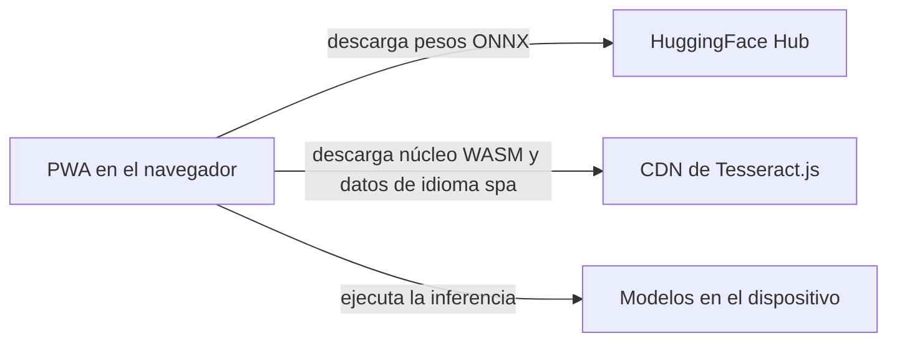

# Contratos de integración

## Resumen

SplitEat no expone ninguna API de servidor: no existe ningún endpoint, ni REST ni Callable, y
ningún documento debe leerse como si existiera uno. El producto entregado realiza exactamente dos
consumos de red, ambos desde el navegador y ambos consistentes en descargar activos que después se
usan en el dispositivo: los pesos ONNX desde HuggingFace Hub y los activos de Tesseract.js —núcleo
WASM y datos de idioma `spa`— desde el CDN de la librería. Este documento es la fuente canónica de
esos dos contratos y de la resolución de la contradicción sobre `processOcr`, que se describía a la
vez como Callable Function y como endpoint REST sin que ninguna de las dos cosas se implementara.
Cubre, por tanto, más de un estado: los dos contratos entregados y las especificaciones
descartadas del OCR en la nube y del generador de Bizum, que se conservan como registro histórico;
la separación está en la tabla de `## Estado`. Queda fuera el detalle interno de los motores de
OCR, que es canónico en el registro de decisiones de arquitectura.

## Estado

| Área | Estado | Evidencia |
| :--- | :--- | :--- |
| API de servidor del producto (endpoints REST o Callable) | `descartado` | `DEC-INT-02`; `grep -rnE "/api/v1\|/api/" frontend/src` → 0 resultados; `backend/` contiene solo `.keep` y una nota |
| Integración con HuggingFace Hub (pesos ONNX) | `entregado` | `frontend/src/lib/scan/florence-engine.ts` y `frontend/src/lib/scan/ner-engine.ts` descargan los pesos con `@huggingface/transformers` |
| Entrega de activos de Tesseract.js (núcleo WASM y datos de idioma `spa`) | `entregado` | `frontend/src/lib/scan/tesseract-engine.ts` crea el worker y la librería descarga sus activos |
| Contrato REST del OCR en la nube (`POST /api/v1/ocr`) | `descartado` | `DEC-INT-04`; la especificación se conserva marcada como histórica y el servicio no existe |
| Capacidad de OCR de servidor (motor `'server'`) | `latente` | `DEC-ARCH-09` mantiene la vía abierta; `frontend/src/lib/types.ts` y `frontend/src/workers/ocr.worker.ts` |
| Generador de QR y mensaje de Bizum (`GET /api/v1/payment/bizum`) | `descartado` | `DEC-INT-05`; `grep -rli bizum frontend/src` → 0 archivos |
| Entrega del bundle estático en Netlify y Vercel | `entregado` | `DEC-ARCH-07`; `.github/workflows/deploy-netlify.yml` y `.github/workflows/deploy-vercel.yml` |

## Detalle

### El producto no expone ninguna API de servidor

La afirmación central de este documento es una ausencia, y por eso se enuncia primero. SplitEat se
cerró como aplicación de cliente con el OCR en el dispositivo; la persistencia de nube se descartó
en `DEC-ARCH-04` y el alojamiento de nube se descartó en `DEC-ARCH-07`. Sin servidor no hay nada
que atienda una petición remota, de modo que cualquier endpoint que aparezca en la documentación
describe un servicio que el producto no puede invocar. La carpeta `backend/` es vestigial: nunca
contuvo código y se conserva solo como registro de la capa que se planificó.

| Hecho | Valor |
| :--- | :--- |
| Endpoints de servidor en el producto entregado | Ninguno |
| Rutas bajo `/api/` en el frontend | Ninguna: `grep -rnE "/api/v1\|/api/" frontend/src` → 0 resultados |
| Cloud Functions de Firebase | `descartado`; el servicio no existe (`DEC-ARCH-04`) |
| Cliente HTTP del frontend | Ninguno: no hay `axios`, `XMLHttpRequest` ni `WebSocket` |
| Llamadas a `fetch` | Dos, y ambas descargan un data URL de una imagen local en memoria |
| Variables de entorno | Ninguna: `grep -rnE "VITE_[A-Z_]+\|import\.meta\.env" frontend/src` → 0 resultados; no existe `frontend/.env.example` |
| Carpeta `backend/` | `.keep` y una nota; nunca contuvo código |

La ausencia importa para leer el resto del conjunto. Un documento que describe un endpoint obliga a
quien lo lee a suponer que existe un servicio capaz de responder, y ese supuesto lleva a diseñar
llamadas, claves y despliegues para algo que no está. Por eso la ausencia se declara aquí como
hecho canónico y no como una carencia provisional: es el resultado de cerrar el MVP sin backend,
decisión que se mantiene.

### La contradicción sobre `processOcr`

El mismo servicio que nunca se construyó quedó descrito de dos formas incompatibles. `readme.md`
lo presentaba como una Callable Function de Firebase llamada `processOcr`, invocable desde el SDK
del cliente. El predecesor de este documento, `docs/api/integration_contracts.md`, lo presentaba
como un endpoint REST `POST /api/v1/ocr` con autenticación por token de identidad de Firebase.
Ambas descripciones afirman un transporte distinto —invocación de función frente a petición HTTP— y
ninguna de las dos llegó a implementarse.

| Descripción | Dónde se escribió | Qué declaraba | Estado real |
| :--- | :--- | :--- | :--- |
| `processOcr` como Callable Function | `readme.md`, líneas 167-170 en `c66fd3f` | Función serverless invocable desde el SDK de Firebase | El servicio no existió nunca |
| `POST /api/v1/ocr` como endpoint REST | Predecesor de este documento, `docs/api/integration_contracts.md` | Endpoint HTTP con Bearer de token de Firebase | El servicio no existió nunca |

La contradicción se resuelve con una sola descripción canónica: la de este documento, que declara
que no existe API de servidor y que conserva las dos variantes como registro histórico marcado. A
partir de ahora, ningún documento describe `processOcr` como un servicio vigente, y una descripción
nueva del mismo servicio no se escribe en dos sitios: se escribe aquí. Las afirmaciones de
`/readme.md` ya se corrigieron en la reorganización documental; este documento
registra el conflicto y su resolución, no reescribe el otro archivo. La decisión queda en
`DEC-INT-01`.

### Integración entregada: HuggingFace Hub

El navegador descarga los pesos ONNX bajo demanda. El producto no los empaqueta en el bundle
porque el modelo principal ronda los 400 MB, de modo que la primera ejecución del motor necesita
red y las siguientes trabajan con la copia cacheada. Este es uno de los dos únicos consumos de red
del producto entregado, y el único que transfiere volúmenes de datos importantes.



<!-- mermaid-companion: integraciones-de-ejecucion -->

| Nodo | Descripción |
| :--- | :--- |
| `PWA` | Aplicación de cliente que se ejecuta en el navegador |
| `HF` | HuggingFace Hub; origen de los pesos ONNX y de sus archivos auxiliares |
| `TJ` | CDN por defecto de Tesseract.js; origen del núcleo WASM y de los datos de idioma |
| `DEV` | Modelos ya descargados que ejecutan la inferencia en el dispositivo |

| Origen | Relación | Destino |
| :--- | :--- | :--- |
| `PWA` | descarga pesos ONNX de | `HF` |
| `PWA` | descarga núcleo WASM y datos de idioma de | `TJ` |
| `PWA` | ejecuta la inferencia con los modelos de | `DEV` |

El diagrama no tiene nodo de servidor porque no hay servicio con el que hablar: los dos orígenes
remotos solo entregan archivos, y toda la computación ocurre después en el dispositivo.

| Hecho | Valor |
| :--- | :--- |
| Proveedor | HuggingFace Hub, en `https://huggingface.co` |
| Repositorios consumidos | `onnx-community/Florence-2-base` y `onnx-community/bert-base-multilingual-cased-ner-hrl-ONNX` |
| Qué se descarga | Los pesos ONNX y los archivos auxiliares de cada repositorio: configuración, tokenizer y processor |
| Quién inicia la descarga | El navegador, desde `frontend/src/lib/scan/florence-engine.ts` y `frontend/src/lib/scan/ner-engine.ts`, mediante `@huggingface/transformers` |
| Cuándo | En la primera ejecución del motor correspondiente, bajo demanda; no durante el arranque de la aplicación |
| Variante seleccionada | `dtype` y `device`: `fp32` sobre `webgpu` y `q4` sobre `wasm` |
| Tamaño aproximado | Florence-2, unos 400 MB; NER multilingüe, unos 110 MB |
| URL de pesos verificado en las pruebas | `https://huggingface.co/onnx-community/Florence-2-base/resolve/main/onnx/encoder_model.onnx` |

| Hecho | Valor |
| :--- | :--- |
| Caché | Cache Storage del navegador, clave `transformers-cache`; la librería se configura con `env.useBrowserCache = true` y `env.allowLocalModels = false` |
| Medición de progreso | `frontend/src/lib/scan/download-tracker.ts` agrega el progreso de los distintos archivos |
| Cuota de almacenamiento | `frontend/src/lib/scan/storage-manager.ts` consulta `navigator.storage.estimate()` y puede liberar la caché de modelos |
| Sin conexión, activos en caché | La inferencia funciona sin red |
| Sin conexión, activos ausentes | La descarga falla y el orquestador continúa con el siguiente motor de la cascada |

La descarga bajo demanda, y no en el arranque, es lo que permite que la aplicación abra sin red y
que el coste de los 400 MB lo pague solo quien elige el motor de mayor precisión. El precio de esa
elección es que la primera ejecución de Florence-2 necesita conexión; el orquestador lo absorbe
porque, ante el fallo de un motor, prueba el siguiente de la cascada en lugar de interrumpir el
escaneo.

### Integración entregada: entrega de activos de Tesseract.js

El segundo consumo de red lo origina la propia librería cuando el producto crea su worker. El
proyecto no configura ninguna ruta, de modo que la librería aplica su valor por defecto para el
núcleo WASM y para los datos de idioma. Este documento no afirma una URL concreta de CDN porque el
proyecto no la declara: determinarla exigiría leer el valor por defecto de la versión instalada de
`tesseract.js`, y esa lectura no forma parte de la verificación realizada.

| Hecho | Valor |
| :--- | :--- |
| Proveedor | CDN por defecto de Tesseract.js |
| Qué se descarga | El núcleo WASM de la librería y los datos de idioma español `spa` |
| Quién inicia la descarga | El navegador, al crear el worker en `frontend/src/lib/scan/tesseract-engine.ts` con `Tesseract.createWorker('spa', 1, { … })` |
| Rutas configuradas por el proyecto | Ninguna: no se declaran `langPath`, `corePath` ni `workerPath` |
| URL exacta del CDN | No fijada por el proyecto; se aplica el valor por defecto de la librería |
| Cuándo | En la primera ejecución de un motor basado en Tesseract: `tesseract` o `tesseract-ner` |
| Caché | La que gestiona la propia librería en el navegador |
| Sin conexión, activos en caché | El OCR funciona sin red |
| Sin conexión, activos ausentes | La descarga falla con un error de red |

Que la ruta no esté fijada tiene una consecuencia práctica que conviene dejar escrita: el contrato
con el CDN no lo controla el proyecto, lo controla la versión instalada de la librería. Fijar una
ruta propia sería una decisión de configuración, con su propio motivo y su propia evidencia, y no
se ha tomado. Mientras no se tome, la descripción correcta es esta: hay descarga de activos y la
URL la resuelve la librería.

### Lo que no es una integración de red

Una llamada a `fetch` no convierte por sí sola a un código en una integración. Se revisaron las dos
únicas llamadas a `fetch` del producto y ninguna sale del dispositivo: ambas recuperan un data URL
de la imagen que ya está en memoria.

| Elemento | Ruta | Por qué no es una integración de red |
| :--- | :--- | :--- |
| `fetch(src)` sobre la imagen que se procesa | `frontend/src/lib/scan/preprocessor.ts` | Recupera un data URL de una imagen local ya presente en memoria |
| `fetch(imageDataUrl)` para reescalar | `frontend/src/lib/scan/tesseract-engine.ts` | Igual que el anterior: data URL local, sin recurso remoto |
| Lectura de EXIF | `frontend/src/utils/exifHelper.ts` | `exifr` lee los metadatos del archivo local; no existe ningún servicio de EXIF |

### Entrega del bundle estático, que no es una integración de ejecución

Netlify y Vercel publican el bundle construido. Es un paso de construcción y despliegue, no una
llamada del producto en tiempo de ejecución, y por eso se separa del resto del documento: un lector
que busque con qué servicios habla la aplicación no debería encontrarlos en la misma lista que los
dos proveedores de activos. La decisión de desplegar en dos destinos está registrada en
`DEC-ARCH-07`.

| Hecho | Valor |
| :--- | :--- |
| Destinos | Netlify y Vercel |
| Naturaleza | Publicación del bundle estático construido |
| Disparador | GitHub Actions desde el mismo repositorio |
| Decisión | `DEC-ARCH-07` |
| Evidencia | `.github/workflows/deploy-netlify.yml` y `.github/workflows/deploy-vercel.yml` |

### Evolución: contrato del OCR en la nube (registro histórico, nunca implementado)

La especificación siguiente se escribió para un servicio serverless que nunca se construyó. Se
conserva íntegra como registro de lo que se planificó, y no describe el producto entregado.
Describía una API REST con autenticación opcional por token de identidad de Firebase y límite de
uso para usuarios anónimos. Su mecanismo de autenticación depende de la infraestructura de Firebase
que `DEC-ARCH-04` descarta, de modo que el contrato concreto queda `descartado`; la capacidad de
OCR de servidor, en cambio, sigue `latente` según `DEC-ARCH-09`, que mantiene abierta la vía hacia
un OCR remoto sin comprometer este diseño concreto. La decisión de descartar el contrato está en
`DEC-INT-04`.

**Contrato original, conservado como registro histórico.**

- **Endpoint**: `POST /api/v1/ocr`
- **Authentication**: Optional Bearer Token (`Authorization: Bearer <Firebase_ID_Token>`). Anonymous users are rate-limited to 5 requests per day based on client IP.
- **Content-Type**: `application/json`

Petición:

```json
{
  "image": "data:image/jpeg;base64,/9j/4AAQSkZJRgABAQE...",
  "locale": "es-ES",
  "clientTimestamp": 1780796880000
}
```

Respuesta correcta (`200 OK`), con un objeto de ticket normalizado por el motor de expresiones
regulares y heurísticas del servidor:

```json
{
  "success": true,
  "data": {
    "metadata": {
      "restaurantName": "La Tagliatella",
      "date": "2026-06-07T01:10:00Z",
      "taxAmount": 4.20,
      "subtotal": 42.00,
      "totalAmount": 46.20
    },
    "items": [
      {
        "id": "fe9a2e31-897b-402e-9d22-263a233633cf",
        "name": "Pizza Carbonara",
        "quantity": 2,
        "unitPrice": 14.50,
        "totalPrice": 29.00
      },
      {
        "id": "a7b3c29d-4e9b-43a1-9492-23c2a39281db",
        "name": "Agua Mineral",
        "quantity": 3,
        "unitPrice": 2.50,
        "totalPrice": 7.50
      },
      {
        "id": "c89b213a-928d-4e1b-9f93-12a83c72dbe2",
        "name": "Tiramisu",
        "quantity": 1,
        "unitPrice": 5.50,
        "totalPrice": 5.50
      }
    ]
  }
}
```

Respuestas de error:

```json
{
  "success": false,
  "error": {
    "code": "INVALID_IMAGE",
    "message": "The provided base64 string could not be processed as a valid image."
  }
}
```

```json
{
  "success": false,
  "error": {
    "code": "RATE_LIMIT_EXCEEDED",
    "message": "Daily scan limit reached. Register to obtain unlimited receipt scans."
  }
}
```

El descarte de este diseño no retira su motivo. La cascada de OCR en el dispositivo de
`DEC-ARCH-03` resuelve el mismo problema —leer un ticket en la mesa— sin depender de la conexión y
sin sacar del dispositivo una fotografía con metadatos. El diseño de servidor sigue siendo el
único camino hacia una precisión que el dispositivo no alcanza, y por eso no se borra: se conserva
como la referencia que habría que reabrir si el producto decidiera dar ese paso.

### Evolución: contrato del generador de QR y mensaje de Bizum (registro histórico, nunca implementado)

La segunda especificación planificada generaba un enlace de pago y un código QR a partir del
importe que una persona debe a otra. Tampoco se construyó: `grep -rli bizum frontend/src` no
devuelve ningún archivo, y el endpoint que describe exige un servicio con cuentas autenticadas que
el MVP nunca tuvo. El generador queda `descartado` en `DEC-INT-05`. El esquema de URL que la
especificación original presentaba como estándar forma parte del registro histórico y no se
verificó contra el proveedor de pagos.

**Contrato original, conservado como registro histórico.**

- **Endpoint**: `GET /api/v1/payment/bizum`
- **Authentication**: Required (Valid ID Token).
- **Request Parameters**:
  - `phone` (string, required): Spain phone format (e.g., `+34600112233` or `600112233`).
  - `amount` (number, required): Format `XX.XX` (e.g., `12.55`).
  - `concept` (string, optional): URL-encoded concept (e.g., `SplitEat%20Cena%20Tagliatella`).

Respuesta correcta (`200 OK`):

```json
{
  "success": true,
  "data": {
    "paymentUrl": "https://bizum.es/pagar?phone=600112233&amount=12.55&concept=SplitEat%20Cena%20Tagliatella",
    "qrCodeBase64": "data:image/png;base64,iVBORw0KGgoAAAANSUhEUgAAAM...",
    "formattedMessage": "¡Hola! Me debes 12.55€ de la cena en La Tagliatella. Puedes pagarme por Bizum aquí: https://bizum.es/pagar?phone=600112233&amount=12.55&concept=SplitEat"
  }
}
```

El motivo del descarte es de alcance, no de viabilidad técnica: el producto resuelve la división de
la cuenta sin iniciar el pago, y la especificación exigía cuentas y servidor que el MVP cerró sin
construir. Conservarla tiene valor porque registra una función de producto que llegó a diseñarse
—la historia US-10 del epic de nube— y evita que una futura reapertura vuelva a empezar de cero.

## Decisiones

| id | fecha | decisión | contexto | alternativas | elección | motivo | estado |
| :--- | :--- | :--- | :--- | :--- | :--- | :--- | :--- |
| `DEC-INT-01` | 2026-09-22 | Resolver la contradicción sobre `processOcr` con una descripción canónica única | `readme.md` describía `processOcr` como Callable Function de Firebase y el predecesor de este documento lo describía como endpoint REST; ninguna de las dos variantes se implementó | Mantener las dos descripciones; declarar una sola descripción canónica | Una sola descripción canónica en este documento, que declara que no existe API de servidor y conserva las dos variantes como registro histórico | Dos descripciones incompatibles del mismo servicio impiden saber qué se planificó; una fuente canónica única es lo que evita que vuelvan a divergir | `entregado` |
| `DEC-INT-02` | 2026-09-22 | Declarar que el producto entregado no expone ninguna API de servidor | El MVP se cerró como aplicación de cliente sin cuenta de usuario y sin backend, y la infraestructura de nube quedó descartada en `DEC-ARCH-04` y `DEC-ARCH-07` | Documentar una API de servidor; declarar su ausencia como hecho canónico | Declarar la ausencia como hecho canónico, con los comandos que la demuestran | Una API documentada sin implementación se lee como vigente y lleva a diseñar llamadas para un servicio que no puede responder | `entregado` |
| `DEC-INT-03` | 2026-09-22 | Documentar como integraciones de ejecución las dos descargas de activos del navegador | El producto descarga pesos ONNX desde HuggingFace Hub y activos de Tesseract.js, y ninguna de las dos aparecía descrita | Mantener el documento centrado en APIs inexistentes; describir los dos proveedores reales | Describir HuggingFace Hub y la entrega de activos de Tesseract.js como los dos únicos consumos de red | Son las dos únicas llamadas de red del producto, y sin contrato escrito no se puede saber qué se descarga, desde dónde ni cuándo | `entregado` |
| `DEC-INT-04` | 2026-09-22 | Descartar el contrato REST `POST /api/v1/ocr` y conservarlo como registro histórico | La especificación se escribió para un servicio serverless con autenticación de Firebase que nunca se implementó, y su autenticación depende de una infraestructura descartada en `DEC-ARCH-04` | Eliminar la especificación; conservarla marcada como histórica | Conservarla marcada como histórica y descartar el contrato concreto, mientras la capacidad de OCR de servidor sigue `latente` según `DEC-ARCH-09` | Borrar el diseño destruye el registro de lo que se planificó; presentarlo como vigente afirma un servicio inexistente | `descartado` |
| `DEC-INT-05` | 2026-09-22 | Descartar el generador de QR y mensaje de Bizum | El contrato describía un endpoint autenticado que exigía cuentas y servidor, y el producto no tiene ninguno de los dos; `grep -rli bizum frontend/src` no devuelve ningún archivo | Implementar el generador; descartarlo y conservar la especificación | Descartarlo y conservar la especificación como registro histórico | El MVP resuelve la división de la cuenta sin iniciar el pago, de modo que el generador no tiene función en el producto entregado | `descartado` |

## Cómo verificar este documento

- [ ] Frontmatter completo:

```bash
for k in doc_id title domain audience status source_of_truth_for last_verified verified_against; do
  grep -q "^$k:" docs/integrations/contracts.md && echo "OK: $k" || echo "FALLO: $k"
done
```

  → ocho líneas `OK`.

- [ ] `status` dentro del vocabulario cerrado:

```bash
grep -qE '^status: (entregado|parcial|latente|descartado|planificado|mixto)$' docs/integrations/contracts.md \
  && echo "OK: status" || echo "FALLO: status"
```

  → `OK: status`.

- [ ] Las seis secciones canónicas están presentes:

```bash
for s in '## Resumen' '## Estado' '## Detalle' '## Decisiones' '## Cómo verificar este documento' '## Referencias'; do
  awk -v s="$s" '/^```/{f=!f; next} !f && index($0,s)==1{found=1} END{exit !found}' docs/integrations/contracts.md \
    && echo "OK: $s" || echo "FALLO: $s"
done
```

  → seis líneas `OK`.

- [ ] Ninguna fila de `## Estado` usa `mixto`:

```bash
awk '/^## Estado/{f=1} /^## Detalle/{f=0} f && /^\| /' docs/integrations/contracts.md | grep -c '`mixto`'
```

  → `0`.

- [ ] Ningún endpoint se presenta como vigente: todas las declaraciones de endpoint viven en los
  dos apartados de registro histórico y ninguno fuera de ellos:

```bash
awk '/^### Evolución:/{f=1} /^## Decisiones/{f=0} f && /(POST|GET) \/api\/v1/{print NR": "$0}' docs/integrations/contracts.md
```

  → dos líneas, `POST /api/v1/ocr` y `GET /api/v1/payment/bizum`, ambas dentro de apartados de
  registro histórico.

- [ ] Las dos integraciones reales están documentadas:

```bash
for t in 'HuggingFace Hub' 'Tesseract.js'; do
  grep -q "$t" docs/integrations/contracts.md && echo "OK: $t" || echo "FALLO: $t"
done
```

  → dos líneas `OK`.

- [ ] Hay un acompañamiento textual por cada diagrama Mermaid:

```bash
m=$(grep -c '^```mermaid' docs/integrations/contracts.md)
c=$(grep -c '^<!-- mermaid-companion' docs/integrations/contracts.md)
[ "$m" = "$c" ] && echo "OK: $m/$c" || echo "FALLO: $m diagramas / $c acompañamientos"
```

  → `OK: 1/1`.

- [ ] Las referencias no suben directorios:

```bash
grep -n '](\.\./' docs/integrations/contracts.md && echo "FALLO" || echo "OK: sin rutas relativas profundas"
```

  → `OK: sin rutas relativas profundas`.

- [ ] No hay expresiones ambiguas en uso. El segundo `grep` descarta la cita del patrón, entre
  «guillemets» y backticks, que es mención y no afirmación:

```bash
grep -niE 'previsto|se usará|está definido|planificado para|se implementará|\[Pending\]|\bReady\b' docs/integrations/contracts.md | grep -viE '«|»|`' && echo "FALLO" || echo "OK: sin expresiones ambiguas"   # cita del estándar entre «guillemets»
```

  → `OK: sin expresiones ambiguas`.

- [ ] Las decisiones son las cinco que este documento posee, y ninguna se repite:

```bash
grep -oE 'DEC-INT-[0-9]{2}' docs/integrations/contracts.md | sort -u | wc -l
```

  → `5`.

## Referencias

- [Estándar de escritura dual (personas y agentes)](/docs/DOC-STANDARD.md) — fuente canónica del esquema de frontmatter, del esqueleto de secciones, del vocabulario de estado y de la convención de rutas canónicas
- [Registro de decisiones de arquitectura](/docs/architecture/decisions.md) — decisiones `DEC-ARCH-03`, `DEC-ARCH-04`, `DEC-ARCH-07` y `DEC-ARCH-09`, que este documento cita y no duplica
- [Arquitectura del sistema (as-is)](/docs/architecture/overview.md) — contenedores y componentes del producto entregado, sin nodos de nube
- [Alcance de datos: evolución](/docs/data/scope-evolution.md) — alcance planificado y descartado de la capa de datos, y diagramas históricos de la nube
- [Producto: requisitos y alcance](/docs/product/prd.md) — funciones del producto y exclusiones de alcance, con `DEC-PROD-06`
- [Plan de reorganización documental](/docs/plan-reorganizacion.md) — diagnóstico de la contradicción del contrato de API (secciones 2.6 y 4) y ficha de la tarea T5
- [README del proyecto](/readme.md) — origen de la descripción de `processOcr` como Callable Function, ya corregida en la reorganización documental
- `frontend/src/lib/scan/florence-engine.ts` — descarga de los pesos de Florence-2 y selección de `dtype` y `device`
- `frontend/src/lib/scan/ner-engine.ts` — repositorio del modelo NER consumido desde HuggingFace Hub
- `frontend/src/lib/scan/tesseract-engine.ts` — creación del worker de Tesseract.js sin rutas declaradas
- `frontend/src/lib/scan/capabilities.test.ts` — URL de pesos de Florence-2 verificada en las pruebas
- `frontend/src/lib/scan/preprocessor.ts` — llamada a `fetch` sobre la imagen local, que no es una integración
- `frontend/src/utils/exifHelper.ts` — lectura local de EXIF, que no es una integración
