# Workflow asistido por IA

## Resumen

El desarrollo de SplitEat se apoyó en un ciclo de seis fases con cinco puertas de aprobación: la
persona autoriza el alcance, aprueba el plan, decide el producto, dispone el resultado de la
revisión adversarial y autoriza la entrega; el asistente redacta los artefactos del cambio, escribe
el código y las pruebas, ejecuta el gate de calidad y pasa la revisión adversarial dentro de un
worktree aislado con su propia rama. Este documento describe ese ciclo, las 16 skills que declara
el registro del repositorio, los artefactos por cambio de `openspec/changes/**` y de
`frontend/openspec/**`, el reparto del trabajo entre worktrees hermanos y subagentes, la revisión
adversarial con dos revisores ciegos, y cinco casos reales en los que el asistente se equivocó y el
error se detectó. Es la fuente canónica del ciclo y de sus puertas de aprobación; quedan fuera el
modelo de ramas y los workflows de integración, cuyo documento canónico es
`/docs/process/delivery-and-branching.md`, y el runner, la suite y el gate de pruebas, cuyo
documento canónico es `/docs/quality/testing-strategy.md`. El documento cubre más de un estado a la
vez —el ciclo, los artefactos de cambio y la revisión adversarial están entregados, mientras que el
contenido de las skills y la cobertura de la revisión no se pueden comprobar desde un clon— y esa
separación está declarada por secciones en la tabla de `## Estado`.

## Estado

| Sección del documento | Área | Estado | Permanencia | Evidencia |
| :--- | :--- | :--- | :--- | :--- |
| `## Detalle` › El ciclo de trabajo | Ciclo de seis fases y cinco puertas de aprobación | `entregado` | `definitivo` | `odd/tasks/evolucion-documentacion.md` registra el alcance autorizado, las cuatro revisiones del alcance y la tabla de decisiones del usuario; los merges de los pull request #32 y #33 cierran la fase de entrega (`d84b660`, `98aa781`) |
| `## Detalle` › La disciplina de commit | Convención de asuntos de commit con tipo, ámbito y asunto | `parcial` | — | Los diez tipos observados en `git log --format='%s'`; el repositorio no tiene gancho ni comprobación que la aplique y `.github/` contiene solo `workflows` (DEC-PRO-12) |
| `## Detalle` › El inventario de skills | Registro de skills en `AGENTS.md` | `entregado` | `definitivo` | `AGENTS.md` declara 16 filas con el disparador y la ruta de cada skill |
| `## Detalle` › El inventario de skills | Contenido de las 16 skills y la guía de estilo que fija su esqueleto | `parcial` | — | Las skills viven bajo `.agents/skills/**` y la guía en `.agents/skill-style-guide.md`; `.gitignore` excluye `.agents/`, la carpeta `skills` no existe en este árbol y ningún lector de un clon puede abrir esos archivos |
| `## Detalle` › Los artefactos del cambio | Artefactos por cambio de `openspec/changes/**` y de `frontend/openspec/**` | `entregado` | `definitivo` | 13 cambios activos y 3 archivados en el árbol de la raíz; 4 activos y 1 archivado en el árbol del frontend; los recuentos por artefacto están en la tabla de la sección y se reproducen con los comandos de `## Cómo verificar este documento` |
| `## Detalle` › Delegación | Un worktree hermano con su rama por línea de trabajo | `entregado` | `definitivo` | `git worktree list` lista 6 worktrees, 5 de ellos con prefijo `spliteat-`; el worktree de la raíz está en la rama de integración y no aloja el trabajo |
| `## Detalle` › Delegación | Reparto entre subagentes y regla de un solo escritor por tarea | `parcial` | — | `odd/tasks/evolucion-documentacion.md` cita el informe de `gentle-ai-explore` y `frontend/openspec/changes/archive/2026-08-23-exif-metadata-mapping/archive-report.md` identifica al subagente `sdd-archive`; la definición de los subagentes es configuración local no versionada, de modo que el reparto no se puede comprobar desde el repositorio (DEC-PRO-10) |
| `## Detalle` › Revisión adversarial | Revisión adversarial de un cambio por dos revisores ciegos, con correcciones acotadas | `entregado` | `definitivo` | `openspec/changes/archive/2026-07-25-routing-refactor/judgment-day-report.md` y el commit `3e369a5`, que aplica sus seis correcciones; `docs/quality/judgment-report.md` conserva el informe anterior |
| `## Detalle` › Revisión adversarial | Cobertura de la revisión sobre el conjunto de los cambios | `parcial` | — | El repositorio conserva dos informes de juicio y no registra qué cambios quedaron sin revisar |
| `## Detalle` › Casos en que el asistente se equivocó | Registro de errores con evidencia de commit y de informe | `entregado` | `definitivo` | `1b4166c` y `d69b6ac`; `fc54af0` con `3e369a5`; `b0b06b5` a `76a21c9`; `frontend/openspec/changes/archive/2026-08-23-exif-metadata-mapping/verify-report.md` |

La columna `permanencia` distingue la entrega estable de la provisional. Las seis filas
`entregado` se declaran `definitivo` porque no hay un sustituto identificado para ellas: el ciclo,
el registro de skills, los artefactos de cambio, el aislamiento por worktree, la revisión
adversarial y el registro de errores siguen en uso. Las filas `parcial` no llevan permanencia porque lo que falta no es un
sustituto de algo entregado, sino evidencia: un mecanismo que aplique la convención de commit, los
archivos locales que permitan leer las skills, la definición versionada de los subagentes y el
registro de los cambios que no pasaron por revisión. Ninguna fila declara `temporal`.

## Detalle

El workflow se apoya en una separación que conviene enunciar antes de las tablas: la persona decide
y el asistente ejecuta, y lo que el asistente produce es evidencia para esa decisión, no la
decisión. Esa separación es verificable en el repositorio por su efecto, no por su enunciado: las
tablas de decisiones del usuario, las autorizaciones de alcance y los merges son actos de la
persona, mientras que el trabajo de ejecución aparece como documentos, código y pruebas dentro de
un worktree aislado. El historial de git no distingue ambos tipos de commit por su autor —las ocho
identidades de autor registradas firman tanto los unos como los otros— de modo que la atribución de
la ejecución al asistente procede de la configuración local del entorno y de los documentos de
seguimiento, no de la identidad del commit; el límite está declarado al final de esta sección.

### El ciclo de trabajo

El ciclo tiene seis fases. Las fases 1, 2 y 6 existen para que una persona decida; las fases 3, 4 y
5 producen el artefacto y su evidencia. El orden importa porque cada fase consume la salida de la
anterior: el alcance autorizado acota el plan, el plan acota la ejecución, y la ejecución es lo
único que el gate y la revisión pueden juzgar.

| # | Fase | Quién decide | Qué se produce | Evidencia |
| :---: | :--- | :--- | :--- | :--- |
| 1 | Autorización del alcance | La persona fija el objetivo, el alcance autorizado y la lista de exclusiones | Un documento de seguimiento con el alcance, las decisiones del usuario y el registro de revisiones | `odd/tasks/evolucion-documentacion.md`, apartados «Alcance autorizado», «Fuera de alcance» y «Registro de decisiones del usuario» |
| 2 | Planificación del cambio | El asistente redacta; la persona acepta, corrige o descarta | Los artefactos del cambio: intención, alcance, diseño, especificación y tareas | 13 cambios activos en `openspec/changes/`; `6b57357` redacta el plan v1 y `24a6137` lo reemplaza por el v2 |
| 3 | Ejecución | El asistente escribe, dentro de un worktree aislado | Commits de unidad de trabajo, con las pruebas y la documentación del cambio en el mismo commit | `4b4ae7b`, que une el transporte de EXIF con sus pruebas; `1468186`, que añade la configuración de lint y su gate |
| 4 | Verificación mecánica | El asistente ejecuta; el resultado es observable por cualquiera | Lint, comprobación de tipos, construcción y pruebas, reejecutados desde cero | `frontend/package.json`; el detalle del gate y de la suite pertenece a `/docs/quality/testing-strategy.md` |
| 5 | Revisión adversarial | El asistente ejecuta el juicio; la persona dispone de su resultado | Un informe de juicio y, cuando hay hallazgos, un commit acotado de correcciones | `openspec/changes/archive/2026-07-25-routing-refactor/judgment-day-report.md` y `3e369a5` |
| 6 | Entrega | La persona autoriza el push, abre el pull request y hace el merge | El cambio integrado en la rama de integración | Merge de los pull request #32 y #33 (`d84b660`, `98aa781`); el modelo de ramas pertenece a `/docs/process/delivery-and-branching.md` |

Las cinco puertas son el instrumento del ciclo: en cada una la persona decide algo que el asistente
no puede decidir por ella, y el asistente ejecuta algo que la persona no necesita hacer a mano.

| Puerta | Qué decide la persona | Qué ejecuta el asistente |
| :--- | :--- | :--- |
| Autorización del alcance | El objetivo, el alcance autorizado y qué queda fuera | Nada: no escribe antes de la autorización |
| Aprobación del plan | Acepta, corrige o descarta la propuesta y sus alternativas | Redacta la propuesta y la reescribe según la revisión |
| Decisión de producto | Resuelve la alternativa entre opciones incompatibles | Presenta cada alternativa con su consecuencia |
| Resultado de la revisión adversarial | Dispone si el cambio se entrega con el informe obtenido | Ejecuta el juicio, aplica las correcciones dentro del alcance y documenta el resultado |
| Entrega | Autoriza el push, abre el pull request y hace el merge | Deja los commits de unidad de trabajo en la rama |

```mermaid
graph LR
  Intent["Intención"] -->|la persona autoriza el alcance| Scope["Alcance autorizado"]
  Scope -->|la persona aprueba el plan| Plan["Plan del cambio"]
  Plan -->|el asistente redacta los artefactos| Work["Ejecución"]
  Work -->|el asistente ejecuta el gate| Gate["Gate de calidad"]
  Gate -->|el asistente ejecuta la revisión| Review["Revisión adversarial"]
  Review -->|el asistente devuelve las correcciones| Work
  Review -->|la persona abre el pull request| PR["Pull request"]
  PR -->|la persona hace el merge| Integration["Rama de integración"]
```



<!-- mermaid-companion: ciclo-trabajo-ia -->

| Nodo | Descripción |
| :--- | :--- |
| `Intent` | Necesidad o problema que la persona plantea al inicio del ciclo |
| `Scope` | Alcance autorizado y lista de exclusiones dentro del documento de seguimiento |
| `Plan` | Artefactos del cambio: intención, alcance, diseño, especificación y tareas |
| `Work` | Ejecución: código, pruebas y documentación escritos en un worktree aislado |
| `Gate` | Verificación mecánica: lint, tipos, construcción y pruebas |
| `Review` | Revisión adversarial del cambio por dos revisores ciegos |
| `PR` | Pull request que la persona abre con la evidencia del cambio |
| `Integration` | Rama de integración que recibe el merge |

| Origen | Relación | Destino |
| :--- | :--- | :--- |
| `Intent` | la persona autoriza el alcance y avanza a | `Scope` |
| `Scope` | la persona aprueba el plan y produce | `Plan` |
| `Plan` | el asistente redacta los artefactos y ejecuta | `Work` |
| `Work` | el asistente pasa el gate de | `Gate` |
| `Gate` | el asistente pasa la revisión de | `Review` |
| `Review` | el asistente devuelve las correcciones a | `Work` |
| `Review` | la persona abre el pull request en | `PR` |
| `PR` | la persona integra con un merge en | `Integration` |

El ciclo se recorrió completo al menos en dos ocasiones de este historial. La migración de
enrutado de `fc54af0` pasó por las seis fases: propuesta y diseño, ejecución en el worktree
`frontend-routing`, gate verde con 193 pruebas, revisión adversarial con hallazgos, commit de
correcciones `3e369a5` y dos pull requests encadenados. El cambio `exif-metadata-mapping` recorrió el
mismo ciclo con un artefacto adicional por fase: `frontend/openspec/changes/archive/2026-08-23-exif-metadata-mapping/`
conserva la propuesta, el diseño, las tareas, el informe de verificación y el informe de archivo, y
este último identifica la fase de archivo como ejecutada por un subagente con el orquestador
detenido tras el resumen.

### La disciplina de commit

Cada tarea del ciclo cierra con un commit de unidad de trabajo: un asunto con tipo y ámbito, y el
contenido del cambio junto con sus pruebas y su documentación. La convención se observa en el
historial, y el repositorio no la impone por ningún medio mecánico, porque no hay gancho de
`commit-msg` ni configuración de `commitlint`.

| Tipo | Qué agrupa | Ejemplo real |
| :--- | :--- | :--- |
| `feat` | Función nueva del producto | `4b4ae7b feat(exif): wire EXIF transport through capture flow without persistence` |
| `fix` | Corrección de un defecto | `a7bfda4 fix(exif): harden stripExifMetadata with typed fail-loud error` |
| `docs` | Documentación | `944a232 docs(standard): add dual-audience documentation standard` |
| `ci` | Workflows y publicación | `1c03e58 ci(staging): capture full multiline netlify JSON block` |
| `chore` | Mantenimiento sin efecto funcional | `f3264e4 chore(odd): record the decision to keep the vestigial folders` |
| `refactor` | Cambio de estructura sin cambio de comportamiento | `e6405ae refactor(routing): migrate to createBrowserRouter with nested wizard routes` |
| `test` | Pruebas añadidas o corregidas | `4f16d9c test(ticket): cover AssignmentEditor modes and distribution` |
| `debug` | Instrumentación temporal para un diagnóstico | `1b4166c debug(scan): temporary florence diagnostics (preprocessed, decoded image, rawText)` |
| `build` | Herramientas de construcción y calidad | `1468186 build(lint): add flat eslint config and lint gate` |
| `wip` | Estado intermedio declarado como tal | `3f04d90 wip(entrega2): commit baseline de trabajo en curso (exif, pwa, scan, radix)` |

El valor del `debug` en esta tabla no es decorativo: es el tipo que declara una instrumentación
temporal, y su presencia en el historial es la razón de que el primer caso de la sección de errores
sea rastreable. Los recuentos de commits y merges del proyecto pertenecen a
`/docs/traceability/evidence.md` y no se repiten aquí.

### El inventario de skills

Una skill es un conjunto de instrucciones guardado fuera del código del producto, que declara
cuándo se activa, qué reglas aplica y cómo verifica su propio trabajo. El registro del repositorio,
`AGENTS.md`, es un índice: enumera el nombre de cada skill, los términos que la activan y la ruta de
su `SKILL.md`.
Solo el índice viaja en el repositorio.

**Las 16 skills que declara el registro y sus archivos son configuración local y no versionada.**
`.agents/` y `.atl/` figuran en `.gitignore`, de modo que ni las definiciones de las skills ni el
registro auxiliar del entorno existen para quien clona el repositorio. Por eso este documento las
nombra como texto y no enlaza ninguno de sus archivos: un enlace a una ruta que solo existe en la
máquina de quien escribió el documento promete una lectura que el lector no puede hacer. En este
árbol la carpeta `.agents/skills/` no existe, así que el contenido de las 16 skills no se puede
comprobar desde aquí, y la única parte verificable del inventario es el propio índice.

| Skill | Disparador declarado en el registro | `SKILL.md` declarado |
| :--- | :--- | :--- |
| `product-owner` | requisitos, documentación de negocio, backlog preliminar | `.agents/skills/product-owner/SKILL.md` |
| `prd-generator` | requisitos de producto, definición de producto | `.agents/skills/prd-generator/SKILL.md` |
| `backlog-generator` | backlog, historias de usuario, epics, tareas, story mapping | `.agents/skills/backlog-generator/SKILL.md` |
| `diagram-generator` | diagrama, mermaid, casos de uso, secuencia, clases, flujo, ER, C4, mindmap, gitGraph | `.agents/skills/diagram-generator/SKILL.md` |
| `tech-lead` | plan técnico, tareas técnicas, orquestación técnica, planificación de sprint | `.agents/skills/tech-lead/SKILL.md` |
| `unit-testing` | pruebas unitarias, TDD, generación de pruebas, cobertura, mocks, fixtures, pruebas de mutación | `.agents/skills/unit-testing/SKILL.md` |
| `e2e-testing` | pruebas de extremo a extremo, flujos de usuario, pruebas de aceptación, Playwright, Cypress | `.agents/skills/e2e-testing/SKILL.md` |
| `a11y-testing` | accesibilidad, WCAG, contraste, ARIA, teclado, lector de pantalla | `.agents/skills/a11y-testing/SKILL.md` |
| `qa-engineer` | QA, tester, plan de QA, cobertura, estrategia de pruebas, pruebas de mutación | `.agents/skills/qa-engineer/SKILL.md` |
| `frontend-architect` | implementar frontend, arquitectura frontend, implementación de interfaz | `.agents/skills/frontend-architect/SKILL.md` |
| `backend-architect` | implementar backend, arquitectura backend | `.agents/skills/backend-architect/SKILL.md` |
| `security-engineer` | seguridad, auditoría de seguridad, SAST, DAST, secretos, dependencias vulnerables, OWASP | `.agents/skills/security-engineer/SKILL.md` |
| `judgment-day` | juicio adversarial, revisión dual, confrontar | `.agents/skills/judgment-day/SKILL.md` |
| `db-architect` | base de datos, esquema, migraciones, diagramas entidad-relación | `.agents/skills/db-architect/SKILL.md` |
| `wireframe-designer` | wireframe, maqueta, prototipo, diseño navegable, interactivo | `.agents/skills/wireframe-designer/SKILL.md` |
| `github-sync` | github, sincronizar, issues, backlog en issues | `.agents/skills/github-sync/SKILL.md` |

El registro declara cuatro skills para áreas que el producto entregado no tiene: `e2e-testing` y
`a11y-testing` cubren trabajo que `/docs/quality/testing-strategy.md` declara fuera del alcance de
la suite, y `backend-architect` y `db-architect` cubren un backend y una base de datos remota que no
se construyeron. La lectura correcta de una fila del registro es que el entorno local dispone de esa
capacidad, no que el producto contenga el trabajo correspondiente.

La estructura que debía seguir cada `SKILL.md` está fijada en la guía de estilo del proyecto, que
también es local. Esa guía exige frontmatter, y después las secciones `[ACTIVATION]`, `[RULES]`,
`[GATES]`, `[HARNESS]`, `[STEPS]`, `[OUTPUT]` y `[REFERENCES]`, en ese orden. La sección `[HARNESS]`
es la que convierte la skill en una red de seguridad y consta de cuatro piezas: restricciones de
dominio, aserciones de calidad medibles, un bucle de autoverificación que el agente recorre sobre su
propio trabajo y un límite de reintentos que obliga a detenerse y escalar cuando la validación no
converge. El patrón tiene un precedente verificable en el repositorio: el estándar de escritura
dual adoptó esa misma disciplina de secciones marcadas y bucle de comprobación para los documentos
de `/docs/`, según `/docs/DOC-STANDARD.md`. La guía describe la forma de las skills, y esta lectura
no pudo comprobar cuáles de las 16 la cumplen, porque los archivos no están en el repositorio.

### Los artefactos del cambio

Un cambio del proyecto se registra como una carpeta de artefactos, y cada artefacto cumple una
función distinta dentro del ciclo: la intención y el alcance acotan el trabajo, la especificación
fija el contrato verificable, el diseño fija la decisión técnica, las tareas ordenan la ejecución y
el informe de verificación cierra con evidencia. El repositorio tiene dos árboles de cambios, no
uno: `openspec/changes/` en la raíz y `frontend/openspec/changes/` dentro del proyecto de interfaz.
El segundo aporta además la configuración del proyecto de cambios —`frontend/openspec/config.yaml`
declara el modo de persistencia y activa el TDD estricto— y sus propias especificaciones de
capacidad. Este documento describe la función de cada artefacto y no reproduce su contenido: el
árbol `openspec/` tiene su propio ciclo de vida y su propio formato.

| Artefacto | Función que cumple | Árbol de la raíz | Árbol del frontend |
| :--- | :--- | ---: | ---: |
| `proposal.md` | Intención del cambio, alcance incluido, alcance excluido y capacidades afectadas | 14 | 5 |
| `design.md` | Decisión técnica del cambio, con la alternativa elegida y las descartadas | 9 | 4 |
| `tasks.md` | Lista de tareas del cambio, encabezada por la previsión de carga de revisión | 15 | 5 |
| `exploration.md` | Investigación previa cuando el cambio parte de una incertidumbre | 4 | 2 |
| `specs/**/spec.md` | Requisitos y escenarios de la capacidad afectada | 7 carpetas | 4 |
| `verify-report.md` | Resultado de la verificación del cambio contra su especificación, con los comandos y sus códigos de salida | 3 | 2 |
| `apply-progress.md` | Registro de avance de la ejecución por tarea | 1 | 0 |
| `archive-report.md` | Cierre del cambio: qué se implementó, qué quedó pendiente y qué se aprendió | 2 | 1 |
| `judgment-day-report.md` | Resultado de la revisión adversarial del cambio, con hallazgos y correcciones | 1 | 0 |
| `specs/**/spec.md` (árbol sincronizado) | Capacidades sincronizadas, que son la fuente de los requisitos en vigor | 2 | 1 |

Los recuentos de la tabla cuentan archivos y carpetas de ambos árboles e incluyen los cambios
archivados. La previsión de carga de revisión que encabeza `tasks.md` se rige por la guarda que
documenta `/docs/process/delivery-and-branching.md` y no se repite aquí. Dos ausencias son
deliberadas y conviene nombrarlas: `frontend/openspec/archive/ticket-image-adjuster/` es un árbol
anterior al actual y conserva su propia forma, y no todos los cambios tienen los nueve artefactos;
`openspec/changes/spliteat-stitch-design/` contiene únicamente un `design.md`, de modo que la
suma de artefactos de la tabla es mayor que el número de cambios.

### Delegación: worktrees aislados y subagentes

El aislamiento se resolvió con worktrees hermanos: cada línea de trabajo vive en un directorio
propio con su rama, y el worktree de la raíz se reserva para la rama de integración. La razón es
que una tarea se puede abandonar o reescribir sin arrastrar el estado del resto, y que el historial
de cada línea queda atribuible a una sola tarea. La convención registrada en el documento de
seguimiento es un worktree hermano con prefijo `spliteat-`, su propia rama y un pull request hacia
la rama de integración.

| Elemento del aislamiento | Valor observado | Evidencia |
| :--- | :--- | :--- |
| Worktrees activos | 6 | `git worktree list` |
| Worktrees con prefijo `spliteat-` | 5 | `spliteat-collab-research`, `spliteat-docs-evolution`, `spliteat-exif-research`, `spliteat-research-recovery`, `spliteat-unit-price-exploration` |
| Worktree de integración | El de la raíz, en `feature/feature-entrega2-ADLC` | `git worktree list` |
| Ramas de investigación | `research/exif-metadata-extraction`, `research/unit-price-exploration`, `research/collaborative-assignment` | `git worktree list` |
| Worktree de un cambio | `frontend-routing`, en la rama `refactor/routing`, con base `fc54af0` | `openspec/changes/archive/2026-07-25-routing-refactor/archive-report.md` |
| Convención registrada | Worktree hermano, rama propia, pull request a la rama de integración | `odd/tasks/evolucion-documentacion.md`, tabla de decisiones del usuario |

El reparto del trabajo se hizo además por fases delegadas, y el repositorio conserva rastros
directos de dos de ellas y del marco que las sostiene.

| Elemento del reparto | Qué muestra | Evidencia |
| :--- | :--- | :--- |
| Exploración delegada | El mapeo previo del árbol documental procede de un informe de `gentle-ai-explore` | `odd/tasks/evolucion-documentacion.md`, tarea F4 |
| Fase de archivo delegada | Un subagente `sdd-archive` ejecuta el cierre con el orquestador detenido tras el resumen | `frontend/openspec/changes/archive/2026-08-23-exif-metadata-mapping/archive-report.md` |
| Verificación separada del apply | El informe de verificación reejecuta los gates desde cero en lugar de aceptar el informe de avance | `frontend/openspec/changes/archive/2026-08-23-exif-metadata-mapping/verify-report.md` |
| Esquema del informe de verificación | Los informes declaran `schema: gentle-ai.verify-result/v1` con revisión, veredicto, códigos de salida y hashes de salida | `frontend/openspec/changes/archive/2026-08-23-exif-metadata-mapping/verify-report.md`, `frontend/openspec/changes/fix-typecheck-and-runtime/verify-report.md` |
| Persistencia compartida entre fases | El archivo referencia observaciones numeradas de Engram para diseño, tareas, especificación, avance y verificación | `frontend/openspec/changes/archive/2026-08-23-exif-metadata-mapping/archive-report.md` |
| Selector de estado del cambio | El dispatcher `gentle-ai sdd-status` con `--cwd frontend --json` se usa como comprobación de completitud | `frontend/openspec/changes/archive/2026-08-23-exif-metadata-mapping/proposal.md` |

La regla que ordena este reparto es que las escrituras permanecen en un solo hilo. Un worktree aloja
una tarea y una tarea cierra con un commit; el paralelismo se admite en la lectura, que es lo que
hace la exploración delegada, no en la escritura. La consecuencia visible en el historial es que la
secuencia de commits de una tarea cuenta una historia única y que las líneas de investigación viven
en ramas separadas hasta que una persona decide integrarlas. Este documento declara la regla y
declara también su límite: la definición de los subagentes es configuración local no versionada, así
que el repositorio permite comprobar el efecto del reparto —worktrees, ramas, una tarea por
commit— pero no el reparto en sí.

### Revisión adversarial

La revisión adversarial es un juicio con dos revisores que examinan el mismo objetivo por separado y
sin conocer el hallazgo del otro, cada uno con un criterio distinto: uno juzga el alineamiento con
el producto y la trazabilidad, y el otro la arquitectura, la seguridad y el rendimiento. Existe
porque el gate mecánico mide lo que está escrito en las pruebas y nada más: una construcción
correcta y una suite verde conviven con un defecto crítico, y el caso de `fc54af0` lo demuestra. El
resultado del juicio es un informe; la aplicación de sus hallazgos es un commit acotado, separado
del commit revisado, y la entrega sigue siendo una decisión de la persona.

| Elemento de la revisión | Valor | Evidencia |
| :--- | :--- | :--- |
| Objetivo del juicio de enrutado | `fc54af0`, 28 archivos, 1664 líneas añadidas y 1265 eliminadas | `openspec/changes/archive/2026-07-25-routing-refactor/judgment-day-report.md` |
| Revisores | Dos, con criterios distintos: negocio y trazabilidad frente a arquitectura y seguridad | El informe de enrutado; `docs/quality/judgment-report.md` nombra al juez A y al juez B |
| Rondas | Una ronda de corrección y un rejuicio acotado | El informe de enrutado |
| Hallazgo crítico confirmado por ambos | Un valor calculado que se pasaba a una propiedad del componente como función, en `AppShell.tsx` | El informe de enrutado, sección de hallazgos confirmados |
| Hallazgos de un solo revisor | Cinco filas de tabla, con dos severidades críticas y tres avisos | El informe de enrutado, sección de hallazgos sospechosos |
| Correcciones aplicadas | Seis, en un commit propio | `3e369a5 fix(routing): apply Judgment Day corrections` |
| Rejuicio posterior | Limpio: sin defectos nuevos | El informe de enrutado |
| Informe anterior | El juicio del 2026-06-07, cuya validez sobre el producto entregado está anulada por su propia nota de estado | `docs/quality/judgment-report.md` |

La revisión no sustituye al gate ni el gate sustituye a la revisión, y el expediente del enrutado
es la prueba de que ambos son necesarios: el gate estaba verde con 193 pruebas antes de que el
juicio encontrara un defecto crítico confirmado por los dos revisores. La cobertura de la práctica
es la parte que no se puede afirmar: el repositorio conserva dos informes de juicio y no registra
cuántos cambios quedaron sin pasar por ella, de modo que la fila correspondiente de `## Estado`
declara `parcial`.

### Casos en que el asistente se equivocó

Un registro que solo contiene aciertos no permite mejorar el método, así que esta sección documenta
los errores con la evidencia que los hace comprobables. Cinco casos están verificados en el
historial, y los dos primeros se desarrollan debajo de la tabla porque su lección es la más
transferible.

| # | Error | Cómo se detectó | Evidencia |
| :---: | :--- | :--- | :--- |
| 1 | Una instrumentación de depuración rompió la inferencia del motor Florence-2 | El propio diagnóstico tronó al serializar la salida del modelo, y la lectura de sus registros previos mostró la extracción correcta y la caída posterior | `1b4166c` y `d69b6ac` |
| 2 | Una migración de enrutado aprobada por el gate con un defecto crítico y varios hallazgos más | La revisión adversarial, en una ronda con dos revisores ciegos y un rejuicio | `fc54af0`, `openspec/changes/archive/2026-07-25-routing-refactor/judgment-day-report.md`, `3e369a5` |
| 3 | El diseño de un cambio omitió un archivo consumidor que la ejecución tuvo que adaptar | La verificación del cambio lo comparó con los archivos realmente tocados | `frontend/openspec/changes/archive/2026-08-23-exif-metadata-mapping/verify-report.md`, sección de coherencia |
| 4 | El informe de avance presentó como evidencia una suite cuyas aserciones no se ejecutaban por estar dentro de condicionales | La verificación leyó la suite y comprobó que el elemento buscado ya no existía | `frontend/openspec/changes/archive/2026-08-23-exif-metadata-mapping/verify-report.md`, sección de calidad de aserciones |
| 5 | Cinco hipótesis sucesivas sobre la autenticación del despliegue en Vercel, todas descartadas | La última hipótesis abandonó la vía de la herramienta de línea de órdenes y el despliegue funcionó | `b0b06b5`, `77338f7`, `a14e12f`, `157da5b`, `b3ff612`, `a19c27f` y `76a21c9` |

**Caso 1: la instrumentación que causó el fallo que investigaba.** El asistente añadió tres
registros de depuración al motor Florence-2 para averiguar por qué la extracción devolvía texto
vacío, y uno de esos registros serializaba la salida del modelo. La serialización tronó con un error
de tipo, porque los tensores de la biblioteca de inferencia contienen enteros grandes que la
serialización no admite, y la excepción abortó la extracción justo después de obtener un texto
válido; el orquestador de motores interpretó el fallo como un resultado vacío y continuó con el
motor de respaldo. El síntoma que el asistente investigaba era, en parte, el que él mismo acababa de
introducir, y la degradación era silenciosa porque la cascada de motores absorbe la excepción y el
usuario final no ve un error. El error se detectó leyendo los propios registros: mostraban la imagen
decodificada y el texto extraído antes de la caída, lo que situó el fallo en el registro posterior.
El commit `d69b6ac` retira los tres registros y documenta en su cuerpo el error de tipo, la causa y
la restauración del motor. La lección es que una instrumentación temporal es una modificación del
código sujeto a prueba: puede introducir el defecto que busca y su retirada debe formar parte del
mismo cambio.

**Caso 2: el gate verde que no vio el defecto crítico.** La migración de enrutado tocó 28 archivos
y se presentó con la comprobación de tipos limpia y 193 pruebas en verde. La revisión adversarial
encontró un defecto crítico que los dos revisores confirmaron: un valor calculado se pasaba a una
propiedad del componente como función en lugar de como resultado, de modo que el componente recibía
código en vez de un dato. Además recogió cinco hallazgos sostenidos por un solo revisor, entre ellos
una redirección circular al entrar por edición manual y una dependencia de efecto que observaba un
objeto estable en lugar de su estado. Las seis correcciones se aplicaron en un commit separado, con
el rejuicio posterior declarado limpio. La lección es que el gate mide lo que las pruebas afirman, y
que ninguna suite cubre la propiedad que el autor no se planteó; de ahí que el juicio sea una fase
con artefacto propio y no una revisión informal.

Los casos 3 y 4 comparten origen: en ambos el asistente describió su propio trabajo con una
precisión mayor que la que la evidencia sostenía. En el caso 3, el diseño del cambio enumeró los
archivos que iba a tocar y omitió un consumidor que la ejecución tuvo que adaptar; el informe de
archivo conserva la omisión y explica por qué no se corrigió el diseño a posteriori, para no
alterar el registro de auditoría. En el caso 4, el informe de avance afirmaba que una suite
respaldaba la no persistencia de un dato, y la verificación comprobó que dos de los casos de esa
suite envolvían sus aserciones en condicionales sobre un elemento que ya no existía, de manera que
pasaban sin ejecutar ninguna comprobación; la evidencia real la aportó la prueba de extremo a
extremo ejecutada por la fase de verificación. El caso 5 muestra el error de método contrario, el de
la hipótesis sostenida más allá de lo razonable: cinco commits de diagnóstico sobre la
autenticación del despliegue en Vercel antes de abandonar la vía de la herramienta de línea de
órdenes, con un commit final que reescribe el paso de publicación en modo de interfaz de
programación.

### Límites de este documento

| Punto | Qué no se pudo determinar | Por qué |
| :--- | :--- | :--- |
| Atribución del trabajo | Qué commits escribió el asistente y cuáles la persona | Las ocho identidades de autor registradas en el historial firman ambos tipos de commit, y el repositorio no guarda marca de origen; la atribución procede de la configuración local y de los documentos de seguimiento |
| Contenido de las skills | Qué contienen las 16 skills y si cumplen el esqueleto de la guía de estilo | Los archivos están bajo `.agents/skills/**`, que `.gitignore` excluye; en este árbol la carpeta no existe |
| Instrucciones que siguió el asistente | El texto de las instrucciones del entorno de trabajo y la definición de cada subagente | Es configuración local no versionada; el documento describe su efecto observable en el historial y en los informes |
| Cobertura de la revisión adversarial | Qué cambios no pasaron por el juicio | El repositorio conserva dos informes y no un registro de la decisión de no revisar |
| Recuento de hallazgos del juicio de enrutado | Si fueron cuatro o cinco los hallazgos sostenidos por un solo revisor | El informe declara cuatro en su tabla de métricas y enumera cinco filas en la tabla de hallazgos; esta lectura no resuelve la diferencia |
| Recuento de reejecuciones del gate | Cuántas veces se ejecutó la suite completa durante el desarrollo | Los informes de verificación dejan constancia de su propia ejecución; las ejecuciones intermedias no se registran |
| Autores de los prompts | Cuál fue el texto exacto de cada petición y cuál su resultado | `/prompts.md` recopila las peticiones agrupadas por documento de destino; su sección de pull requests no tiene ninguna. Fue reorganizado en la tarea T11 del plan y conserva las 16 peticiones originales |
| Métricas del proyecto | Commits, merges, etiquetas y archivos de prueba | Su documento canónico es `/docs/traceability/evidence.md`; este documento no las duplica |

## Decisiones

| id | fecha | decisión | contexto | alternativas | elección | motivo | estado |
| :--- | :--- | :--- | :--- | :--- | :--- | :--- | :--- |
| `DEC-PRO-07` | 2026-09-22 | Describir la configuración local del entorno de trabajo como texto y no enlazar ninguno de sus archivos | El registro de skills, la guía de estilo y las definiciones de los subagentes viven bajo `.agents/` y `.atl/`, dos rutas que `.gitignore` excluye y que ningún lector de un clon puede abrir | Enlazar las skills desde la documentación; describirlas sin enlazarlas; omitirlas | Describirlas en prosa y en tablas, nombrando las rutas como texto y declarando una sola vez que son locales y no versionadas | Un enlace a una ruta que solo existe en la máquina de quien lo escribió promete una lectura imposible, que es el mismo defecto que el proyecto ya había detectado en el informe de juicio anterior; describir sin enlazar conserva el hecho y no promete lo que no existe | `entregado` |
| `DEC-PRO-08` | 2026-09-22 | Documentar el ciclo como seis fases con cinco puertas de aprobación, separando lo que decide la persona de lo que ejecuta el asistente | La documentación anterior describía el resultado del trabajo sin decir en qué punto intervenía una persona, de modo que el uso de IA quedaba sin reparto de responsabilidad | Describir solo las herramientas; describir el ciclo sin las puertas; describir las fases con su puerta y su responsable | Seis fases y cinco puertas, con una tabla que enfrenta la decisión de la persona y la ejecución del asistente | El valor del ciclo no está en la secuencia sino en quién decide cada transición: sin esa separación no se puede saber si un cambio se entregó por autorización o por inercia, que es lo que la revisión necesita saber | `entregado` |
| `DEC-PRO-09` | 2026-09-22 | Ejecutar cada línea de trabajo en un worktree hermano con su propia rama, dejando el worktree de la raíz a la rama de integración | La reorganización se hizo en un worktree aparte y el historial conserva seis worktrees con cinco prefijos `spliteat-` | Trabajar sobre la rama de integración; ramas sin worktree; un worktree por línea de trabajo | Un worktree hermano por línea de trabajo, con su rama y su pull request hacia la rama de integración | Aislar la línea de trabajo permite abandonarla o reescribirla sin arrastrar el estado del resto, y deja un historial atribuible a una sola tarea; trabajar sobre la integración mezcla el trabajo en curso con lo integrado y hace imposible saber qué está listo | `entregado` |
| `DEC-PRO-10` | 2026-09-22 | Mantener las escrituras en un solo hilo y admitir paralelismo solo en la lectura | La exploración se delegó a un subagente mientras la escritura permaneció en un único worktree por tarea | Permitir varios escritores sobre la misma rama; serializar toda la actividad; paralelizar solo la lectura | Un escritor por tarea y paralelismo restringido a la lectura | Dos escritores sobre un mismo árbol producen un historial que no se puede atribuir a ninguna tarea y obligan a resolver conflictos que el aislamiento evita; la lectura en paralelo aporta la exploración sin ese coste | `entregado` |
| `DEC-PRO-11` | 2026-09-22 | Registrar la revisión adversarial como fase con artefacto propio, cuyo resultado no autoriza la entrega | La migración de enrutado tenía el gate verde con 193 pruebas y aun así un defecto crítico confirmado por los dos revisores, más cinco hallazgos de un solo revisor | Confiar en el gate; revisar sin artefacto; revisar con dos revisores ciegos y un informe | Un juicio de dos revisores ciegos con informe propio, correcciones en un commit separado y entrega reservada a la persona | El gate mide lo que las pruebas afirman, de modo que un defecto que el autor no se planteó no aparece por mucho que la suite pase; el informe deja el hallazgo comprobable y el commit de correcciones lo mantiene separable del cambio revisado | `entregado` |
| `DEC-PRO-12` | 2026-09-22 | Declarar la convención de asuntos de commit como convención observada y no como mecanismo aplicado | El historial usa diez tipos con ámbito en el asunto, y el repositorio no tiene gancho ni comprobación que la imponga | Declararla entregada sin matices; retirarla; declararla como convención con estado `parcial` | Conservarla como convención declarada con estado `parcial` y el límite escrito en `## Detalle` | La convención ordena el historial y es la razón de que una instrumentación temporal sea localizable, pero un estado `entregado` afirmaría que se aplica y no hay evidencia de ello; declarar el límite mantiene la convención visible sin presentar como hecho lo que no se ha comprobado | `parcial` |

Las decisiones de este documento son las del workflow asistido por IA. El modelo de ramas y la
guarda de carga de revisión no se repiten aquí: sus decisiones están en
`/docs/process/delivery-and-branching.md`, donde son `DEC-PRO-04`, `DEC-PRO-05` y `DEC-PRO-06`. El
gate de calidad y el alcance de la suite pertenecen a `/docs/quality/testing-strategy.md`. El
alcance del informe de juicio del 2026-06-07 pertenece a `/docs/quality/judgment-report.md`.

## Cómo verificar este documento

- [ ] Frontmatter completo:

```bash
for k in doc_id title domain audience status source_of_truth_for last_verified verified_against; do
  grep -q "^$k:" docs/process/ai-workflow.md && echo "OK: $k" || echo "FALLO: $k"
done
```

- [ ] Estado dentro del vocabulario cerrado:

```bash
grep -qE '^status: (entregado|parcial|latente|descartado|planificado|mixto)$' docs/process/ai-workflow.md \
  && echo "OK: status" || echo "FALLO: status"
```

- [ ] Las seis secciones canónicas están presentes y en orden relativo creciente:

```bash
grep -nE '^## ' docs/process/ai-workflow.md
```

- [ ] El H1 repite el campo `title` y es el único del documento:

```bash
grep -nE '^# ' docs/process/ai-workflow.md
```

- [ ] Ningún enlace apunta a la configuración local, que no viaja en el repositorio:

```bash
grep -nE '\]\([^)]*\.(agents|atl)/' docs/process/ai-workflow.md \
  && echo "FALLO: enlace a configuración local" || echo "OK: sin enlaces a configuración local"
```

- [ ] Sin enlaces que suban directorios y sin expresiones ambiguas en uso. Las clases de caracteres
  de la segunda orden evitan que el propio comando active la comprobación del estándar:

```bash
grep -n '](\.\./' docs/process/ai-workflow.md && echo "FALLO" || echo "OK: sin rutas relativas profundas"
grep -rniE 'prev[i]sto|se us[a]rá|est[a] definido|planificad[o] para|se implement[a]rá|\[Pend[i]ng\]|\bRea[d]y\b' docs/process/ai-workflow.md \
  | grep -viE '«|»|`' && echo "FALLO" || echo "OK: sin expresiones ambiguas en uso"
```

- [ ] Hay un acompañamiento textual por cada diagrama Mermaid. El patrón de la primera orden evita
  los tres acentos graves seguidos que cerrarían el bloque:

```bash
m=$(grep -cE '^[[:punct:]]{3}mermaid' docs/process/ai-workflow.md)
c=$(grep -c '^<!-- mermaid-companion' docs/process/ai-workflow.md)
[ "$m" = "$c" ] && echo "OK: $m/$c" || echo "FALLO: $m diagramas / $c acompañamientos"
```

- [ ] Los nodos del diagrama se repiten en la tabla de acompañamiento:

```bash
for n in Intent Scope Plan Work Gate Review PR Integration; do
  grep -q "\`$n\`" docs/process/ai-workflow.md && echo "OK: $n" || echo "FALLO: $n"
done
```

- [ ] Las decisiones propias usan el rango que le corresponde a este documento y no redefinen las
  de los otros dos documentos del dominio:

```bash
grep -oE 'DEC-PRO-[0-9]{2}' docs/process/ai-workflow.md | sort -u | tr '\n' ' '
grep -oE '^\| `DEC-PRO-[0-9]{2}`' docs/process/ai-workflow.md | sort -u | tr '\n' ' '
```

- [ ] Toda skill declarada en el registro aparece en la tabla del documento. La salida esperada son
  16 líneas `OK`, una por skill:

```bash
awk -F'|' 'NR>6 && /SKILL\.md/ {gsub(/ /,"",$2); print $2}' AGENTS.md | while read -r s; do
  grep -q "| \`$s\` |" docs/process/ai-workflow.md && echo "OK: $s" || echo "FALLO: $s"
done
```

- [ ] Los recuentos de artefactos de cambio coinciden con los de la tabla de los dos árboles:

```bash
echo "cambios activos de la raíz: $(find openspec/changes -maxdepth 1 -mindepth 1 -type d ! -name archive | wc -l | tr -d ' ')"
echo "cambios archivados de la raíz: $(find openspec/changes/archive -maxdepth 1 -mindepth 1 -type d | wc -l | tr -d ' ')"
echo "cambios activos del frontend: $(find frontend/openspec/changes -maxdepth 1 -mindepth 1 -type d ! -name archive | wc -l | tr -d ' ')"
for a in proposal.md design.md tasks.md exploration.md verify-report.md apply-progress.md archive-report.md judgment-day-report.md; do
  printf '%-24s raiz=%s frontend=%s\n' "$a" "$(find openspec -name "$a" | wc -l | tr -d ' ')" "$(find frontend/openspec -name "$a" | wc -l | tr -d ' ')"
done
echo "carpetas de specs de cambios: raiz=$(find openspec/changes -type d -name specs | wc -l | tr -d ' ') frontend=$(find frontend/openspec/changes frontend/openspec/archive -type d -name specs | wc -l | tr -d ' ')"
echo "specs sincronizadas: raiz=$(find openspec/specs -name '*.md' | wc -l | tr -d ' ') frontend=$(find frontend/openspec/specs -name '*.md' | wc -l | tr -d ' ')"
```

- [ ] La evidencia de los errores documentados existe en el historial:

```bash
git show --stat --oneline 1b4166c d69b6ac 3e369a5 fc54af0 | grep -E '^[0-9a-f]{7} '
git log --oneline | grep -cE 'debug\(scan\)|fix\(scan\)'
```

- [ ] Los informes que sustentan la revisión adversarial y los casos de error están en el árbol:

```bash
for f in openspec/changes/archive/2026-07-25-routing-refactor/judgment-day-report.md \
         frontend/openspec/changes/archive/2026-08-23-exif-metadata-mapping/verify-report.md \
         frontend/openspec/changes/archive/2026-08-23-exif-metadata-mapping/archive-report.md \
         odd/tasks/evolucion-documentacion.md; do
  test -f "$f" && echo "OK: $f" || echo "FALLO: $f"
done
```

- [ ] La tabla de `## Estado` usa la columna `permanencia` con valores admitidos, no declara ninguna
  fila `temporal` sin sustituto y no usa el término agregado dentro de la tabla:

```bash
awk '/^## Estado/{f=1; next} /^## Detalle/{f=0} f && /^\| /' docs/process/ai-workflow.md | grep -oE '`(temporal|definitivo)`' | sort | uniq -c
awk '/^## Estado/{f=1; next} /^## Detalle/{f=0} f && /^\| /' docs/process/ai-workflow.md | grep -c '`mixto`'
```

## Referencias

- [Estándar de escritura dual](/docs/DOC-STANDARD.md) — fuente canónica del esquema de frontmatter, del esqueleto de seis secciones, del vocabulario de estado y del acompañamiento de diagramas
- [Entrega y estrategia de ramas](/docs/process/delivery-and-branching.md) — modelo de ramas, inventario y disparadores de los workflows y guarda de carga de revisión, con sus decisiones `DEC-PRO-04`, `DEC-PRO-05` y `DEC-PRO-06`
- [Estrategia de pruebas y calidad](/docs/quality/testing-strategy.md) — runner, configuración y suite; alcance de lo que queda fuera del gate
- [Reporte de juicio adversarial](/docs/quality/judgment-report.md) — informe del 2026-06-07 con la nota de estado que anula su veredicto sobre el producto entregado
- [Plan técnico de SplitEat](/docs/process/technical-plan.md) — fases del plan y su correspondencia con el trabajo canónico; `DEC-PRO-01` a `DEC-PRO-03`
- [Evidencia y métricas](/docs/traceability/evidence.md) — commits, merges, etiquetas y worktrees del proyecto, cada métrica con su comando
- [Plan de reorganización documental](/docs/plan-reorganizacion.md) — secciones 2, 3.4, 4 y ficha T7, que fijan el alcance de este documento
- [Documentación del proyecto SplitEat](/docs/README.md) — índice maestro y estado documental de cada dominio
- [Registro de skills](/AGENTS.md) — registro de skills del repositorio, con el disparador y la ruta declarada de cada una
- `odd/tasks/evolucion-documentacion.md` — alcance autorizado, revisiones del alcance, decisiones del usuario y tareas del trabajo documental
- `openspec/changes/archive/2026-07-25-routing-refactor/judgment-day-report.md` — informe de la revisión adversarial de la migración de enrutado
- `openspec/changes/archive/2026-07-25-routing-refactor/archive-report.md` — cierre del cambio, con su worktree, sus decisiones y su estado final
- `frontend/openspec/config.yaml` — configuración del proyecto de cambios del frontend: modo de persistencia y activación del TDD estricto
- `frontend/openspec/changes/archive/2026-08-23-exif-metadata-mapping/verify-report.md` — informe de verificación con gates reejecutados desde cero
- `frontend/openspec/changes/archive/2026-08-23-exif-metadata-mapping/archive-report.md` — cierre del cambio, con el actor de la fase de archivo y las lecciones registradas
- [Registro de peticiones](/prompts.md) — recopilación de las peticiones que originaron cada documento del proyecto
- [Informe de viabilidad de enrutado](/ROUTING_FEASIBILITY.md) — informe producido en el worktree `frontend-routing`, sin modificaciones de código
