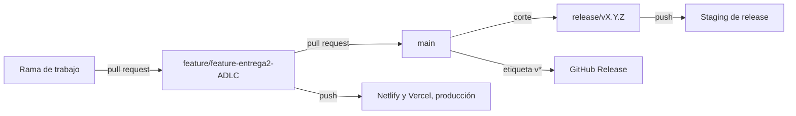

# Entrega y estrategia de ramas

## Resumen

La entrega de SplitEat se apoya en **cinco workflows de GitHub Actions** y en un modelo de ramas
de tres niveles: una rama de trabajo se integra por pull request en
`feature/feature-entrega2-ADLC`, que es la rama de integración y la que dispara el gate de calidad
y los dos despliegues; desde la línea estable `main` se cortan las ramas `release/vX.Y.Z`, y una
etiqueta `v*` publica la versión en GitHub Releases. El bundle publicado es estático y **no lee
ninguna variable de entorno**: no existe `frontend/.env.example` ni ninguna referencia
`import.meta.env` en el código. Este documento es la fuente canónica del modelo de ramas, de la
guarda de carga de revisión y del inventario, disparadores y destino de los workflows; quedan fuera
la elección del destino de despliegue, que es `DEC-ARCH-07` en `architecture/decisions`, y el
detalle del gate de pruebas, que pertenece a `quality/testing-strategy`. El documento cubre más de
un estado a la vez —el proceso entregado, una guarda de revisión declarada `parcial` y un pipeline
en la nube que se conserva como registro de evolución— y esa separación está declarada por
secciones en la tabla de `## Estado`.

## Estado

| Sección del documento | Área | Estado | Permanencia | Evidencia |
| :--- | :--- | :--- | :--- | :--- |
| `## Detalle` › Modelo de ramas | Modelo de ramas: rama de trabajo, pull request, rama de integración `feature/feature-entrega2-ADLC`, línea estable `main` y ramas `release/vX.Y.Z` | `entregado` | `definitivo` | Los cinco disparadores de `.github/workflows/`; `DEC-PRO-04` |
| `## Detalle` › Modelo de ramas | Integración por pull request con gate de calidad en la rama de integración | `entregado` | `definitivo` | `.github/workflows/ci.yml` dispara sobre `pull_request` y sobre `push` a `feature/feature-entrega2-ADLC` |
| `## Detalle` › Guarda de carga de revisión | Regla de pull request de menos de 400 líneas y PRs encadenadas | `parcial` | — | La convención está documentada en este documento; no hay plantilla de PR, ni comprobación de tamaño en el gate, ni evidencia recogida de su aplicación en el historial (`DEC-PRO-06`) |
| `## Detalle` › Los cinco workflows | Gate de integración continua: workflow `CI`, job `Lint · Build · Test` | `entregado` | `definitivo` | `.github/workflows/ci.yml` |
| `## Detalle` › Los cinco workflows | Despliegue del bundle en Netlify | `entregado` | `definitivo` | `.github/workflows/deploy-netlify.yml`; `DEC-ARCH-07` |
| `## Detalle` › Los cinco workflows | Despliegue del bundle en Vercel | `entregado` | `definitivo` | `.github/workflows/deploy-vercel.yml`; `DEC-ARCH-07` |
| `## Detalle` › Los cinco workflows | Prueba y publicación de una rama de release en staging | `entregado` | `definitivo` | `.github/workflows/release-staging.yml` |
| `## Detalle` › Los cinco workflows | Publicación de la versión en GitHub Releases desde una etiqueta `v*` | `entregado` | `definitivo` | `.github/workflows/release.yml`; etiquetas `v0.1.0` y `v0.2.0` |
| `## Detalle` › Variables de entorno y secretos | Configuración de entorno de la aplicación | `entregado` | `definitivo` | `grep -rnE -e 'VITE_[A-Z_]+' -e 'import\.meta\.env' frontend/src` → 0 resultados; `frontend/.env.example` no existe |
| `## Detalle` › Variables de entorno y secretos | Secretos de los workflows | `entregado` | `definitivo` | `NETLIFY_AUTH_TOKEN`, `NETLIFY_SITE_ID`, `VERCEL_TOKEN`, `VERCEL_ORG_ID`, `VERCEL_PROJECT_ID` y `GITHUB_TOKEN` en los cinco archivos de `.github/workflows/` |
| `## Detalle` › El pipeline descartado | Despliegue en Firebase Hosting, variables `VITE_FIREBASE_*` y `VISION_API_KEY` en Secret Manager | `descartado` | — | `DEC-ARCH-07` y `DEC-ARCH-04` registran el descarte; `grep -ril firebase frontend/src` → 0 archivos |

La columna `permanencia` distingue la entrega estable de la provisional. Las filas entregadas del
proceso se declaran `definitivo` porque no hay un sustituto identificado para ellas. La guarda de
carga de revisión no lleva permanencia porque su estado es `parcial` y lo que falta no es un
sustituto, sino la evidencia de su aplicación; el pipeline descartado tampoco la lleva, porque no
existe nada que sustituir: ya está retirado y su reemplazo, Netlify y Vercel, figura en su propia
fila. Ninguna fila declara `temporal`.

## Detalle

La entrega de este proyecto se organiza alrededor de una sola rama de integración y no de un flujo
con dos ramas permanentes. Esa forma responde a la naturaleza del producto: una aplicación de
cliente cuyo artefacto publicado es un directorio estático, de modo que publicar no exige preparar
un entorno de servidor y la distancia entre integrar y publicar es la misma que hay entre empujar
a una rama y leer la salida de un workflow. El documento anterior describía un flujo GitFlow con
una rama `develop` y una rama de release propia que no existen en el repositorio, y un despliegue
en Firebase Hosting que nunca se configuró; esta versión declara el modelo real y conserva el
pipeline retirado como registro de evolución.

### Modelo de ramas

| Elemento del modelo | Valor | Evidencia |
| :--- | :--- | :--- |
| Rama de trabajo | Cualquier rama de funcionalidad o de corrección donde se hace el cambio | El modelo de entrada en integración de los cinco workflows |
| Integración | Pull request hacia `feature/feature-entrega2-ADLC` | `.github/workflows/ci.yml` dispara sobre `pull_request` dirigido a esa rama |
| Rama de integración | `feature/feature-entrega2-ADLC` | Los disparadores `push` de `ci.yml`, `deploy-netlify.yml` y `deploy-vercel.yml` |
| Línea estable | `main`, alcanzada por pull request desde la rama de integración | El modelo documentado; ningún workflow dispara sobre `main` |
| Ramas de release | `release/vX.Y.Z`, cortadas de la línea estable | `.github/workflows/release-staging.yml` dispara sobre `release/**` |
| Etiquetas de versión | `v0.1.0` y `v0.2.0` | `.github/workflows/release.yml` dispara sobre etiquetas `v*`; `docs/traceability/evidence.md` |
| Rama de integración ausente | Ningún workflow declara `develop` | `grep -rn 'develop' .github/workflows/` → sin salida |



<!-- mermaid-companion: flujo-ramas-entrega -->

| Nodo | Descripción |
| :--- | :--- |
| `Work` | Rama de funcionalidad o de corrección donde se prepara el cambio |
| `Integration` | Rama de integración `feature/feature-entrega2-ADLC`; recibe los pull request y ejecuta el gate |
| `Main` | Línea estable del repositorio, alcanzada por pull request desde la rama de integración |
| `Release` | Rama `release/vX.Y.Z` cortada de la línea estable |
| `Staging` | Publicación de prueba y alias de staging que dispara el push a la rama de release |
| `Deploy` | Publicación del bundle en producción de Netlify y de Vercel |
| `Tag` | Publicación de la versión en GitHub Releases desde una etiqueta `v*` |

| Origen | Relación | Destino |
| :--- | :--- | :--- |
| `Work` | se integra con un pull request en | `Integration` |
| `Integration` | llega a la línea estable con un pull request a | `Main` |
| `Main` | produce el corte de | `Release` |
| `Release` | dispara con su push el | `Staging` |
| `Integration` | dispara con su push el | `Deploy` |
| `Main` | publica la versión al etiquetar con `v*` un | `Tag` |

El despliegue de producción no lo dispara `main` sino la rama de integración, y esa es la parte del
modelo que más conviene tener presente: cada push a `feature/feature-entrega2-ADLC` publica el
bundle en Netlify y en Vercel, de modo que la rama de integración es a la vez el entorno de
integración y el origen de lo publicado. La consecuencia práctica es que un cambio llega a un
destino público antes de que la línea estable lo reciba, y que la revisión del pull request es la
única puerta previa a esa publicación. El documento anterior situaba el despliegue en `main` y
deducía de ahí una puerta que en la práctica no existe; la corrección está registrada en
`DEC-PRO-04`.

### Guarda de carga de revisión

| Elemento de la guarda | Valor | Origen |
| :--- | :--- | :--- |
| Límite de líneas por pull request | 400 | Este documento, que es su fuente canónica |
| Encadenado | Cada pull request apunta a la rama de integración con sus propias pruebas y una implementación completa de su porción | Este documento |
| Descomposición de un cambio grande | PRs autónomos y secuenciales | Este documento |
| Mecanismo de aplicación | Ninguno: no hay plantilla de pull request ni comprobación de tamaño en el gate | `ls .github/` → solo `workflows`; `.github/workflows/ci.yml` no mide el tamaño del cambio |
| Aplicación en el historial de PR | No verificada en esta pasada | No se inspeccionó el historial de PR y el repositorio no deja rastro de la regla |

La guarda existe para proteger la revisión, y su motivo no ha cambiado: un cambio de más de 400
líneas deja de leerse con detalle y la revisión se degrada a una comprobación de que las pruebas
pasan. Por eso la descomposición propuesta no es por archivos ni por capas, sino por unidades
autónomas que se pueden revisar y ejecutar por separado. Lo que este documento corrige es el
ejemplo que acompañaba a la regla: citaba `TSK-3.5` como «Cloud OCR + Regex Parser» y una
integración con Google Cloud Vision, dos elementos que pertenecen al alcance descartado, y
apuntaba los PRs encadenados a `main` o a `develop` en lugar de a la rama de integración real. La
regla se conserva como convención declarada, con su estado `parcial` y su decisión en `DEC-PRO-06`,
porque sin evidencia de su aplicación no se puede afirmar que el historial la cumpla.

### Los cinco workflows

El repositorio tiene exactamente **cinco workflows** y ninguno más. Cuatro publican o preparan una
publicación y uno es el gate de integración; los tres que instalan dependencias y construyen el
bundle —`ci.yml`, `deploy-netlify.yml` y `release-staging.yml`— trabajan con Node 22 y pnpm 11.10.0
y usan `frontend` como directorio de trabajo.

| # | Workflow | Disparador | Job | Qué hace |
| :---: | :--- | :--- | :--- | :--- |
| 1 | `.github/workflows/ci.yml` | `pull_request` y `push` sobre `feature/feature-entrega2-ADLC` | `Lint · Build · Test`, en `frontend/` | `pnpm lint` → `eslint . --report-unused-disable-directives --max-warnings 0`; `pnpm build` → `tsc -b && vite build`; `pnpm test` → `vitest run` |
| 2 | `.github/workflows/deploy-netlify.yml` | `push` sobre `feature/feature-entrega2-ADLC` con cambios en `frontend/**` o en el propio workflow, y `workflow_dispatch` | `Deploy frontend to Netlify` | Instala, construye y publica el directorio `dist` en producción de Netlify |
| 3 | `.github/workflows/deploy-vercel.yml` | Igual que el anterior | `Deploy frontend to Vercel` | Publica el bundle en producción de Vercel con `amondnet/vercel-action@v42` y el directorio raíz `frontend` |
| 4 | `.github/workflows/release-staging.yml` | `push` sobre `release/**` y `workflow_dispatch` | `Test and stage release`, en `frontend/` | Repite lint, build y test, y publica un preview de Vercel y un alias de staging en Netlify |
| 5 | `.github/workflows/release.yml` | `push` de etiquetas `v*` y `workflow_dispatch` con la etiqueta como entrada | `Create GitHub Release` | Compone las notas desde los commits posteriores a la etiqueta anterior y crea la release, con `permissions: contents: write` |

| Hecho | Valor | Evidencia |
| :--- | :--- | :--- |
| Workflows del repositorio | 5 | `ls .github/workflows/*.yml \| wc -l` |
| Runtime e instalador de los workflows que construyen | Node 22 y pnpm 11.10.0 con `--frozen-lockfile` | `actions/setup-node` y `pnpm/action-setup` en `ci.yml`, `deploy-netlify.yml` y `release-staging.yml`, que son los tres que instalan |
| Concurrencia | Grupo por referencia en `ci.yml` y en `release-staging.yml`; grupos fijos por destino en los dos despliegues | bloques `concurrency` de los cinco archivos |
| Segundo lugar donde corren lint, build y test | `release-staging.yml` | `.github/workflows/release-staging.yml` |
| Workflows que no ejecutan pruebas | `deploy-netlify.yml`, `deploy-vercel.yml` y `release.yml` | los tres archivos |
| Secretos de publicación | `NETLIFY_AUTH_TOKEN` y `NETLIFY_SITE_ID`; `VERCEL_TOKEN`, `VERCEL_ORG_ID` y `VERCEL_PROJECT_ID`; `GITHUB_TOKEN` | los cinco archivos de `.github/workflows/` |

La división en cinco workflows separa tres responsabilidades que conviene no mezclar. La primera es
el gate: `ci.yml` es el único lugar donde lint, tipos y pruebas se ejecutan sobre cada cambio que
entra en la rama de integración, y su detalle pertenece a
[Estrategia de pruebas y calidad](/docs/quality/testing-strategy.md). La segunda es la publicación:
los dos despliegues son independientes y publican el mismo bundle en dos proveedores, lo que da dos
frentes de disponibilidad sin mantener una cuenta ni una consola de nube para servir archivos
estáticos, según `DEC-ARCH-07`. La tercera es la versión: `release-staging.yml` prepara una candidata
y `release.yml` la convierte en una entrada de GitHub Releases. Que `release-staging.yml` repita
lint, build y test tiene una razón concreta: una rama cortada de la línea estable no tiene por qué
haber pasado por el gate de la rama de integración, así que la publicación de staging vuelve a
comprobar lo mismo antes de publicar.

### Variables de entorno y secretos

| Hecho | Valor | Evidencia |
| :--- | :--- | :--- |
| Variables de entorno de la aplicación | Ninguna | `grep -rnE -e 'VITE_[A-Z_]+' -e 'import\.meta\.env' frontend/src` → 0 resultados |
| Archivo de ejemplo de entorno | No existe | `ls frontend/.env.example` → no such file or directory |
| Configuración externa en tiempo de ejecución | Ninguna: el bundle es estático y los modelos de OCR se descargan en el dispositivo | `docs/architecture/stack.md` |
| Secretos de publicación en el repositorio | Cinco más el token de GitHub, consumidos solo por los workflows | `.github/workflows/` |

La ausencia de variables de entorno no es un descuido de configuración: es la consecuencia de que
no haya nada externo que configurar. El bundle no se conecta a ninguna API, no apunta a ninguna
base de datos y no necesita credenciales en tiempo de ejecución, porque el OCR y la persistencia
ocurren en el dispositivo. Los únicos secretos existen para que la integración continua pueda
publicar en nombre del repositorio, y por eso no llegan al código: se pasan al paso de despliegue
desde la configuración del repositorio.

### El pipeline descartado

El documento anterior describía un pipeline de nube que no llegó a ejecutarse. Se conserva aquí
como registro de evolución, con su motivo, porque explica para qué se pensó cada pieza y por qué
dejó de tener sentido. El descarte del destino de despliegue está registrado en `DEC-ARCH-07` y el
de la infraestructura de nube, en `DEC-ARCH-04`.

| Pieza del pipeline anterior | Estado | Qué la sustituyó |
| :--- | :--- | :--- |
| `main` desplegado en `Firebase Hosting` | `descartado` | Netlify y Vercel, según `DEC-ARCH-07` |
| Workflow `CD Deploy` con `FirebaseExtended/action-hosting-deploy@v0` y el canal `live` | `descartado` | `deploy-netlify.yml` y `deploy-vercel.yml` |
| Variables `VITE_FIREBASE_*` inyectadas en la construcción | `descartado` | Ninguna: el bundle no lee variables de entorno |
| Archivos de entorno con emuladores y servicios de Firebase | `descartado` | No existe ningún archivo de entorno en `frontend/` |
| `VISION_API_KEY` en Secret Manager para las Cloud Functions | `descartado` | No hay OCR remoto: el motor `'server'` sigue `latente` sin servicio, según `DEC-ARCH-09` |
| Flujo de validación con `npm ci`, `npm run format:check`, `npm run test:ci` y Playwright | `descartado` | El gate real es `ci.yml`, con pnpm y sin navegador ni comprobación de formato |

El pipeline de nube existía porque el plan del producto incluía un backend: si el OCR se ejecuta en
una función serverless, hace falta un proyecto de nube con su clave de API, y si el resultado se
sirve desde el mismo proveedor, el despliegue forma parte de esa misma consola. Cuando el alcance
se cerró como aplicación de cliente, las tres piezas perdieron su sujeto a la vez: sin OCR remoto
no hay clave que guardar, sin backend no hay proyecto de nube que administrar y sin proyecto de
nube no hay hosting que configurar. Lo que quedó es un directorio estático que se publica en dos
destinos. Lo que el documento anterior daba por vigente y no existe —pruebas de extremo a extremo,
auditoría de accesibilidad automatizada y medición de cobertura— está declarado `planificado` en
`quality/testing-strategy`, que es su fuente canónica, junto con el alcance real de la suite.

### Límites de este documento

| Punto | Qué no se pudo determinar | Por qué |
| :--- | :--- | :--- |
| Aplicación de la guarda de 400 líneas | Si los PR del historial respetaron el límite y el encadenado | El repositorio no contiene plantilla de PR ni comprobación de tamaño, y en esta pasada no se inspeccionó el historial de PR |
| Fecha de las etiquetas `v0.1.0` y `v0.2.0` | Cuándo se publicó cada versión | La fuente canónica de las etiquetas es `docs/traceability/evidence.md`, que registra su existencia y no su fecha |
| Contenido de las release publicadas | Qué incluye cada entrada de GitHub Releases | Las notas las compone `release.yml` desde los commits; no se descargó ninguna release para comprobarlas |
| Estado de acceso de los destinos desplegados | Si el sitio de Netlify y el de Vercel responden | No se consultaron las URLs; su verificación corresponde a `docs/traceability/evidence.md` |

## Decisiones

| id | fecha | decisión | contexto | alternativas | elección | motivo | estado |
| :--- | :--- | :--- | :--- | :--- | :--- | :--- | :--- |
| `DEC-PRO-04` | 2026-09-22 | Declarar el modelo real de ramas: rama de trabajo, pull request hacia `feature/feature-entrega2-ADLC`, línea estable `main` y ramas `release/vX.Y.Z` cortadas de la línea estable | El documento describía un flujo con una rama `develop` y una rama de release propia que no aparecen en ningún workflow, y situaba el despliegue de producción en `main` | Mantener la descripción anterior; declarar el modelo real verificado en los workflows | El modelo real: una sola rama de integración, `main` como línea estable y `release/vX.Y.Z` para las candidatas | Un modelo de ramas que no coincide con los disparadores del repositorio no se puede comprobar ni seguir: cualquiera que abra un pull request descubre que el destino y las puertas son otros. Declarar el modelo de los workflows hace que el documento y los archivos se puedan cotejar con un `grep` | `entregado` |
| `DEC-PRO-05` | 2026-09-22 | Retirar la afirmación de despliegue en Firebase Hosting y el pipeline con `VITE_FIREBASE_*` y `VISION_API_KEY`, y conservar su razonamiento como registro de evolución | El documento declaraba como vigente un despliegue y un conjunto de secretos que no existen: el repositorio publica en Netlify y Vercel y el código no lee ninguna variable de entorno | Eliminar el pipeline sin más; mantenerlo como vigente; conservarlo reencuadrado como registro | Conservarlo reencuadrado, declarando el descarte y remitiendo la decisión de despliegue a `DEC-ARCH-07` | El pipeline explica por qué el plan necesitaba un proyecto de nube, y ese motivo es lo que permite entender la forma actual de la entrega; eliminarlo borraría la razón y dejaría el cambio sin explicación. La decisión de despliegue no se duplica: su documento canónico es `architecture/decisions` | `entregado` |
| `DEC-PRO-06` | 2026-09-22 | Conservar la guarda de carga de revisión como convención declarada, con estado `parcial`, y corregir sus ejemplos | La regla no tiene mecanismo de aplicación en el repositorio y su ejemplo citaba tareas y una integración del alcance descartado, además de apuntar los PRs a ramas que no son la de integración | Retirar la regla; declararla `entregado` sin matices; conservarla como convención y declarar el estado real | Conservarla como convención con estado `parcial`, con los ejemplos corregidos y el límite declarado en `## Detalle` | La regla protege la revisión, que es un objetivo vigente, pero un estado `entregado` afirmaría que se aplica y no hay evidencia de ello. Declararla `parcial` mantiene el objetivo visible sin presentar como hecho lo que no se ha comprobado | `parcial` |

La elección del destino de despliegue y el descarte de la infraestructura de nube no se repiten
aquí: su documento canónico es `docs/architecture/decisions.md`, donde están registradas como
`DEC-ARCH-07` y `DEC-ARCH-04`. El detalle del gate de lint, build y test y el alcance real de la
suite pertenecen a `docs/quality/testing-strategy.md`.

## Cómo verificar este documento

- [ ] Frontmatter completo:

```bash
for k in doc_id title domain audience status source_of_truth_for last_verified verified_against; do
  grep -q "^$k:" docs/process/delivery-and-branching.md && echo "OK: $k" || echo "FALLO: $k"
done
```

- [ ] Las seis secciones canónicas están presentes y en orden relativo creciente:

```bash
grep -nE '^## ' docs/process/delivery-and-branching.md
```

- [ ] El H1 repite el campo `title` y es el único del documento:

```bash
grep -nE '^# ' docs/process/delivery-and-branching.md
```

- [ ] Los cinco workflows reales están documentados y no falta ninguno. La salida esperada son cinco líneas `OK`, una por archivo:

```bash
for f in .github/workflows/*.yml; do
  grep -q "$f" docs/process/delivery-and-branching.md && echo "OK: $f" || echo "FALLO: $f"
done
```

- [ ] El número de workflows documentado coincide con el del repositorio:

```bash
echo "workflows en el repositorio: $(ls .github/workflows/*.yml | wc -l | tr -d ' ')"
grep -c '^| [0-9] | `.github/workflows/' docs/process/delivery-and-branching.md
```

- [ ] No queda ninguna afirmación vigente de Firebase Hosting, de `VITE_FIREBASE_*` ni de `VISION_API_KEY`. El filtro excluye las citas, los comandos y las filas marcadas como descartadas:

```bash
grep -niE 'firebase hosting|firebaseextended|vite_firebase|vision_api_key' docs/process/delivery-and-branching.md \
  | grep -viE '«|»|`|grep |descartad|nunca se configur|no existe' \
  && echo "FALLO: afirmación vigente" || echo "OK: toda mención está reencuadrada"
```

- [ ] No queda ninguna afirmación de una rama `develop` ni de la rama de release del plan:

```bash
grep -niE 'develop' docs/process/delivery-and-branching.md \
  | grep -viE '«|»|`|grep |ningún|no aparece|ausente|en lugar de' \
  && echo "FALLO: afirmación vigente" || echo "OK: toda mención está reencuadrada"
```

- [ ] El modelo de ramas declarado coincide con los disparadores reales de los workflows:

```bash
grep -rn 'branches:' .github/workflows/ | sed 's/^/disparador: /'
grep -n 'feature/feature-entrega2-ADLC' docs/process/delivery-and-branching.md | head -5
```

- [ ] La aplicación no tiene variables de entorno ni archivo de ejemplo:

```bash
echo "referencias de entorno en el código: $(grep -rnE 'VITE_[A-Z_]+|import\.meta\.env' frontend/src | wc -l | tr -d ' ')"
ls frontend/.env.example 2>&1
```

- [ ] Hay un acompañamiento textual por cada diagrama Mermaid. El patrón de la primera orden evita los tres acentos graves seguidos que cerrarían el bloque:

```bash
m=$(grep -cE '^[[:punct:]]{3}mermaid' docs/process/delivery-and-branching.md)
c=$(grep -c '^<!-- mermaid-companion' docs/process/delivery-and-branching.md)
[ "$m" = "$c" ] && echo "OK: $m/$c" || echo "FALLO: $m diagramas / $c acompañamientos"
```

- [ ] Los nodos del diagrama se repiten en la tabla de acompañamiento:

```bash
for n in Work Integration Main Release Staging Deploy Tag; do
  grep -q "\`$n\`" docs/process/delivery-and-branching.md && echo "OK: $n" || echo "FALLO: $n"
done
```

- [ ] Sin enlaces que suban directorios y sin expresiones ambiguas en uso. Las clases de caracteres de la segunda orden evitan que el propio comando active la comprobación del estándar:

```bash
grep -n '](\.\./' docs/process/delivery-and-branching.md && echo "FALLO" || echo "OK: sin rutas relativas profundas"
grep -rniE 'prev[i]sto|se us[a]rá|est[a] definido|planificad[o] para|se implement[a]rá|\[Pend[i]ng\]|\bRea[d]y\b' docs/process/delivery-and-branching.md \
  | grep -viE '«|»|`' && echo "FALLO" || echo "OK: sin expresiones ambiguas en uso"
```

- [ ] Las decisiones propias se declaran solo aquí y el despliegue no se duplica:

```bash
grep -oE 'DEC-PRO-[0-9]{2}' docs/process/delivery-and-branching.md | sort -u | tr '\n' ' '
grep -c 'DEC-ARCH-07' docs/architecture/decisions.md
```

- [ ] La tabla de `## Estado` usa la columna `permanencia` con valores admitidos y no declara ninguna fila `temporal` sin sustituto:

```bash
awk '/^## Estado/{f=1; next} /^## Detalle/{f=0} f && /^\| /' docs/process/delivery-and-branching.md | grep -oE '`(temporal|definitivo)`' | sort | uniq -c
awk '/^## Estado/{f=1; next} /^## Detalle/{f=0} f && /^\| /' docs/process/delivery-and-branching.md | grep -c '`mixto`'
```

## Referencias

- [Estándar de escritura dual](/docs/DOC-STANDARD.md) — fuente canónica del esquema de frontmatter, del esqueleto de seis secciones, del vocabulario de estado y de la columna `permanencia`
- [Registro de decisiones de arquitectura](/docs/architecture/decisions.md) — `DEC-ARCH-07` fija Netlify y Vercel y descarta Firebase Hosting; `DEC-ARCH-04` descarta la nube
- [Estrategia de pruebas y calidad](/docs/quality/testing-strategy.md) — detalle del gate de lint, build y test, y alcance real de la suite
- [Stack tecnológico](/docs/architecture/stack.md) — stack entregado y publicación del bundle estático
- [Evolución del alcance de datos](/docs/data/scope-evolution.md) — registro histórico del alcance de nube descartado
- [Plan técnico](/docs/process/technical-plan.md) — fases del plan, rama declarada que no existió y remisión del modelo de ramas a este documento
- [Flujo de trabajo asistido por IA](/docs/process/ai-workflow.md) — ciclo de trabajo con IA del proyecto
- [Evidencia y métricas](/docs/traceability/evidence.md) — etiquetas de versión y métricas de entrega
- [Plan de reorganización documental](/docs/plan-reorganizacion.md) — secciones 2.3 y 4, y ficha T7
- [Requisitos de producto](/docs/product/prd.md) — alcance entregado y decisiones de producto
- `.github/workflows/ci.yml` — gate de integración continua
- `.github/workflows/deploy-netlify.yml` — publicación del bundle en Netlify
- `.github/workflows/deploy-vercel.yml` — publicación del bundle en Vercel
- `.github/workflows/release-staging.yml` — prueba y publicación de una rama de release en staging
- `.github/workflows/release.yml` — publicación de la versión en GitHub Releases
- `frontend/package.json` — scripts `lint`, `build` y `test` que ejecuta el gate
- `frontend/netlify.toml` y `frontend/vercel.json` — configuración de los dos destinos de despliegue
