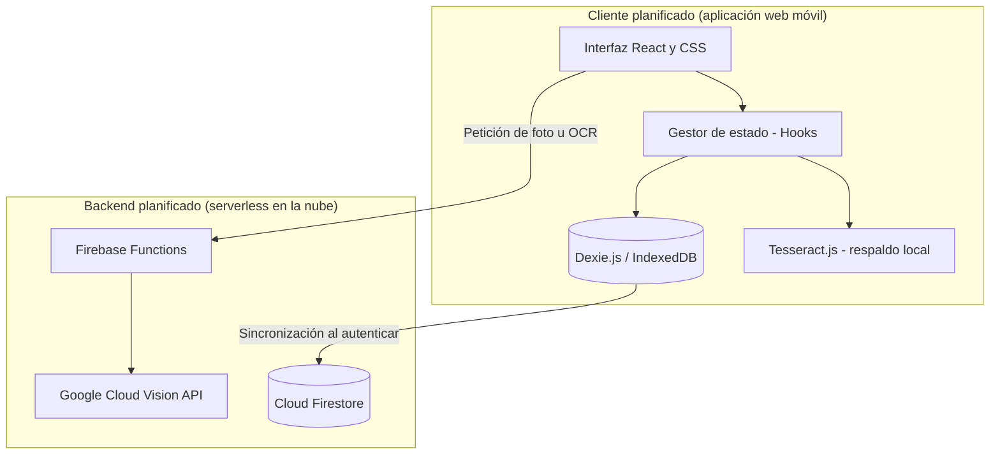

# Plan técnico de SplitEat

## Resumen

El plan técnico de SplitEat se organiza en cinco fases, `PLAN-1` a `PLAN-5`, que **no son tareas
canónicas**: el trabajo real se registra con identificadores `TSK-x.y` en el backlog, que es su
propietario, y este documento enumera las fases y las remite allí. El MVP que el plan describía
dependía de un backend para el OCR avanzado y la sincronización en la nube; el producto
entregado es una **aplicación de cliente sin backend**, con el OCR ejecutado en el dispositivo y
la persistencia en `localStorage`. Este documento es la fuente canónica de las fases del plan, del
espacio de nombres `PLAN-N` y de la resolución de la colisión de `TSK-x.y` dentro del plan; quedan
fuera el modelo de datos, que pertenece a `data/local-model`, el stack, que pertenece a
`architecture/stack`, el registro de decisiones, que pertenece a `architecture/decisions`, y la
estrategia de ramas y entrega, que pertenece a `process/delivery-and-branching`. El documento cubre
más de un estado a la vez —fases entregadas, una fase parcial, una rama latente y una fase
descartada— y esa separación está declarada por secciones en la tabla de `## Estado`.

## Estado

| Sección del documento | Área | Estado | Permanencia | Evidencia |
| :--- | :--- | :--- | :--- | :--- |
| `## Detalle` › Las fases del plan y el backlog | `PLAN-1` — preparación del proyecto y almacenamiento local | `parcial` | `temporal` | `TSK-1.1` está `entregado` y `TSK-1.2` está `parcial` en `docs/product/backlog.md`; la capa Dexie está descartada por `DEC-ARCH-04` |
| `## Detalle` › Las fases del plan y el backlog | `PLAN-2` — interfaz y asignación por arrastre | `entregado` | `definitivo` | `TSK-1.6` y `TSK-1.8` en `docs/product/backlog.md`; `frontend/src/components/ticket/` |
| `## Detalle` › Las fases del plan y el backlog | `PLAN-3` — OCR en dispositivo y parser | `entregado` | `definitivo` | `TSK-1.3` y `TSK-1.4`; `frontend/src/lib/scan/` con los tres motores y el parser común |
| `## Detalle` › Las fases del plan y el backlog | `PLAN-3` — OCR de servidor | `latente` | — | `TSK-3.5` está `latente` en `docs/product/backlog.md`; `DEC-ARCH-09` mantiene la vía abierta |
| `## Detalle` › Las fases del plan y el backlog | `PLAN-4` — redondeo, alertas y gamificación | `entregado` | `definitivo` | `TSK-2.1` a `TSK-2.6` en `docs/product/backlog.md`; `frontend/src/lib/calc.ts` |
| `## Detalle` › Las fases del plan y el backlog | `PLAN-5` — autenticación opcional y sincronización en la nube | `descartado` | — | `DEC-PROD-08` y `DEC-ARCH-04` registran el descarte; `grep -ril firebase frontend/src` → 0 archivos |
| `## Detalle` › Las fases del plan y el backlog | Numeración de fases `PLAN-1` a `PLAN-5` y remisión del trabajo a `product/backlog` | `entregado` | `definitivo` | `DEC-PRO-01`; `DEC-PROD-11` fija la propiedad del espacio de nombres `TSK-x.y` en el backlog |
| `## Detalle` › Arquitectura y stack | Diagrama de la arquitectura planificada, conservado como registro histórico | `entregado` | `definitivo` | Un bloque Mermaid con su acompañamiento textual; la arquitectura vigente está en `docs/architecture/overview.md` |
| `## Detalle` › Riesgos de borde que el plan identificó | Descuadre de céntimos en divisiones | `parcial` | `definitivo` | `verifyCuadre` verifica el cuadre con tolerancia de un céntimo en `frontend/src/lib/calc.ts:182-196`; el algoritmo de ajuste que el plan detalla no existe: `grep -rni penny frontend/src` → 0 coincidencias |
| `## Detalle` › Riesgos de borde que el plan identificó | Pérdida de datos por limpieza del navegador | `entregado` | `definitivo` | Copia de seguridad en JSON de F-11, en `frontend/src/lib/store.ts`; detalle canónico en `docs/data/local-model.md` |
| `## Detalle` › Riesgos de borde que el plan identificó | OCR ilegible o sin cobertura | `entregado` | `definitivo` | Motores en dispositivo (`TSK-1.3`) y entrada manual (`TSK-1.7`); `frontend/src/lib/scan/` |
| `## Detalle` › Auditoría de dependencias | Auditoría de dependencias registrada en el plan | `parcial` | — | El plan cita versiones distintas de las declaradas en `frontend/package.json`, y no existe artefacto de auditoría ni paso de escaneo en `.github/workflows/ci.yml` |
| `## Detalle` › Estrategia de ramas | Estrategia de ramas propia del plan | `descartado` | — | El modelo real de ramas está en `docs/process/delivery-and-branching.md`; la rama que el plan declaraba no aparece en ninguno de los cinco workflows del repositorio |

Ninguna fila de esta tabla declara más de un estado: cada una usa un solo término del vocabulario
cerrado, y el documento declara el suyo agregado en el frontmatter. Los estados de las fases no se
repiten aquí desde el backlog: se citan, y su registro canónico es `docs/product/backlog.md`.

La columna `permanencia` distingue la entrega estable de la provisional. La única fila `temporal`
es la de `PLAN-1`: la persistencia entregada es `localStorage`, y su sustituto duradero está
identificado y sin decidir en `docs/data/local-model.md`, donde están el candidato, lo que falta
para decidirlo y `DEC-DATA-01`; el estado de la fase no cambia por ser `temporal`. Las filas
`descartado` y `latente` no llevan permanencia porque describen contenido que no está entregado, y
la auditoría de dependencias tampoco la lleva porque lo que falta es la propia auditoría y no un
sustituto de algo entregado.

## Detalle

El plan técnico se escribió antes de que el alcance del producto se cerrara y describe una
aplicación con backend: OCR avanzado en `Google Cloud Vision` a través de una función serverless,
`Cloud Firestore` para sincronizar el historial y autenticación opcional para usuarios registrados.
El producto entregado es una PWA de cliente sin backend. La corrección de este documento no elimina
el plan: separa lo que el plan propuso, lo que se entregó y lo que quedó descartado, según la regla
«lo planificado no se borra, se reencuadra» del plan de reorganización. La divergencia es de
alcance y no de criterio técnico: el MVP se cerró como aplicación 100 % local en `DEC-PROD-04`, las
funciones que dependían de infraestructura de nube pasaron a alcance evolutivo descartado en
`DEC-PROD-05`, y el epic 3 del backlog quedó como alcance abandonado en `DEC-PROD-08`.

### Las fases del plan y el backlog

Este documento numera su propio desglose con el prefijo `PLAN`. El espacio de nombres `TSK-x.y`
pertenece al [backlog del producto](/docs/product/backlog.md) y no se reutiliza aquí para numerar
fases: los identificadores `TSK-x.y` que aparecen en este documento son referencias al registro
canónico, cuya definición y estado viven en ese documento. La colisión anterior entre ambos
espacios de nombres y su resolución se registran en `DEC-PRO-01` y en `DEC-PROD-11`.

| Fase | Título original en el plan | Estimación del plan | Trabajo canónico de la misma materia (`TSK-x.y`) | Historias que el plan declaraba | Estado de la fase |
| :--- | :--- | :--- | :--- | :--- | :--- |
| `PLAN-1` | Project Setup and Offline-First Storage (Dexie.js) | 3 días | `TSK-1.1`, `TSK-1.2` | `US-09`, `US-11` | `parcial` |
| `PLAN-2` | UI Framework & Drag-and-Drop Assignment | 5 días | `TSK-1.6`, `TSK-1.8` | `US-03`, `US-04` | `entregado` |
| `PLAN-3` | OCR Processing & Parser Engine | 6 días | `TSK-1.3`, `TSK-1.4`, `TSK-1.5`, `TSK-3.5` | `US-01`, `US-02` | `entregado` en dispositivo, `latente` en servidor |
| `PLAN-4` | Rounding, Alerter & Gamification (Ruleta del Pagador) | 4 días | `TSK-2.1` a `TSK-2.6` | `US-06`, `US-07`, `US-08` | `entregado` |
| `PLAN-5` | Optional Auth & Cloud Synchronization | 5 días | Ninguna: `TSK-3.1` a `TSK-3.4`, `TSK-3.6` y `TSK-3.7` pertenecen al epic 3, declarado abandonado | `US-10`, `US-11`, `US-12` | `descartado` |

La correspondencia entre fase y tarea canónica es de materia y no de identidad: el plan agrupa en
cinco fases el trabajo que el backlog registra en 27 tareas de cuatro epics, y el plan no era el
registro de ese trabajo. Por eso la columna de tareas canónicas cita varios identificadores por
fase y ninguna fila de la tabla declara un `TSK-x.y` propio.

| Historia declarada por el plan | Fase que la declaraba | Epic en el backlog | Estado en el backlog |
| :--- | :--- | :--- | :--- |
| `US-01`, `US-02` | `PLAN-3` | Epic 1 — Core | `entregado` |
| `US-03` | `PLAN-2` | Epic 1 — Core | `entregado` |
| `US-04` | `PLAN-2` | Epic 2 — Advanced | `entregado` |
| `US-06`, `US-07`, `US-08` | `PLAN-4` | Epic 2 — Advanced | `entregado` |
| `US-09` | `PLAN-1` | Epic 2 — Advanced | `entregado` |
| `US-10`, `US-11`, `US-12` | `PLAN-5` | Epic 3 — Cloud | `descartado` |

La única historia que el plan declaraba en más de una fase es `US-11`, que aparece en `PLAN-1` y en
`PLAN-5`; su estado canónico es `descartado`, coherente con el alcance abandonado del epic 3.

### El MVP entregado no tiene backend

El plan define el MVP con «un backend mínimo para OCR avanzado y sincronización en la nube
opcional para usuarios registrados». Esa definición no corresponde al producto entregado.

| Hecho | Valor | Evidencia |
| :--- | :--- | :--- |
| MVP entregado | Aplicación de cliente, sin backend | `DEC-PROD-04`; funciones F-01 a F-11 en `docs/product/prd.md` |
| Presencia de Firebase en el código | 0 archivos | `grep -ril firebase frontend/src` → 0 archivos |
| Carpetas `backend/` y `db/` | Sin código: solo `.keep` y una nota de ubicación | `DEC-ARCH-04` |
| OCR | En el dispositivo, dentro de un worker | `DEC-ARCH-03`; `frontend/src/lib/scan/`, `frontend/src/workers/ocr.worker.ts` |
| Persistencia | `localStorage` con Zustand `persist`, clave `spliteat-app-v1` | `docs/data/local-model.md`; `frontend/src/lib/store.ts` |
| Publicación del producto | Bundle estático en Netlify y Vercel | `DEC-ARCH-07` |
| Funciones F-12 a F-14 y métricas asociadas | Alcance evolutivo descartado | `DEC-PROD-05` |

El motivo de la divergencia no es una limitación técnica sobrevenida: la restricción de producto
—funcionar sin conexión y sin cuenta de usuario— se decidió antes de cerrar el alcance y dejó sin
trabajo a todas las piezas de nube. Sin servidor no hay función que procese imágenes, sin base de
datos remota no hay sincronización que programar y sin registro no hay usuario que autenticar. Esta
consecuencia está desarrollada en `docs/data/scope-evolution.md`, que conserva el alcance
descartado, y en `docs/architecture/decisions.md`, que registra las decisiones con sus
alternativas.

### Arquitectura y stack

El plan describía un cliente SPA con estado y almacenamiento local, y un backend serverless con
`Firebase Functions`, `Google Cloud Vision` y `Cloud Firestore`. El diagrama se conserva como registro
de lo planificado, porque explica por qué el plan proponía cada pieza; **no describe el producto
entregado**. La arquitectura vigente está en `docs/architecture/overview.md` y el stack entregado,
en `docs/architecture/stack.md`.



<!-- mermaid-companion: arquitectura-planificada-descartada -->

| Nodo | Descripción | Estado en el producto entregado |
| :--- | :--- | :--- |
| `UI` | Interfaz React y CSS del cliente móvil | `entregado` como interfaz de cliente; no existe la arista hacia una función en la nube |
| `CoreState` | Gestor de estado del cliente basado en hooks | `entregado` con Zustand en lugar de hooks propios |
| `LocalDB` | Base de datos local Dexie.js sobre IndexedDB | `descartado` por `DEC-ARCH-04`; la persistencia entregada es `localStorage` |
| `LocalOCR` | Tesseract.js como respaldo cuando falla la nube | `entregado` como motor principal, no como respaldo: el OCR se ejecuta en el dispositivo |
| `CloudFunc` | Función serverless de procesamiento de imágenes | `descartado` por `DEC-ARCH-04`; no existe backend |
| `VisionAPI` | Google Cloud Vision para detección de texto | `descartado` por `DEC-ARCH-03`; el OCR remoto queda `latente` como motor `'server'` |
| `Firestore` | Base de datos en la nube para la sincronización | `descartado` por `DEC-ARCH-04`; no hay cuenta ni sincronización |

| Origen | Relación | Destino |
| :--- | :--- | :--- |
| `UI` | envía la petición de foto u OCR a | `CloudFunc` |
| `UI` | delega el estado en | `CoreState` |
| `CoreState` | persiste el ticket en | `LocalDB` |
| `CoreState` | invoca el OCR de | `LocalOCR` |
| `LocalDB` | sincroniza al autenticar con | `Firestore` |
| `CloudFunc` | llama a | `VisionAPI` |

| Pieza | Lo que el plan declaraba | Lo entregado | Documento canónico |
| :--- | :--- | :--- | :--- |
| Framework y empaquetado | React 18.2.0 + TypeScript, compilado con Vite 5.0.0 | `react` `^18.3.1`, `typescript` `^5.9.3` y `vite` `^5.4.21` en `frontend/package.json` | `docs/architecture/stack.md` |
| Estilos | Vanilla CSS con variables propias, Grid y Flexbox | Tailwind CSS v4 con 27 paquetes `@radix-ui/*` | `DEC-ARCH-02` |
| Persistencia local | Dexie.js 4.0.0 sobre IndexedDB | `localStorage` con Zustand `persist`; `dexie` está declarado en `frontend/package.json:51` y no se importa | `DEC-ARCH-04` |
| OCR en dispositivo | Tesseract.js 5.0.0 | `tesseract.js` `^5.1.1` y `@huggingface/transformers` `^4.2.0`, con tres motores | `DEC-ARCH-03` |
| OCR remoto | Firebase Cloud Functions (Node.js 20) sobre Google Cloud Vision | No existe; el motor `'server'` sigue declarado y sin servicio que lo atienda | `DEC-ARCH-09` |
| Base de datos en la nube | Cloud Firestore + Firebase Authentication | No existe | `DEC-ARCH-04` |
| Despliegue | El plan no lo trataba en su apartado de arquitectura | Netlify y Vercel desde GitHub Actions | `DEC-ARCH-07` |

El plan justificaba Vanilla CSS por el rendimiento en dispositivos de gama media y baja, y eligió
Dexie por su tipado, sus consultas y su soporte transaccional sobre IndexedDB. Ninguna de las dos
razones era errónea en su contexto: la primera quedó superada porque Tailwind v4 resuelve el mismo
objetivo con utilidades y un bloque `@theme`, y la segunda perdió su motivo cuando el producto se
cerró sin nube, porque una base de datos con índices y transacciones deja de ser necesaria cuando
el estado completo cabe en una instantánea JSON. El motivo del segundo cambio está en
`DEC-ARCH-04` y su detalle técnico, en `docs/data/local-model.md`.

### `PLAN-1` — preparación del proyecto y almacenamiento local

| Elemento del entregable del plan | Estado | Evidencia |
| :--- | :--- | :--- |
| Repositorio configurado con Vite + React + TypeScript | `entregado` | `TSK-1.1`; `frontend/package.json`, `frontend/vite.config.ts` |
| Base de datos Dexie.js con tablas para `tickets`, `items`, `participants` y `sessions` | `descartado` | `grep -rn "from 'dexie'" frontend/src` → 0 líneas; `DEC-ARCH-04` |
| Pruebas de la base de datos local | `entregado` | `frontend/src/lib/store.test.ts`, con 42 casos |
| Requisito de negocio declarado en el plan: `US-09`, `US-11` | `US-09` `entregado`, `US-11` `descartado` | `docs/product/backlog.md`, epics 2 y 3 |

El plan nombra la capa de almacenamiento y no la tarea que la construye, de modo que la fase se
declara `parcial`: la preparación del proyecto está entregada y la capa Dexie está descartada. La
persistencia entregada no queda sin documentar por ello: su esquema, su clave, su ciclo de vida y
sus límites están en `docs/data/local-model.md`. Su permanencia es `temporal` y no `definitivo`:
`docs/data/local-model.md` identifica el candidato de sustituto —un almacén duradero en el
navegador con índices y transacciones— y lo que falta para decidirlo, y `DEC-DATA-01` registra la
declaración.

### `PLAN-2` — interfaz y asignación por arrastre

| Elemento del entregable del plan | Estado | Evidencia |
| :--- | :--- | :--- |
| Estructura visual de la mesa interactiva: líneas del ticket y avatares de participantes | `entregado` | `TSK-1.8`; `frontend/src/components/ticket/` |
| Componentes táctiles de asignación: arrastrar una línea a una persona y tocar para dividir | `entregado` | `@dnd-kit/core` `^6.3.1` y `@dnd-kit/sortable` `^10.0.0` en `frontend/package.json` |
| Estado global de la cuenta | `entregado` | `TSK-1.6`; `frontend/src/lib/store.ts` |
| Requisito de negocio declarado en el plan: `US-03`, `US-04` | `entregado` | `docs/product/backlog.md`, epics 1 y 2 |

El plan eligió React por la gestión de estado visual dinámico que exige el arrastre, y esa razón se
mantuvo: la asignación por arrastre es una de las funciones entregadas y su biblioteca de arrastre
está declarada en el manifiesto. El detalle funcional de la asignación pertenece a
`docs/product/user-stories/` y no se repite aquí.

### `PLAN-3` — OCR en dispositivo y parser

| Elemento del entregable del plan | Estado | Evidencia |
| :--- | :--- | :--- |
| Función de Firebase para procesar imágenes con Google Cloud Vision | `descartado` | `DEC-ARCH-04`; `grep -ril firebase frontend/src` → 0 archivos |
| Heurísticas locales de expresiones regulares para parsear líneas de ticket | `entregado` | `TSK-1.4`; `frontend/src/lib/scan/receipt-parser.ts` |
| Pipeline de respaldo sin conexión que activa el OCR local o la entrada manual | `entregado` | `TSK-1.3` y `TSK-1.7`; `frontend/src/lib/scan/orchestrator.ts` |
| Cobertura de pruebas sobre variaciones de tickets reales | `entregado` | `frontend/src/lib/scan/receipt-parser.test.ts`, con 66 casos |
| OCR remoto como motor seleccionable | `latente` | `TSK-3.5`; `DEC-ARCH-09` |
| Requisito de negocio declarado en el plan: `US-01`, `US-02` | `entregado` | `docs/product/backlog.md`, epic 1 |

El plan invertía la relación entre los dos motores: el OCR de nube era el principal y Tesseract.js
el respaldo local para cuando faltara conexión. Lo entregado es lo contrario, y el motivo es el
mismo que retiró el backend: el producto funciona sin conexión y no tiene servidor, así que el
único OCR posible es el del dispositivo. Lo que sobrevivió del plan es la cascada de motores, hoy
con Tesseract, Tesseract con reconocimiento de entidades y Florence-2, y el parser común que
convierte el texto en líneas de ticket. El motor `'server'` sigue declarado en el código y sin
servicio que lo atienda, lo que mantiene la vía de retorno abierta como elemento `latente` según
`DEC-ARCH-09`; su detalle está en `docs/data/scope-evolution.md`.

### `PLAN-4` — redondeo, alertas y gamificación

| Elemento del entregable del plan | Estado | Evidencia |
| :--- | :--- | :--- |
| Cuadre matemático del reparto y vista de dictado al camarero | `parcial` | `verifyCuadre` en `frontend/src/lib/calc.ts:182-196` verifica el cuadre con tolerancia de un céntimo; `TSK-2.6` está `entregado` |
| Avisos de líneas sin asignar y de decimales flotantes | `entregado` | `TSK-2.3`; `frontend/src/lib/calc.ts:198-210` con `itemsFullyAssigned` |
| Componente interactivo de la ruleta del pagador | `entregado` | `TSK-2.5`; `frontend/src/components/` |
| Pruebas del redondeo y del estado de cuadre | `entregado` | `frontend/src/lib/calc.test.ts`, con 53 casos |
| Requisito de negocio declarado en el plan: `US-06`, `US-07`, `US-08` | `entregado` | `docs/product/backlog.md`, epic 2 |

La fase se declara `parcial` por un solo elemento: el algoritmo de ajuste de céntimos que el plan
describe como mitigación del descuadre. Lo entregado verifica el cuadre en lugar de corregirlo, y
`frontend/src` no contiene ninguna función de ajuste con ese nombre ni equivalente declarado,
según documenta `docs/quality/testing-strategy.md`. El resto de la fase está entregado.

### `PLAN-5` — autenticación opcional y sincronización en la nube

| Elemento del entregable del plan | Estado | Evidencia |
| :--- | :--- | :--- |
| Configuración de Firebase Authentication y Cloud Firestore | `descartado` | `DEC-PROD-08`; `grep -ril firebase frontend/src` → 0 archivos |
| Servicio de sincronización que migra los datos locales a Firestore al iniciar sesión | `descartado` | `DEC-ARCH-04`; `grep -ril firestore frontend/src` → 0 archivos |
| Generador sin conexión de QR de Bizum y textos para compartir por WhatsApp | `descartado` | `grep -rli bizum frontend/src` → 0 archivos |
| Pruebas de reglas de seguridad y de flujos de inicio de sesión | `descartado` | `DEC-PROD-08`; el epic 3 no tiene código asociado |
| Requisito de negocio declarado en el plan: `US-10`, `US-11`, `US-12` | `descartado` | `docs/product/backlog.md`, epic 3 |

Esta fase se conserva íntegra como registro de lo planificado, y su razonamiento sigue siendo útil
porque explica qué se habría construido y por qué no se construyó. El plan la situaba como opcional
y separada del flujo sin registro, con la intención de no romper el funcionamiento sin conexión;
esa separación fue la que permitió retirarla sin tocar el MVP. Lo que la retiró no fue un fallo de
diseño, sino el cierre del alcance: sin cuenta de usuario no hay autenticación que configurar, sin
sincronización no hay migración que programar y sin servidor no hay reglas de seguridad que
desplegar. Las decisiones del descarte están en `DEC-PROD-08`, para el epic completo, y en
`DEC-ARCH-04`, para la infraestructura; el alcance conservado con su motivo, en
`docs/data/scope-evolution.md`.

### Riesgos de borde que el plan identificó

| Riesgo | Mitigación detallada en el plan | Lo que existe hoy | Estado |
| :--- | :--- | :--- | :--- |
| Descuadre de céntimos al dividir | Algoritmo de ajuste que reparte redondeado y asigna la diferencia al último comensal, con aviso visible | `verifyCuadre` comprueba que la suma de las partes coincide con el total dentro de una tolerancia de un céntimo; `round2` redondea para presentar | `parcial` |
| Pérdida de datos por limpieza del navegador | Exportación manual a un archivo JSON y aviso contextual tras varias divisiones | Copia de seguridad en JSON de F-11, con validación estructural al importar | `entregado` |
| OCR ilegible o sin cobertura | Uso de Tesseract.js local con aviso de menor precisión, y entrada por voz o manual | Cascada de tres motores en dispositivo y pantalla de corrección manual | `entregado` |

El riesgo de descuadre se planificó como un problema de corrección y se resolvió como un problema
de verificación: el reparto por pesos reparte céntimo a céntimo cuando hace falta y el cuadre se
comprueba, de modo que la interfaz avisa cuando algo no cuadra en lugar de forzar un ajuste. La
mitigación de pérdida de datos es la que más sobrevivió al cambio de alcance, porque no depende del
motor de almacenamiento: exporta el estado serializable a un archivo y lo vuelve a importar con
validación, de modo que un sustituto duradero la conservaría sin rehacerla. El tercer riesgo perdió
su premisa al desaparecer la nube: ya no hay una decisión que tomar entre el motor remoto y el
local, porque el único motor existente es el del dispositivo; la entrada manual sigue entregada
como respaldo de la lectura.

### Auditoría de dependencias

| Dependencia | Versión citada en el plan | Versión declarada en `frontend/package.json` | Auditoría vigente |
| :--- | :--- | :--- | :--- |
| React | 18.2.0 | `react` `^18.3.1` y `react-dom` `^18.3.1` | No registrada |
| Dexie | 4.0.0 | `dexie` `^4.4.4`, sin importaciones | No registrada |
| Tesseract.js | 5.0.0 | `tesseract.js` `^5.1.1` | No registrada |

El plan registró una auditoría de tres dependencias con el resultado «sin CVE críticos o altos». Esa
auditoría es un registro del momento en que se escribió y no una afirmación vigente: las versiones
que cita no coinciden con las declaradas hoy y el repositorio no contiene ningún artefacto de
auditoría, ni un paso de escaneo de dependencias en `.github/workflows/ci.yml`. La única
comprobación de dependencias que se ejecuta en el gate es la instalación con el archivo de bloqueo
congelado. No se repite ninguna conclusión de la auditoría original como si siguiera siendo válida.

### Estrategia de ramas

El plan declaraba una estrategia de ramas de funcionalidad que se consolidaban en una rama estable
de preproducción, con una rama propia para el flujo sin registro y otra para la nube.

| Afirmación del plan | Realidad | Evidencia |
| :--- | :--- | :--- |
| El flujo sin registro se integra en una rama de release propia | Esa rama no existió y no aparece en ningún workflow | Los cinco archivos de `.github/workflows/` disparan sobre `feature/feature-entrega2-ADLC`, sobre `release/**` o sobre etiquetas `v*` |
| El trabajo de nube se desarrolla en una rama secundaria y se integra con una PR separada | No existe trabajo de nube que integrar | `DEC-PROD-08` |

Este documento no documenta ramas: el modelo real, sus disparadores y sus puertas de revisión están
en `docs/process/delivery-and-branching.md`, que es su documento canónico. Mantener aquí una
segunda descripción del modelo de ramas duplicaría el hecho y volvería a separarlo, que es el
problema que este plan corrige; la decisión de remitirlo está en `DEC-PRO-03`.

## Decisiones

| id | fecha | decisión | contexto | alternativas | elección | motivo | estado |
| :--- | :--- | :--- | :--- | :--- | :--- | :--- | :--- |
| `DEC-PRO-01` | 2026-09-22 | Numerar las fases de este plan como `PLAN-1` a `PLAN-5` y remitir el trabajo a `docs/product/backlog.md` | El plan numeraba sus cinco tareas con identificadores `TSK-x.y`; `TSK-2.1` y `TSK-3.1` significaban cosas distintas en cada documento y el plan usaba un `TSK-5.1` que no pertenece a ningún epic | Mantener los dos espacios de nombres; renumerar las tareas del plan dentro del rango `TSK` existente; ceder la propiedad del espacio de nombres al plan | Prefijo propio `PLAN-N` para las fases, con referencias al `TSK-x.y` canónico y al backlog como propietario | El backlog es el registro de epics e identificadores y este plan no pertenece a ningún epic, de modo que su desglose no puede ocupar el espacio de nombres del registro. Un prefijo propio hace la colisión imposible por construcción y la convierte en detectable con un `grep` | `entregado` |
| `DEC-PRO-02` | 2026-09-22 | Conservar las fases no entregadas como registro de evolución, con su estado declarado, en lugar de eliminarlas | La fase 5 completa y el OCR de servidor de la fase 3 describen trabajo que no se construyó, y el documento anterior los presentaba junto al trabajo entregado | Eliminarlos; conservarlos sin corregir; conservarlos reencuadrados con su estado | Conservarlos reencuadrados: la fase 5 como `descartado` y el OCR de servidor como `latente` | El razonamiento del descarte no se puede reconstruir desde el código: leer por qué se planificó cada pieza evita que un lector futuro repita el diseño sin conocer el motivo por el que se retiró. El estado declarado impide además que el contenido no entregado se lea como vigente | `entregado` |
| `DEC-PRO-03` | 2026-09-22 | Remitir la estrategia de ramas a `docs/process/delivery-and-branching.md` y no declarar ramas propias en este plan | El plan declaraba una rama de release propia que nunca existió, y el modelo real de ramas ya está documentado en el dominio de proceso | Mantener una estrategia de ramas propia en el plan; remitirla al documento canónico | El plan referencia el modelo de ramas y no lo describe | Un hecho con una sola fuente canónica se puede comprobar con un `grep`; mantener dos descripciones del mismo modelo garantiza que vuelvan a divergir, que es exactamente lo que ocurrió entre el plan y el repositorio | `entregado` |

Las decisiones de alcance y de arquitectura que fijan el MVP de cliente, el descarte de la nube y
el motor OCR de servidor no se repiten aquí: su documento canónico es `docs/product/prd.md` para
`DEC-PROD-04`, `DEC-PROD-05` y `DEC-PROD-08`, y `docs/architecture/decisions.md` para `DEC-ARCH-03`,
`DEC-ARCH-04`, `DEC-ARCH-07` y `DEC-ARCH-09`. La propiedad del espacio de nombres `TSK-x.y` está
fijada en `DEC-PROD-11`, dentro de `docs/product/backlog.md`.

## Cómo verificar este documento

- [ ] Frontmatter completo:

```bash
for k in doc_id title domain audience status source_of_truth_for last_verified verified_against; do
  grep -q "^$k:" docs/process/technical-plan.md && echo "OK: $k" || echo "FALLO: $k"
done
```

- [ ] Las seis secciones canónicas están presentes y en orden relativo creciente:

```bash
grep -nE '^## ' docs/process/technical-plan.md
```

- [ ] El H1 repite el campo `title` y es el único del documento:

```bash
grep -nE '^# ' docs/process/technical-plan.md
```

- [ ] Las fases del plan usan el prefijo propio `PLAN-` y son cinco:

```bash
grep -oE '\bPLAN-[0-9]+\b' docs/process/technical-plan.md | sort -u | tr '\n' ' '
```

- [ ] Ningún `TSK-x.y` de este documento numera una fase: cada identificador citado existe en el registro canónico:

```bash
for id in $(grep -oE 'TSK-[0-9]+\.[0-9]+' docs/process/technical-plan.md | sort -u | grep -vE '^TSK-5\.1$'); do
  grep -q "| $id |" docs/product/backlog.md && echo "OK: $id existe en el backlog" || echo "FALLO: $id no existe en el backlog"
done
```

- [ ] El identificador retirado `TSK-5.1` aparece solo citado como parte de la colisión resuelta. La salida esperada son tres líneas: la fila de `DEC-PRO-01`, el enunciado de esta comprobación y su propio comando:

```bash
grep -n 'TSK-5.1' docs/process/technical-plan.md
```

- [ ] No queda ninguna afirmación vigente de que el MVP tenga backend, ni la rama de release del plan. El filtro excluye las citas entre comillas angulares y los comandos:

```bash
grep -niE 'backend mínimo|release/mvp-offline' docs/process/technical-plan.md \
  | grep -viE '«|»|`|grep ' \
  && echo "FALLO: afirmación vigente" || echo "OK: toda mención está reencuadrada"
```

- [ ] No queda ninguna afirmación vigente de OCR en la nube: cada mención de Firebase o de Cloud Vision está citada, reencuadrada o dentro del diagrama histórico:

```bash
grep -niE 'firebase|cloud vision' docs/process/technical-plan.md \
  | grep -viE '«|»|`|-->|grep |echo |no existe|descartad|latente|reencuadr' \
  && echo "FALLO: mención sin reencuadrar" || echo "OK: toda mención está reencuadrada"
```

- [ ] Hay un acompañamiento textual por cada diagrama Mermaid. El patrón de la primera orden evita los tres acentos graves seguidos que cerrarían el bloque:

```bash
m=$(grep -cE '^[[:punct:]]{3}mermaid' docs/process/technical-plan.md)
c=$(grep -c '^<!-- mermaid-companion' docs/process/technical-plan.md)
[ "$m" = "$c" ] && echo "OK: $m/$c" || echo "FALLO: $m diagramas / $c acompañamientos"
```

- [ ] Los nodos del diagrama se repiten en la tabla de acompañamiento:

```bash
for n in UI CoreState LocalDB LocalOCR CloudFunc VisionAPI Firestore; do
  grep -q "\`$n\`" docs/process/technical-plan.md && echo "OK: $n" || echo "FALLO: $n"
done
```

- [ ] Las afirmaciones sobre el producto entregado coinciden con el código:

```bash
echo "firebase en el código: $(grep -ril firebase frontend/src | wc -l) archivos"
echo "bizum en el código: $(grep -rli bizum frontend/src | wc -l) archivos"
echo "importaciones de dexie: $(grep -rn "from 'dexie'" frontend/src | wc -l) líneas"
echo "funciones de ajuste de céntimos: $(grep -rni penny frontend/src | wc -l) coincidencias"
```

- [ ] Sin enlaces que suban directorios y sin expresiones ambiguas en uso. Las clases de caracteres de la segunda orden evitan que el propio comando active la comprobación del estándar:

```bash
grep -n '](\.\./' docs/process/technical-plan.md && echo "FALLO" || echo "OK: sin rutas relativas profundas"
grep -rniE 'prev[i]sto|se us[a]rá|est[a] definido|planificad[o] para|se implement[a]rá|\[Pend[i]ng\]|\bRea[d]y\b' docs/process/technical-plan.md \
  | grep -viE '«|»|`' && echo "FALLO" || echo "OK: sin expresiones ambiguas en uso"
```

- [ ] Las decisiones propias se declaran solo aquí y el resto se citan:

```bash
grep -oE 'DEC-PRO-[0-9]{2}' docs/process/technical-plan.md | sort -u | tr '\n' ' '
grep -c 'DEC-PROD-11' docs/product/backlog.md
```

- [ ] La tabla de `## Estado` usa la columna `permanencia` con valores admitidos, no declara ninguna fila `temporal` sin sustituto y no usa el término `mixto`:

```bash
awk '/^## Estado/{f=1; next} /^## Detalle/{f=0} f && /^\| /' docs/process/technical-plan.md | grep -oE '`(temporal|definitivo)`' | sort | uniq -c
awk '/^## Estado/{f=1; next} /^## Detalle/{f=0} f && /^\| /' docs/process/technical-plan.md | grep -c '`mixto`'
```

## Referencias

- [Estándar de escritura dual](/docs/DOC-STANDARD.md) — fuente canónica del esquema de frontmatter, del esqueleto de seis secciones, del vocabulario de estado y del acompañamiento de diagramas
- [Backlog del producto](/docs/product/backlog.md) — propietario canónico de los identificadores `TSK-x.y` y `US-xx`, con la colisión y su resolución en `DEC-PROD-11`
- [Plan de reorganización documental](/docs/plan-reorganizacion.md) — secciones 2.1, 2.3, 4 y ficha T7, que fijan el diagnóstico y el tratamiento del alcance no entregado
- [Decisiones de arquitectura](/docs/architecture/decisions.md) — registro canónico de `DEC-ARCH-03`, `DEC-ARCH-04`, `DEC-ARCH-07` y `DEC-ARCH-09`
- [Requisitos de producto](/docs/product/prd.md) — funciones F-01 a F-14 y decisiones `DEC-PROD-04`, `DEC-PROD-05` y `DEC-PROD-06`
- [Evolución del alcance de datos](/docs/data/scope-evolution.md) — registro histórico de la nube y de Dexie, con su motivo de descarte
- [Modelo de datos local](/docs/data/local-model.md) — esquema, clave y ciclo de vida de la persistencia entregada
- [Arquitectura del sistema](/docs/architecture/overview.md) — arquitectura vigente del producto entregado
- [Stack tecnológico](/docs/architecture/stack.md) — stack entregado, versiones declaradas y motivo de cada elección
- [Estrategia de pruebas](/docs/quality/testing-strategy.md) — gate de integración continua y lectura verificada del reparto al céntimo
- [Entrega y estrategia de ramas](/docs/process/delivery-and-branching.md) — modelo de ramas, PRs encadenadas y workflows reales
- [Flujo de trabajo asistido por IA](/docs/process/ai-workflow.md) — ciclo de trabajo con IA del proyecto
- `frontend/package.json` — versiones declaradas de `dexie`, `tesseract.js`, `@huggingface/transformers` y el resto de dependencias
- `frontend/src/lib/calc.ts` — reparto, redondeo y verificación del cuadre
- `frontend/src/lib/scan/` — pipeline de OCR en dispositivo: orquestador, motores y parser
- `frontend/src/lib/store.ts` — estado global, persistencia en `localStorage` y copia de seguridad en JSON
- `.github/workflows/` — cinco workflows del repositorio, con sus disparadores y sus destinos
