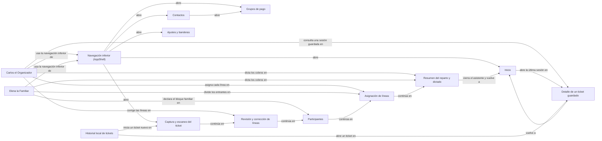

# PRD del producto SplitEat

## Resumen

El MVP entregado de SplitEat son las funciones F-01…F-11: todas locales, sin cuenta de usuario y
sin nube, apoyadas en OCR en el dispositivo y persistencia en `localStorage`. Este documento es la
fuente canónica de las funciones del producto, de sus requisitos y métricas de negocio y de sus
restricciones. Las funciones premium F-12…F-14 y las métricas ligadas al registro y a la base de
datos en la nube quedaron descartadas y viven en el apartado de alcance evolutivo, no como
requisitos «Should». El único elemento latente es el motor OCR de servidor, declarado en el código
sin contraparte de servicio. El documento cubre más de un estado y lo declara en la tabla de
`## Estado`.

## Estado

| Área | Estado | Evidencia |
| :--- | :--- | :--- |
| MVP entregado (F-01…F-11) | `entregado` | `frontend/src/lib/scan/`, `frontend/src/lib/calc.ts`, `frontend/src/lib/store.ts`; `grep -ril firebase frontend/src` → 0 archivos |
| Funciones premium y de nube (F-12…F-14) | `descartado` | `DEC-PROD-05`; `backend/` y `db/` no contienen código: solo `.keep` y una nota de ubicación |
| Motor OCR de servidor | `latente` | `DEC-PROD-05`; el motor `'server'` sigue declarado en `frontend/src/lib/types.ts` y `frontend/src/workers/ocr.worker.ts`, sin servicio que lo atienda |
| Objetivos locales O-01 y O-02, KPIs K-01 y K-02 | `parcial` | Requisitos de producto declarados; su medición no está instrumentada y sigue sin dato |
| Objetivo O-03 y KPI K-03 (conversión a registro en nube) | `descartado` | `DEC-PROD-05`; no existe registro de usuario ni base de datos en la nube |
| Personas, segmentos y contexto competitivo | `entregado` | Describen el producto de cliente entregado |
| Restricciones técnicas, de negocio y regulatorias | `entregado` | Flujo offline-first y procesamiento local en `frontend/src/` |
| Alcance excluido (pasarelas de pago, POS, sincronización obligatoria) | `descartado` | `DEC-PROD-06`; el producto es informativo y de un solo dispositivo |

## Detalle

### Visión, problema y propuesta de valor

SplitEat es una aplicación web móvil para dividir el ticket de un restaurante de forma individual o
ponderada. El flujo principal es local y offline: se elimina la fricción de cobertura en la mesa y
el registro de usuario deja de ser una capa opcional para quedar descartado junto con la nube. La
visión y el problema son canónicos en `docs/product/brief.md`; aquí se conservan como contexto de
las funciones.

El problema se concreta en tres puntos: el cálculo manual rápido en la mesa genera estrés y errores;
las aplicaciones que exigen conexión o registro fallan en sótanos y zonas con baja señal; y las
soluciones improvisadas, como dividir a partes iguales, penalizan a quien consume menos o terminan
en descuadres de céntimos.

### Personas y segmentos

| Persona | Rol | Contexto | Necesidad principal | Métrica de éxito |
| :--- | :--- | :--- | :--- | :--- |
| Carlos el Organizador | Amigo organizador del grupo | Cenas de 6 a 10 personas; pide la cuenta y reparte los cobros | Escanear el ticket sin conexión y ver qué falta por asignar | Reducir la división de la cuenta a menos de 90 segundos |
| Elena la Familiar | Madre en cena grupal | Paga de forma conjunta por su subgrupo familiar | Agrupar a su familia como un bloque pagador y dividir entrantes | Asignar consumos a la «Familia Gómez» con dos toques |

| Segmento | Tipo | Descripción | Tamaño estimado | Valor estratégico |
| :--- | :--- | :--- | :--- | :--- |
| Consumidores sociales (B2C) | Primario | Personas de 18 a 45 años que comen en grupo y usan smartphone | 15 M de usuarios en España (sin validar) | Adopción orgánica por boca a boca |
| Familias y parejas (B2C) | Secundario | Grupos familiares con pagos consolidados de subgrupo | 5 M de usuarios en España (sin validar) | Diferenciación frente a calculadoras simples |

### MVP entregado: funciones locales (F-01…F-11)

| ID | Función | Capacidad | Persona | Prioridad | Estado |
| :--- | :--- | :--- | :--- | :--- | :--- |
| F-01 | Escaneo OCR inteligente | Extraer productos, cantidades, precios unitarios, IVA, nombre del local y fecha | Carlos | Must | `entregado` |
| F-02 | Entrada por voz o texto offline | Añadir productos por dictado o transcripción manual si el OCR falla o no hay cámara | Carlos | Should | `entregado` |
| F-03 | Extracción de metadatos EXIF | Extraer localmente geolocalización, tipo de cámara y fecha/hora de la imagen | Carlos | Should | `entregado` |
| F-04 | Asignación visual e interactiva | Arrastrar y asignar productos a personas o subgrupos creados en el momento | Carlos / Elena | Must | `entregado` |
| F-05 | División matemática de platos y cuadre | Dividir el coste de un plato entre varios comensales con cuadre exacto al céntimo | Elena | Must | `entregado` |
| F-06 | Vista de dictado al camarero | Ver el desglose ordenado por comensal o familia para dictar los cobros | Carlos / Elena | Must | `entregado` |
| F-07 | Redondeo visual e individual | Ver el redondeo al euro por comensal y el total de redondeo acumulado | Carlos | Must | `entregado` |
| F-08 | Gamificación: la ruleta del pagador | Sortear en local quién paga un plato, la propina o el ticket completo | Carlos | Should | `entregado` |
| F-09 | Alerta de platos huérfanos y descuadres | Avisar de platos sin asignar o descuadres de céntimos, con auto-reparto rápido | Carlos | Must | `entregado` |
| F-10 | Asignador rápido de entrantes | Dividir varios platos comunes entre todo el grupo con un solo toque | Elena | Should | `entregado` |
| F-11 | Historial local y backups JSON | Ver las últimas sesiones guardadas localmente y descargar un backup `.json` | Carlos | Should | `entregado` |

El MVP es local por decisión de producto: cubrir la mesa sin cobertura y sin obligar a crear una
cuenta. El OCR se ejecuta en el dispositivo con Tesseract.js y con el VLM Florence-2
(`@huggingface/transformers`, WebGPU/WASM), y la persistencia real es `localStorage` mediante
Zustand persist. `dexie@4.4.4` figura en `frontend/package.json` pero no tiene ningún import.

### Casos de uso del MVP entregado

El producto entregado tiene dos personas y ninguna cuenta: no existe inicio de sesión y no hay
nada que sincronizar, de modo que las dos actúan sobre el mismo dispositivo y el mismo estado
local. El diagrama siguiente recoge los casos de uso del MVP entregado. Las aristas de actor se
derivan de la columna Persona de la tabla de funciones F-01…F-11 y de la navegación inferior de
`frontend/src/components/layout/AppShell.tsx`; las aristas de flujo se derivan de las rutas
declaradas en `frontend/src/main.tsx`.



<!-- mermaid-companion: casos-de-uso-mvp -->

| Nodo | Tipo | Descripción |
| :--- | :--- | :--- |
| `Carlos` | Actor | Carlos el Organizador: pide la cuenta y reparte los cobros; escanea el ticket y asigna cada línea |
| `Elena` | Actor | Elena la Familiar: agrupa a su familia como un bloque pagador y divide los entrantes |
| `AppShell` | Componente de la SPA | Navegación inferior con cinco destinos: inicio, contactos, nuevo, grupos y ajustes |
| `Home` | Caso de uso | Inicio; resume el ticket en curso y enlaza a la última sesión guardada |
| `Contacts` | Caso de uso | Contactos: alta y consulta de las personas del dispositivo |
| `Groups` | Caso de uso | Grupos de pago y su detalle en `GroupsView` y `GroupDetailView` |
| `Tickets` | Caso de uso | Historial local de tickets guardados |
| `Capture` | Caso de uso | Captura y escaneo del ticket: OCR en dispositivo o entrada manual |
| `Review` | Caso de uso | Revisión y corrección manual de las líneas leídas |
| `Participants` | Caso de uso | Selección de participantes y creación de personas o bloques |
| `Assign` | Caso de uso | Asignación de cada línea a personas o grupos |
| `Summary` | Caso de uso | Resumen del reparto por persona y vista de dictado al camarero |
| `Settings` | Caso de uso | Ajustes del producto y banderas de funcionalidad |
| `TicketDetail` | Caso de uso | Detalle de un ticket guardado |

| Origen | Relación | Destino |
| :--- | :--- | :--- |
| `Carlos` | usa la navegación inferior de | `AppShell` |
| `Elena` | usa la navegación inferior de | `AppShell` |
| `AppShell` | abre | `Home` |
| `AppShell` | abre | `Contacts` |
| `AppShell` | abre | `Capture` |
| `AppShell` | abre | `Groups` |
| `AppShell` | abre | `Settings` |
| `Carlos` | corrige las líneas en | `Review` |
| `Carlos` | asigna cada línea en | `Assign` |
| `Carlos` | dicta los cobros en | `Summary` |
| `Carlos` | consulta una sesión guardada en | `TicketDetail` |
| `Elena` | declara el bloque familiar en | `Participants` |
| `Elena` | divide los entrantes en | `Assign` |
| `Elena` | dicta los cobros en | `Summary` |
| `Home` | abre la última sesión en | `TicketDetail` |
| `TicketDetail` | vuelve a | `Home` |
| `Contacts` | abre | `Groups` |
| `Capture` | continúa en | `Review` |
| `Review` | continúa en | `Participants` |
| `Participants` | continúa en | `Assign` |
| `Assign` | continúa en | `Summary` |
| `Summary` | cierra el asistente y vuelve a | `Home` |
| `Tickets` | abre un ticket en | `TicketDetail` |
| `Tickets` | inicia un ticket nuevo en | `Capture` |

| Ruta | Vista | Nodo del diagrama |
| :--- | :--- | :--- |
| `/` | `HomeView` | `Home` |
| `/contacts` | `ContactsView` | `Contacts` |
| `/groups`, `/groups/:groupId` | `GroupsView`, `GroupDetailView` | `Groups` |
| `/tickets` | `TicketsListView` | `Tickets` |
| `/tickets/new` | `NewTicketShell` (redirige a `capture`) | `Capture` |
| `/tickets/new/capture` | `NewTicketCaptureView` | `Capture` |
| `/tickets/new/review` | `NewTicketReviewView` | `Review` |
| `/tickets/new/participants` | `NewTicketParticipantsView` | `Participants` |
| `/tickets/new/assign` | `NewTicketAssignView` | `Assign` |
| `/tickets/new/summary` | `NewTicketSummaryView` | `Summary` |
| `/tickets/:ticketId` | `TicketDetailView` | `TicketDetail` |
| `/settings`, `/settings/feature-flags` | `SettingsView`, `FeatureFlagsView` | `Settings` |
| `*` | `NotFound` | Sin nodo: no es un flujo de producto |

El diagrama cubre las rutas del producto entregado con dos excepciones explícitas y verificables:
la ruta comodín `*` resuelve a `NotFound`, que no es un flujo de producto, y el caso de uso
`Tickets` no tiene ninguna arista entrante porque la vista del historial no recibe ningún enlace
en el código entregado: se alcanza escribiendo la URL.

### Alcance evolutivo descartado: funciones premium y de nube (F-12…F-14)

| ID | Función | Estado | Motivo del descarte |
| :--- | :--- | :--- | :--- |
| F-12 | QR de cobro Bizum y plantillas dinámicas | `descartado` | Requiere backend para generar el enlace de pago y la mensajería |
| F-13 | Sincronización cloud de amigos y grupos | `descartado` | Requiere cuenta de usuario y base de datos en la nube |
| F-14 | Respaldo e historial cloud completo | `descartado` | Requiere base de datos en la nube y un registro de usuario |

Estas funciones exigían una infraestructura de servidor que el producto entregado no tiene. La
vía hacia un OCR remoto de mayor precisión sigue abierta, pero solo como elemento latente: el motor
`'server'` continúa declarado en `frontend/src/lib/types.ts` y `frontend/src/workers/ocr.worker.ts`
y no existe servicio que lo atienda. La decisión está en `DEC-PROD-05`. El detalle de cada función
descartada se conserva para trazabilidad en `docs/product/user-stories/epic-3-cloud/`.

### Requisitos de negocio locales

| ID | Objetivo | Métrica | Meta | Estado |
| :--- | :--- | :--- | :--- | :--- |
| O-01 | Reducir la fricción y el tiempo de pago en mesa de grupos grandes sin conexión | Tiempo de reparto y cálculo | Menos de 90 segundos | `parcial` |
| O-02 | Maximizar la precisión de extracción y asignación evitando la entrada manual | Tasa de acierto del OCR | Más del 92 % | `parcial` |

| ID | KPI | Línea base | Meta | Estado |
| :--- | :--- | :--- | :--- | :--- |
| K-01 | Tiempo medio del proceso offline | Sin medir (estimado en 5 minutos manual) | Menos de 90 segundos | `parcial` |
| K-02 | Tasa de cuadre matemático al primer intento | Sin medir | 98,5 % | `parcial` |

Los objetivos O-01 y O-02 y los KPIs K-01 y K-02 están declarados como requisitos de producto, pero
no hay instrumentación ni telemetría que los mida sobre el producto entregado; por eso quedan en
`parcial` y no pueden declararse verdes.

### Alcance evolutivo: métricas ligadas al registro y a la nube

| ID | Requisito | Estado | Motivo |
| :--- | :--- | :--- | :--- |
| O-03 | Conversión de anónimo a registrado superior al 10 % a 6 meses | `descartado` | No existe registro de usuario ni base de datos en la nube |
| K-03 | Conversión a perfil registrado medida contra sesiones únicas | `descartado` | La medición dependía de una base de datos cloud inexistente |

### Modelo de negocio

| Elemento | Estado | Detalle |
| :--- | :--- | :--- |
| Herramienta gratuita y sin publicidad | `entregado` | Modelo vigente del producto de cliente |
| Registro opcional como incentivo premium | `descartado` | Dependía de las funciones de nube F-12…F-14 |
| Explotación analítica de datos agregados | `descartado` | Dependía del histórico cloud y del registro de usuario |
| Canales B2B SaaS futuros | `planificado` | Sin trabajo iniciado; no hay código ni diseño asociado |

### Contexto competitivo

| Competidor | Tipo | Fortalezas | Debilidades | Diferenciador de SplitEat |
| :--- | :--- | :--- | :--- | :--- |
| Splitwise | Indirecto | Popular; buena gestión de balances a largo plazo | Obliga a registrar cuentas; tedioso para un solo ticket | Resolver el ticket offline al instante, sin cuentas |
| Calculadora del teléfono | Directo | Rápida, offline y preinstalada | Sin OCR, sin división de platos ni grupos | Lectura visual del ticket e interfaz de asignación offline |

| Diferenciador | Descripción | Necesidad asociada |
| :--- | :--- | :--- |
| Modo de dictado al camarero | Interfaz para dictar los cobros individuales en secuencia | Carlos el Organizador |
| Soporte de familias y agrupaciones | Consolidación de subgrupos de pago dentro de un ticket | Elena la Familiar |
| Cuadre offline con redondeo visual | Cuadre al céntimo y desglose del redondeo acumulado sin conexión | Carlos el Organizador |

### Supuestos

| ID | Supuesto | Riesgo | Método de validación | Estado |
| :--- | :--- | :--- | :--- | :--- |
| A-01 | La cámara basta para extraer el texto con un 85 % de acierto mediante OCR local | Medio | Pruebas de usabilidad con 15 tipos de ticket | `parcial`: sin prueba de usabilidad documentada |
| A-02 | El almacenamiento local del navegador es suficiente y no se limpia de forma agresiva | Bajo | Exportación manual de backup JSON | `parcial`: la mitigación está entregada (F-11), el supuesto no se mide |

### Restricciones

| Tipo | Restricción | Detalle | Estado |
| :--- | :--- | :--- | :--- |
| Técnica | Aplicación web móvil autocontenida | Debe funcionar en navegadores móviles de iOS y Android | `entregado` |
| Técnica | Filosofía offline-first | Cálculo, edición y persistencia funcionan sin internet | `entregado` |
| Técnica | Permisos de cámara y geolocalización | Requieren contexto seguro (HTTPS o localhost) y degradar a entrada manual si se deniegan | `entregado` |
| Negocio | Presupuesto de infraestructura mínimo | El costo de servidor y base de datos es cero para usuarios anónimos | `entregado` |
| Regulatoria | RGPD sobre imagen y metadatos EXIF | El procesamiento es local y anónimo; el envío a la nube exigía consentimiento y quedó descartado | `entregado` |

### Registro de cambios

| Fecha | Versión | Cambio | Autor |
| :--- | :--- | :--- | :--- |
| 2026-06-06 | 1.0.0 | Creación inicial del PRD | Product Owner y PRD Generator AI |
| 2026-06-06 | 1.1.0 | Refactorización a filosofía mobile y offline first, con registro opcional de usuario | Product Owner y PRD Generator AI |
| 2026-09-22 | 1.2.0 | Separación del MVP entregado (F-01…F-11) y del alcance evolutivo descartado (F-12…F-14, métricas de nube) | Reorganización documental T2 |

## Decisiones

| id | fecha | decisión | contexto | alternativas | elección | motivo | estado |
| :--- | :--- | :--- | :--- | :--- | :--- | :--- | :--- |
| `DEC-PROD-04` | 2026-09-22 | Declarar F-01…F-11 como MVP entregado | El PRD ya las agrupaba como funciones 100 % locales, pero mezcladas con el alcance de nube | Mantener la mezcla; separar el MVP entregado | F-01…F-11 como MVP entregado | Son las funciones que existen y funcionan sin backend, sin cuenta y sin nube | `entregado` |
| `DEC-PROD-05` | 2026-09-22 | Mover F-12…F-14 y las métricas O-03 y K-03 al alcance evolutivo descartado | Se contabilizaban como requisitos «Should» aunque dependían de infraestructura de nube inexistente | Mantenerlas como requisitos pendientes; marcarlas `latente`; descartarlas | `descartado`, con el motor OCR de servidor como único elemento `latente` | El producto entregado es de cliente y no existe backend; el motor `'server'` sigue declarado en el código, así que esa vía se conserva como latente | `descartado` |
| `DEC-PROD-06` | 2026-09-22 | Retirar del alcance las pasarelas de pago, la integración POS y la sincronización multi-dispositivo obligatoria | Eran exclusiones declaradas, pero convivían con requisitos de nube que las contradecían | Incorporarlas al producto; mantenerlas excluidas | Mantenerlas excluidas | El producto es informativo, B2C y de un solo dispositivo durante la comida | `descartado` |

## Cómo verificar este documento

- [ ] `for k in doc_id title domain audience status source_of_truth_for last_verified verified_against; do grep -q "^$k:" docs/product/prd.md && echo "OK: $k" || echo "FALLO: $k"; done` → ocho líneas `OK`
- [ ] `awk '/^```/{f=!f; next} !f && /^# /{print NR": "$0}' docs/product/prd.md` → un H1 igual al campo `title`
- [ ] `for s in '## Resumen' '## Estado' '## Detalle' '## Decisiones' '## Cómo verificar este documento' '## Referencias'; do grep -qF "$s" docs/product/prd.md && echo "OK: $s" || echo "FALLO: $s"; done` → seis líneas `OK`
- [ ] `grep -c '^| F-' docs/product/prd.md` → 14 filas, una por función F-01…F-14
- [ ] `grep -cE '^\| F-1[234] .*descartado' docs/product/prd.md` → 3; las funciones premium están en el alcance descartado
- [ ] `grep -rn 'src/' docs/product/prd.md | grep -v 'frontend/src/'` → sin salida
- [ ] `grep -rniE 'previsto|se usará|está definido|planificado para|se implementará' docs/product/prd.md` → sin salida
- [ ] `grep -o 'DEC-[0-9][0-9]' docs/product/prd.md | sort -u | tr '\n' ' '` → `DEC-PROD-04 DEC-PROD-05 DEC-PROD-06`
- [ ] ``m=$(grep -c '^```mermaid' docs/product/prd.md); c=$(grep -c '^<!-- mermaid-companion' docs/product/prd.md); [ "$m" = "$c" ] && echo "OK: $m/$c" || echo "FALLO: $m/$c"`` → `OK: 1/1`
- [ ] ``for n in Carlos Elena AppShell Home Contacts Groups Tickets Capture Review Participants Assign Summary Settings TicketDetail; do grep -qF "\`$n\`" docs/product/prd.md && echo "OK: $n" || echo "FALLO: $n"; done`` → catorce líneas `OK`: los catorce nodos del diagrama aparecen en su acompañamiento
- [ ] ``grep -cE '^\| `/' docs/product/prd.md`` → 12: una fila por ruta del producto en la tabla de cobertura, sin la ruta comodín
- [ ] `grep -c '^| ' docs/product/prd.md` → al menos 50 filas de tabla

## Referencias

- `docs/product/brief.md` — visión, problema, público objetivo y exclusiones de negocio
- `docs/product/backlog.md` — epics, identificadores, prioridad y estado de cada elemento
- `docs/product/user-stories/` — detalle funcional de las historias y tareas asociadas a F-01…F-14
- `docs/product/user-stories/epic-3-cloud/` — detalle conservado del alcance descartado
- `docs/DOC-STANDARD.md` — estándar de escritura dual que gobierna este documento
- `docs/plan-reorganizacion.md` — diagnóstico y plan de la reorganización documental
