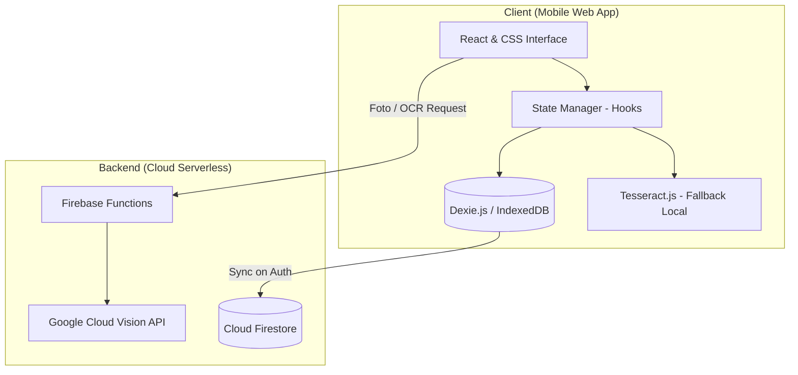

# Technical Plan: SplitEat

## 1. Objectives
Este plan técnico describe la arquitectura, stack tecnológico, mitigación de riesgos y desglose de tareas de desarrollo para implementar SplitEat, una aplicación web mobile-first y offline-first de división de cuentas de restauración. El objetivo es construir un MVP robusto e independiente de internet para su flujo básico, con un backend mínimo para OCR avanzado y sincronización en la nube opcional para usuarios registrados.

---

## 2. Architecture & Tech Stack

### 2.1 Overview & System Context
La aplicación se compone de un cliente Single Page Application (SPA) modular que corre en navegadores móviles y un backend ligero serverless para procesamiento de imágenes de ticket pesado.

### 2.2 Tech Stack
- **Framework Frontend**: React 18.2.0 + TypeScript (compilado con Vite 5.0.0). Se selecciona React por su facilidad para gestionar estados visuales dinámicos (drag-and-drop) y persistencia local modular.
- **Estilos**: Vanilla CSS con variables CSS personalizadas y Grid/Flexbox para rendimiento en dispositivos de gama media-baja.
- **Base de Datos Local (Offline)**: Dexie.js 4.0.0. Es un wrapper sobre IndexedDB que proporciona tipado robusto, consultas sencillas y soporte transaccional nativo ideal para guardar el estado del ticket y comensales.
- **OCR (Local / Cloud)**:
  - *Local*: Tesseract.js 5.0.0 (procesamiento ligero offline directo en el móvil).
  - *Cloud*: Firebase Cloud Functions (Node.js 20) llamando a Google Cloud Vision API para detección de texto de alta precisión (cuando haya conexión).
- **Base de Datos Nube (Opcional)**: Cloud Firestore + Firebase Authentication (para usuarios registrados).

### 2.3 CVE Dependency Audit
- **React v18.2.0**: Sin CVEs críticos/altos.
- **Dexie v4.0.0**: Sin vulnerabilidades conocidas en la base de datos de NPM.
- **Tesseract.js v5.0.0**: Seguro, las dependencias de WebAssembly están compiladas de forma estática y aisladas.

---

## 3. Edge Cases & Mitigations

### 3.1 Edge Case 1: Descuadres de céntimos en divisiones (Penny Discrepancy)
- **Problema**: Dividir 10.00€ entre 3 personas genera 3.3333...€, sumando 9.99€ y dejando 0.01€ en el limbo.
- **Mitigación**: Implementar el algoritmo **"Penny Adjustment Algorithm"**:
  1. Calcular el reparto entero redondeado a 2 decimales para todos menos para el último comensal.
  2. El último comensal (o el creador del ticket) asume la diferencia restante: $Último = Total - \sum(Anteriores)$.
  3. Mostrar visualmente una alerta permitiendo añadir esta diferencia al redondeo de propina común o asignarla manualmente a un participante.

### 3.2 Edge Case 2: Pérdida de datos locales por limpieza del Navegador (Cache Eviction)
- **Problema**: iOS y Android pueden borrar el localStorage o IndexedDB de un sitio web si el usuario no lo visita en 7-14 días o si el dispositivo se queda sin espacio.
- **Mitigación**: 
  1. Implementar exportación manual con un clic a un archivo `.json` de respaldo local.
  2. Notificar de forma contextual al usuario tras realizar 3 divisiones exitosas locales: *"Tus datos están guardados solo en este móvil. Regístrate gratis para respaldar tu historial en la nube."*

### 3.3 Edge Case 3: Procesamiento OCR ilegible o sin cobertura
- **Problema**: El usuario está en un sótano sin datos y toma una foto de un ticket arrugado.
- **Mitigación**:
  1. Si no hay conexión a internet, la aplicación no envía la foto al servidor; ofrece usar Tesseract.js localmente en el móvil (con advertencia de que la precisión será menor) o cambiar directamente a **Entrada por Voz / Manual Rápida**.
  2. La interfaz de corrección manual muestra campos de texto auto-enfocados con controles táctiles grandes para añadir cantidades y precios a mano en segundos.

---

## 4. Development Tasks & Breakdown

### Task 1: Project Setup and Offline-First Storage (Dexie.js)
- **ID**: TSK-1.1
- **Depends on**: None
- **Business Requirement**: US-09, US-11
- **Estimate**: 3 days
- **Deliverable**:
  - Repositorio configurado con Vite + React + TS.
  - Base de datos Dexie.js inicializada con tablas para `tickets`, `items`, `participants` y `sessions`.
  - Tests unitarios de base de datos local (inserción, actualización de relaciones, borrado).

### Task 2: UI Framework & Drag-and-Drop Assignment
- **ID**: TSK-2.1
- **Depends on**: TSK-1.1
- **Business Requirement**: US-03, US-04
- **Estimate**: 5 days
- **Deliverable**:
  - Estructura visual de la mesa interactiva (lista de platos a la izquierda, avatares de participantes a la derecha).
  - Componentes táctiles interactivos de asignación (arrastrar plato a avatar, tocar para dividir).
  - Tests unitarios y de integración de flujo de asignación simulando eventos touch de iOS/Android.

### Task 3: OCR Processing & Parser Engine
- **ID**: TSK-3.1
- **Depends on**: None
- **Business Requirement**: US-01, US-02
- **Estimate**: 6 days
- **Deliverable**:
  - Firebase Cloud Function para procesamiento de imágenes con Google Cloud Vision.
  - Heurísticas locales de expresiones regulares (Regex) para parsear patrones de líneas de ticket (ej. `[cantidad] [nombre] [precio]`).
  - Pipeline de fallback offline que activa Tesseract.js local o entrada manual si falla la red.
  - Cobertura de tests de integración para 10 variaciones de tickets de restaurantes reales.

### Task 4: Rounding, Alerter & Gamification (Ruleta del Pagador)
- **ID**: TSK-4.1
- **Depends on**: TSK-2.1
- **Business Requirement**: US-06, US-07, US-08
- **Estimate**: 4 days
- **Deliverable**:
  - Algoritmo de cuadre matemático ("Penny Adjustment") y vista "Dictado al Camarero".
  - Banner de alertas de platos sin asignar y decimales flotantes.
  - Componente Canvas/CSS interactivo de la ruleta del pagador.
  - Tests unitarios matemáticos de redondeo y comprobaciones del estado de cuadre.

### Task 5: Optional Auth & Cloud Synchronization
- **ID**: TSK-5.1
- **Depends on**: TSK-1.1, TSK-2.1
- **Business Requirement**: US-10, US-11, US-12
- **Estimate**: 5 days
- **Deliverable**:
  - Configuración de Firebase Authentication y base de datos Cloud Firestore.
  - Servicio de sincronización que migra los datos locales de Dexie.js a Firestore tras el login del usuario de forma transparente.
  - Generador offline de QR de Bizum y textos para compartir WhatsApp.
  - Tests de integración de seguridad de base de datos (Security Rules) y flujos de login/sync.

---

## 5. Branching Strategy
Se utilizará una estrategia de **Feature Branches** que se consolidan en una rama estable de pre-producción antes de subir a main.
- Las tareas `TSK-1.1` a `TSK-4.1` (flujo offline obligatorio) se integrarán en una sola rama de release (`release/mvp-offline`) para asegurar la consistencia del flujo sin registro.
- La tarea `TSK-5.1` (nube y registro) se desarrollará en una rama secundaria y se integrará mediante una PR separada para validar que no rompe el comportamiento offline-first.
