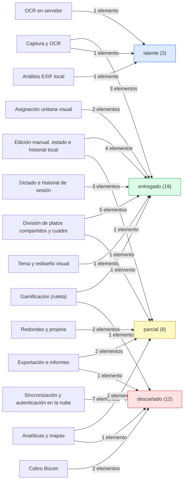

# Evidencia y métricas

## Resumen

El estado de código entregado es `c66fd3f`: 181 commits, 19 de ellos de merge, con las etiquetas
`v0.1.0` y `v0.2.0`; 23 archivos de prueba que declaran 347 casos de forma estática; y cinco
workflows de GitHub Actions. Las dos URLs de despliegue respondieron con código 200 el 2026-09-22.
Los 181 commits **no son todos de este producto**: 18 pertenecen a la semilla heredada de otro
equipo y 7 a la plantilla de un curso, de modo que el trabajo de este producto son 156. El
recuento de casos de prueba es estático —se obtiene leyendo los bloques `it(` y `test(`— y no el
resultado de una ejecución, porque `frontend/node_modules` no está instalado en este árbol de
trabajo. Este documento es la fuente canónica de las métricas y cubre más de un estado: las
métricas están entregadas, la ejecución de la suite queda `parcial` y el diagrama de estado actual
está entregado en este documento; la separación por áreas está en la tabla de `## Estado`.

## Estado

| Área | Estado | Permanencia | Evidencia |
| :--- | :--- | :--- | :--- |
| Métricas de commits, merges y etiquetas del estado de código | `entregado` | `definitivo` | Tabla de métricas de `## Detalle`; cada fila con su comando |
| Descomposición por autor y origen de los 181 commits | `entregado` | `definitivo` | Tabla de autoría; `git log --format='%an' c66fd3f \| sort \| uniq -c \| sort -rn` |
| Inventario de archivos de prueba y recuento estático de casos | `entregado` | `definitivo` | `find` y `grep` sobre `frontend/src`; el desglose por archivo es de `quality/testing-strategy` |
| Ejecución de la suite de pruebas y su resultado | `parcial` | — | El recuento de 347 casos es estático; para ejecutarlos hace falta instalar `frontend/node_modules`. `DEC-TRA-05` |
| Inventario de los cinco workflows de GitHub Actions | `entregado` | `definitivo` | `ls .github/workflows`; disparadores y destino en `process/delivery-and-branching` |
| Estado de acceso observado de las dos URLs de despliegue | `entregado` | `definitivo` | `curl -s -o /dev/null -w '%{http_code}'` → `200` en ambas el 2026-09-22; `DEC-TRA-06` |
| Trazabilidad de commits a historias de usuario | `descartado` | — | Los commits no citan identificadores `US-xx` ni `TSK-x.y`; `DEC-TRA-01` en `traceability/user-stories-traceability` |
| Diagrama de estado actual (D3) | `entregado` | `definitivo` | Diagrama de áreas funcionales de `## Detalle`, con su acompañamiento textual; 42 elementos: 19 `entregado`, 8 `parcial`, 3 `latente` y 12 `descartado` |

La columna `permanencia` distingue la medición estable de la provisional, y ninguna fila declara
`temporal`: las métricas de commits, etiquetas, pruebas, workflows y acceso se pueden volver a
medir con el comando que las acompaña. Las filas `parcial` y `descartado` no llevan permanencia
porque lo que falta no es un sustituto, sino una medición o un trabajo: la ejecución de la suite y
la traza por commit.

## Detalle

### Contra qué estado se mide

Todas las métricas de este documento se miden contra el estado de código entregado, `c66fd3f`, que
es la base de la rama de documentación, y no contra el extremo de esa rama. La diferencia no es
menor: `docs/project-evolution` añade 32 commits que solo escriben documentación, de modo que
contarlos como producto inflaría el recuento y describiría esta rama en lugar del código. La fecha
de medición de todas las filas es 2026-09-22.

### Métricas del estado de código

| Métrica | Valor | Comando | Fecha |
| :--- | ---: | :--- | :--- |
| Commits del estado de código entregado | 181 | `git rev-list --count c66fd3f` | 2026-09-22 |
| Commits de merge | 19 | `git rev-list --merges --count c66fd3f` | 2026-09-22 |
| Commits añadidos por la rama de documentación | 33, y **crece con cada commit** | `git rev-list --count c66fd3f..HEAD` | 2026-09-22 |
| Commits del extremo de la rama de documentación | 213 | `git rev-list --count HEAD` | 2026-09-22 |
| Etiquetas de versión | `v0.1.0`, `v0.2.0` | `git tag` | 2026-09-22 |
| Archivos de prueba | 23 | `find frontend/src -name '*.test.ts*' \| wc -l` | 2026-09-22 |
| Casos de prueba declarados (recuento estático) | 347 | `grep -rhoE '^\s*(it\|test)\(' frontend/src --include='*.test.ts' --include='*.test.tsx' \| wc -l` | 2026-09-22 |
| Workflows de GitHub Actions | 5 | `ls .github/workflows` | 2026-09-22 |
| Commits que citan un identificador de historia o tarea | 1 | `git log --oneline \| grep -cE '\bUS-[0-9]\|\bTSK-[0-9]'` | 2026-09-22 |

Las tres primeras filas de commits no son tres medidas distintas del mismo hecho, sino la
descomposición de una sola: la rama de documentación parte de `c66fd3f` y añade 32 commits, así que
181 + 32 = 213. Reportar 213 como «commits del proyecto» sería describir la rama de trabajo en la
que se escribe esta documentación.

| Hecho | Valor | Comando |
| :--- | ---: | :--- |
| Commits del estado de código | 181 | `git rev-list --count c66fd3f` |
| Commits del extremo de la rama de documentación | 213 | `git rev-list --count HEAD` |
| Commits que aporta la rama de documentación | 33, y **crece con cada commit** | `git rev-list --count c66fd3f..HEAD` |
| Coincidencia de la descomposición | 181 + 32 = 213 | Las tres filas anteriores |

### Descomposición por autor y origen

El repositorio no empieza con este producto. Antes de la primera entrega vivían aquí el proyecto
de otro equipo y la plantilla inicial de un curso; esa historia se conservó al reiniciar el
trabajo. La descomposición por autor es la que evita leer los 181 commits como 181 commits de este
producto.

| Grupo | Commits | Autores | Fechas | Evidencia |
| :--- | ---: | :--- | :--- | :--- |
| Producto | 156 | Alfredo de la Calle | 2026-06-04 → 2026-09-08 | `git log --format='%an' c66fd3f \| sort \| uniq -c \| sort -rn` |
| Semilla heredada | 18 | Ana (12), Jorge Pilo (2), PetraZeta (2), liam-dev-eng (2) | 2025-12-17 → 2026-03-10 | igual que la fila anterior |
| Plantilla del curso | 7 | Alvaro Moya y alvaromoya (7 entre ambos) | 2024-07-23 → 2024-08-28 | igual que la fila anterior |
| **Total** | **181** | — | 2024-07-23 → 2026-09-08 | — |

La semilla heredada corresponde a otro proyecto que vivió dentro de este repositorio y que se
revirtió: sus mensajes hablan de un entregable y de funcionalidades que no existen aquí. La
plantilla del curso es más antigua todavía y su contenido son archivos de arranque. Ninguno de esos
25 commits implementa una historia de SplitEat, y por eso el total de 181 no debe leerse como la
cifra de trabajo del producto.

### Disciplina de los mensajes de commit

Los tipos de Conventional Commits que se observan en el estado de código son siete. La columna
`HEAD` añade los commits de la rama de documentación, que son 30 de tipo `docs` y 2 de tipo
`chore`; el resto coincide.

| Tipo | Commits en `c66fd3f` | Commits en `HEAD` |
| :--- | ---: | ---: |
| `feat` | 70 | 70 |
| `docs` | 17 | 47 |
| `ci` | 16 | 16 |
| `fix` | 15 | 15 |
| `chore` | 10 | 12 |
| `refactor` | 7 | 7 |
| `seed` | 4 | 4 |
| **Subtotal con tipo convencional** | **139** | **171** |

El resto de los mensajes no sigue la convención. Casi todos pertenecen a la historia heredada, con
una excepción en el producto.

| Mensaje | Commits | Autor y origen |
| :--- | ---: | :--- |
| `merge` (fusión de ramas) | 19 | Repositorio completo; no lleva tipo |
| `Update readme.md`, `update readme` | 4 | Plantilla del curso (3) y semilla heredada (1) |
| `Revert "Merge pull request …"` | 2 | Semilla heredada (Jorge Pilo) |
| `terminado 2do entregable …` | 2 | Semilla heredada (Ana) |
| `implementacion …` | 2 | Semilla heredada (Ana) |
| `Frontend finalizado`, `Frontend avanzado y pruebas finales` | 2 | Semilla heredada (Ana) |
| `Test suite update and fixes` | 1 | Semilla heredada (Ana) |
| `Subidos datos de prueba…`, `final touches`, `finalizado backend`, `E2E tests passed!`, `added documentation…` | 5 | Semilla heredada (Ana) |
| `add devops integration` | 1 | Semilla heredada (liam-dev-eng) |
| `test(ticket): …` | 1 | Producto (Alfredo de la Calle); el tipo `test` es válido |
| `debug(scan): …`, `build(lint): …` | 2 | Producto (Alfredo de la Calle) |
| `wip(entrega2): …` | 1 | Producto (Alfredo de la Calle) |

La conclusión es que la convención domina en el producto y desaparece en la historia heredada: los
dos mensajes `terminado` y los dos `implementacion` son de Ana, de la semilla, y el único `wip` es
del producto. El comando que produce el primer token de cada asunto es
`git log --format='%s' c66fd3f | sed -E 's/^([a-zA-Z_]+).*/\1/' | tr 'A-Z' 'a-z' | sort | uniq -c | sort -rn`.

### Inventario de pruebas

| Hecho | Valor | Comando |
| :--- | ---: | :--- |
| Archivos de prueba | 23 | `find frontend/src -name '*.test.ts*' \| wc -l` |
| Casos de prueba declarados | 347 | `grep -rhoE '^\s*(it\|test)\(' frontend/src --include='*.test.ts' --include='*.test.tsx' \| wc -l` |
| Casos ejecutados en este árbol de trabajo | No medidos | `frontend/node_modules` no existe; `pnpm test` no se puede ejecutar aquí |

El número 347 es un **recuento estático**: se obtiene contando los bloques `it(` y `test(` escritos
en los archivos, no leyendo la salida de una ejecución. La diferencia importa porque un caso
declarado puede no ejecutarse —por una condición interna, por un `skip` o porque el archivo no
cargue— y porque el resultado de una ejecución es lo único que prueba que la suite pasa. Este
árbol de trabajo no tiene `frontend/node_modules`, así que la suite no se ejecuta en él y ninguna
afirmación de este documento sobre pruebas ejecutadas sería verificable. El desglose de los 23
archivos por área y el detalle del gate están en
[Estrategia de pruebas y calidad](/docs/quality/testing-strategy.md), que es su documento canónico.

### Los cinco workflows

| # | Workflow | Rol |
| :---: | :--- | :--- |
| 1 | `.github/workflows/ci.yml` | Gate de integración: lint, comprobación de tipos, empaquetado y pruebas |
| 2 | `.github/workflows/deploy-netlify.yml` | Publicación del bundle en Netlify |
| 3 | `.github/workflows/deploy-vercel.yml` | Publicación del bundle en Vercel |
| 4 | `.github/workflows/release-staging.yml` | Prueba y publicación de una rama de release en staging |
| 5 | `.github/workflows/release.yml` | Publicación de la versión en GitHub Releases desde una etiqueta `v*` |

El comando que produce el inventario es `ls .github/workflows` y devuelve cinco archivos. Los
disparadores, los destinos y los secretos de cada flujo no se repiten aquí: su documento canónico es
[Entrega y estrategia de ramas](/docs/process/delivery-and-branching.md).

### Despliegue y estado de acceso observado

| Plataforma | URL | Código HTTP | Fecha | Comando |
| :--- | :--- | :---: | :--- | :--- |
| Netlify | `https://spliteat-cuadra.netlify.app` | 200 | 2026-09-22 | `curl -s -o /dev/null -w '%{http_code}' https://spliteat-cuadra.netlify.app` |
| Vercel | `https://spliteat-bytelovers-projects.vercel.app` | 200 | 2026-09-22 | `curl -s -o /dev/null -w '%{http_code}' https://spliteat-bytelovers-projects.vercel.app` |

Las dos plataformas respondían antes con protección de acceso —Vercel redirigía y Netlify pedía una
contraseña—, y el 2026-09-22 ambas responden sin ella. Conviene leer el dato por lo que es: un
código 200 prueba que **el extremo responde**, no que la aplicación funcione. Comprobar el
funcionamiento real exigiría cargar la aplicación en un navegador y ejercitar sus flujos, algo que
ninguna petición HTTP mide. La decisión de registrar el código con su fecha y su comando, sin
ampliarlo a una afirmación de funcionamiento, está en `DEC-TRA-06`.

### Trazabilidad a nivel de commit

Esta evidencia no permite seguir una historia hasta los commits que la implementaron, porque los
commits no citan identificadores: `git log --oneline | grep -cE '\bUS-[0-9]|\bTSK-[0-9]'` devuelve
`1`, y ese único acierto es un commit de documentación. La matriz de trazabilidad traza por
registro canónico, artefacto entregado y estado, y declara el límite en `DEC-TRA-01`, que es su
documento canónico: [Matriz de trazabilidad de historias de usuario](/docs/traceability/user-stories-traceability.md).

### Diagrama de estado actual (D3)

El diagrama siguiente sitúa cada área funcional del backlog en su estado: qué está `entregado`, qué
es `parcial`, qué queda `latente` y qué está `descartado`. Los epics y el total de 42 elementos son
canónicos en [Backlog del producto](/docs/product/backlog.md); aquí se descomponen los 42
elementos por área funcional, de modo que la suma por epic coincide con esa reconciliación. La
decisión de diferir este diagrama a la tarea T9 fue `DEC-TRA-07`; con la tarea ejecutada, el
diagrama existe y la fila correspondiente de `## Estado` pasa a `entregado`.



<!-- mermaid-companion: estado-actual-por-area -->

| Nodo | Descripción |
| :--- | :--- |
| `CapturaOCR` | Captura del ticket y OCR en dispositivo |
| `EdicionManual` | Edición manual de líneas, estado global e historial local del dispositivo |
| `AsignacionVisual` | Asignación unitaria visual de líneas |
| `DivisionCuadre` | División de platos compartidos, alertas de huérfanos y cuadre |
| `RedondeoPropina` | Redondeo y propina común |
| `DictadoHistorial` | Vista de dictado al camarero y recuperación de sesiones |
| `Gamificacion` | Ruleta del pagador |
| `Tema` | Selector de tema y rediseño visual |
| `SincroNube` | Sincronización de contactos y grupos, y autenticación en la nube |
| `Bizum` | Enlace de cobro por Bizum y sus plantillas |
| `OCRServidor` | Función de OCR en servidor |
| `Exportacion` | Exportación de informes y hojas de cálculo |
| `AnaliticasMapas` | Mapa de restaurantes y panel de analíticas |
| `ExifLocal` | Análisis EXIF local de geolocalización |
| `Entregado` | Estado `entregado`: 19 elementos |
| `Parcial` | Estado `parcial`: 8 elementos |
| `Latente` | Estado `latente`: 3 elementos |
| `Descartado` | Estado `descartado`: 12 elementos |

| Origen | Relación | Destino |
| :--- | :--- | :--- |
| `CapturaOCR` | aporta 3 elementos a | `Entregado` |
| `CapturaOCR` | aporta 1 elemento a | `Latente` |
| `EdicionManual` | aporta 4 elementos a | `Entregado` |
| `EdicionManual` | aporta 1 elemento a | `Parcial` |
| `AsignacionVisual` | aporta 2 elementos a | `Entregado` |
| `DivisionCuadre` | aporta 5 elementos a | `Entregado` |
| `DivisionCuadre` | aporta 1 elemento a | `Parcial` |
| `RedondeoPropina` | aporta 2 elementos a | `Parcial` |
| `DictadoHistorial` | aporta 3 elementos a | `Entregado` |
| `Gamificacion` | aporta 1 elemento a | `Entregado` |
| `Gamificacion` | aporta 1 elemento a | `Descartado` |
| `Tema` | aporta 1 elemento a | `Entregado` |
| `SincroNube` | aporta 7 elementos a | `Descartado` |
| `Bizum` | aporta 2 elementos a | `Descartado` |
| `OCRServidor` | aporta 1 elemento a | `Latente` |
| `Exportacion` | aporta 2 elementos a | `Parcial` |
| `Exportacion` | aporta 1 elemento a | `Descartado` |
| `AnaliticasMapas` | aporta 2 elementos a | `Parcial` |
| `AnaliticasMapas` | aporta 1 elemento a | `Descartado` |
| `ExifLocal` | aporta 1 elemento a | `Latente` |

| Área | Epic | Elementos | `entregado` | `parcial` | `latente` | `descartado` | Elementos del backlog |
| :--- | :---: | ---: | ---: | ---: | ---: | ---: | :--- |
| `CapturaOCR` | 1 | 4 | 3 | 0 | 1 | 0 | `US-01`, `TSK-1.3`, `TSK-1.4`, `TSK-1.5` |
| `EdicionManual` | 1 | 5 | 4 | 1 | 0 | 0 | `US-02`, `TSK-1.1`, `TSK-1.2`, `TSK-1.6`, `TSK-1.7` |
| `AsignacionVisual` | 1 | 2 | 2 | 0 | 0 | 0 | `US-03`, `TSK-1.8` |
| `DivisionCuadre` | 2 | 6 | 5 | 1 | 0 | 0 | `US-04`, `US-05`, `US-06`, `TSK-2.1`, `TSK-2.2`, `TSK-2.3` |
| `RedondeoPropina` | 2 | 2 | 0 | 2 | 0 | 0 | `US-07`, `TSK-2.4` |
| `DictadoHistorial` | 2 | 3 | 3 | 0 | 0 | 0 | `US-09`, `TSK-2.6`, `TSK-2.7` |
| `Gamificacion` | 2 | 2 | 1 | 0 | 0 | 1 | `US-08` |
| `Tema` | 2 | 1 | 1 | 0 | 0 | 0 | `US-15` |
| `SincroNube` | 3 | 7 | 0 | 0 | 0 | 7 | `US-11`, `US-12`, `TSK-3.1`, `TSK-3.2`, `TSK-3.3`, `TSK-3.4`, `TSK-3.7` |
| `Bizum` | 3 | 2 | 0 | 0 | 0 | 2 | `US-10`, `TSK-3.6` |
| `OCRServidor` | 3 | 1 | 0 | 0 | 1 | 0 | `TSK-3.5` |
| `Exportacion` | 4 | 3 | 0 | 2 | 0 | 1 | `US-13`, `TSK-4.1`, `TSK-4.2` |
| `AnaliticasMapas` | 4 | 3 | 0 | 2 | 0 | 1 | `US-14`, `TSK-4.4`, `TSK-4.5` |
| `ExifLocal` | 4 | 1 | 0 | 0 | 1 | 0 | `TSK-4.3` |
| **Total** | — | **42** | **19** | **8** | **3** | **12** | — |

La columna `Elementos del backlog` enumera los registros que cada área agrupa, para que la
asignación de un elemento a un área se pueda comprobar sin interpretar el diagrama. Los subtotales
por epic de la tabla anterior coinciden fila a fila con la reconciliación canónica de
[Backlog del producto](/docs/product/backlog.md).

| Epic | Elementos | `entregado` | `parcial` | `latente` | `descartado` |
| :--- | ---: | ---: | ---: | ---: | ---: |
| Epic 1 — Core | 11 | 9 | 1 | 1 | 0 |
| Epic 2 — Advanced | 14 | 10 | 3 | 0 | 1 |
| Epic 3 — Cloud | 10 | 0 | 0 | 1 | 9 |
| Epic 4 — Analytics | 7 | 0 | 4 | 1 | 2 |
| **Total** | **42** | **19** | **8** | **3** | **12** |

### Límites de esta evidencia

| Punto | Qué no se pudo medir | Por qué |
| :--- | :--- | :--- |
| Resultado de la suite de pruebas | Cuántos casos se ejecutan y cuántos pasan | `frontend/node_modules` no existe en este árbol de trabajo y la suite no se puede ejecutar aquí; el recuento de 347 casos es estático |
| Cobertura del código | Qué proporción del código cubre la suite | No hay proveedor de cobertura ni umbral configurado en `frontend/vitest.config.ts` ni en `frontend/package.json` |
| Funcionamiento de la aplicación desplegada | Si los flujos del producto funcionan en Netlify y en Vercel | Solo se consultó el código HTTP de la raíz; comprobar el funcionamiento exige un navegador y una ejecución de los flujos |
| Aplicación de la guarda de revisión de 400 líneas | Si los pull request del historial respetaron el límite y el encadenado | El repositorio no contiene plantilla de pull request ni comprobación de tamaño, y no se inspeccionó el historial de pull request |
| Contenido de las release publicadas | Qué incluye cada entrada de GitHub Releases | Las notas las compone `release.yml` desde los commits; no se descargó ninguna release para comprobarla |
| Fecha de publicación de las etiquetas | Cuándo se publicó `v0.1.0` y cuándo `v0.2.0` | Este documento registra la existencia de las etiquetas y el comando que las lista, no su fecha |

## Decisiones

| id | fecha | decisión | contexto | alternativas | elección | motivo | estado |
| :--- | :--- | :--- | :--- | :--- | :--- | :--- | :--- |
| `DEC-TRA-03` | 2026-09-22 | Medir las métricas contra el estado de código `c66fd3f` y no contra el extremo de la rama de documentación | La rama `docs/project-evolution` añade 32 commits que no forman parte del producto: `git rev-list --count HEAD` devuelve 213, mientras que el estado de código entregado contiene 181 | Reportar el extremo de la rama; reportar la base de la rama; reportar ambas y explicar la diferencia | Reportar la base `c66fd3f` como referencia y dejar la diferencia declarada | Las métricas describen el producto entregado; contarlas sobre la rama de documentación mediría el trabajo documental de esta rama y no el código | `entregado` |
| `DEC-TRA-04` | 2026-09-22 | Descomponer los 181 commits por autor y origen antes de presentar el total | El repositorio hereda la historia de otro proyecto y de la plantilla de un curso; presentar 181 como trabajo de este producto sería falso | Reportar sólo el total; descomponer por origen | Descomponer en producto, semilla heredada y plantilla, con el rango de fechas de cada grupo | De los 181 commits, 18 son de la semilla heredada de otro equipo y 7 de la plantilla del curso; sin la descomposición el total se lee como trabajo del producto | `entregado` |
| `DEC-TRA-05` | 2026-09-22 | Reportar los casos de prueba como recuento estático y no como resultado de una ejecución | `frontend/node_modules` no está instalado, así que la suite no se ejecuta en este árbol de trabajo; el número se obtiene leyendo los bloques `it(` y `test(` | Omitir el número; presentarlo como resultado de una ejecución; presentarlo como recuento estático con su comando y su límite | Presentarlo como recuento estático, con el comando que lo produce y el motivo de que no haya ejecución | Un número obtenido por lectura no es un resultado de prueba; presentarlo como ejecución afirmaría un hecho que no se observó | `parcial` |
| `DEC-TRA-06` | 2026-09-22 | Registrar el acceso observado a las dos URLs con su código, su fecha y su comando, sin convertirlo en prueba de funcionamiento | Ambas plataformas respondían antes con protección de acceso —Vercel redirigía y Netlify pedía contraseña— y el 2026-09-22 ambas devuelven 200 | Omitir el estado de acceso; registrarlo como «accesible»; registrar código, fecha y comando con su límite explícito | Código, fecha y comando, con la advertencia de que un 200 prueba que el extremo responde y no que la aplicación funcione | La métrica responde a una pregunta concreta y acotada; ampliarla a «la aplicación funciona» afirmaría más de lo medido | `entregado` |
| `DEC-TRA-07` | 2026-09-22 | Diferir el diagrama de estado actual (D3) a la tarea T9 y declararlo en este documento | El plan sitúa D3 aquí, pero difiere los tres diagramas nuevos a T9 para escribirlos con el alcance de datos ya cerrado | Incluir aquí un diagrama provisional; dejar un marcador vacío; declarar el aplazamiento y remitir a la tarea | Declarar el aplazamiento y la tarea que lo aborda | Un marcador vacío se lee como trabajo faltante o como error; declarar el aplazamiento convierte una ausencia en un dato verificable | `entregado` |

## Cómo verificar este documento

- [ ] Frontmatter completo:

```bash
for k in doc_id title domain audience status source_of_truth_for last_verified verified_against; do
  grep -q "^$k:" docs/traceability/evidence.md && echo "OK: $k" || echo "FALLO: $k"
done
```

- [ ] Las seis secciones canónicas están presentes y en orden relativo creciente:

```bash
for s in '## Resumen' '## Estado' '## Detalle' '## Decisiones' '## Cómo verificar este documento' '## Referencias'; do
  awk -v s="$s" '/^```/{f=!f; next} !f && index($0,s)==1{found=1} END{exit !found}' docs/traceability/evidence.md \
    && echo "OK: $s" || echo "FALLO: $s"
done
grep -nE '^## ' docs/traceability/evidence.md
```

- [ ] El estado del frontmatter pertenece al vocabulario cerrado y ninguna fila de `## Estado` usa `mixto`:

```bash
grep -qE '^status: (entregado|parcial|latente|descartado|planificado|mixto)$' docs/traceability/evidence.md \
  && echo "OK: status" || echo "FALLO: status"
awk '/^## Estado/{f=1; next} /^## Detalle/{f=0} f && /^\| /' docs/traceability/evidence.md | grep -c '`mixto`'
```

- [ ] Las métricas reproducen los valores declarados:

```bash
git rev-list --count c66fd3f
git rev-list --merges --count c66fd3f
git rev-list --count c66fd3f..HEAD
git tag
find frontend/src -name '*.test.ts*' | wc -l
grep -rhoE '^\s*(it|test)\(' frontend/src --include='*.test.ts' --include='*.test.tsx' | wc -l
ls .github/workflows
```

- [ ] La descomposición por autor suma el total declarado:

```bash
git log --format='%an' c66fd3f | sort | uniq -c | sort -rn
```

- [ ] El diagrama D3 existe, tiene acompañamiento y sus recuentos coinciden con el backlog:

```bash
m=$(grep -c '^```mermaid' docs/traceability/evidence.md)
c=$(grep -c '^<!-- mermaid-companion' docs/traceability/evidence.md)
[ "$m" = "$c" ] && echo "OK: $m/$c" || echo "FALLO: $m/$c"
grep -nE '^\| \*\*Total\*\* \| — \| \*\*42\*\* \| \*\*19\*\* \| \*\*8\*\* \| \*\*3\*\* \| \*\*12\*\* \|' docs/traceability/evidence.md
for n in CapturaOCR EdicionManual AsignacionVisual DivisionCuadre RedondeoPropina DictadoHistorial Gamificacion Tema SincroNube Bizum OCRServidor Exportacion AnaliticasMapas ExifLocal Entregado Parcial Latente Descartado; do
  grep -qF "\`$n\`" docs/traceability/evidence.md && echo "OK: $n" || echo "FALLO: $n"
done
```

→ `OK: 1/1`, una fila `Total` con 42/19/8/3/12 y dieciocho líneas `OK`

- [ ] Ningún enlace sube directorios y todo enlace lleva barra inicial:

```bash
grep -n '](\.\./' docs/traceability/evidence.md && echo "FALLO" || echo "OK: sin rutas relativas profundas"
grep -nE '\]\([a-z]' docs/traceability/evidence.md && echo "FALLO" || echo "OK: todo enlace lleva barra inicial"
```

- [ ] No hay expresiones ambiguas en uso:

```bash
grep -niE 'prev[i]sto|se us[a]rá|est[a] definido|planificad[o] para|se implement[a]rá|\[Pend[i]ng\]|\bRea[d]y\b' docs/traceability/evidence.md \
  | grep -viE '«|»|`' && echo "FALLO" || echo "OK: sin expresiones ambiguas en uso"
```

- [ ] No queda ningún marcador de estado con emoji:

```bash
perl -CSD -ne 'print "$.: $_" if /[\x{1F000}-\x{1FAFF}\x{2600}-\x{27BF}\x{2B00}-\x{2BFF}\x{FE0F}]/' docs/traceability/evidence.md \
  | grep -q . && echo "FALLO: emoji" || echo "OK: sin emoji"
```

- [ ] Las decisiones propias se declaran sólo aquí:

```bash
grep -oE 'DEC-TRA-[0-9]{2}' docs/traceability/evidence.md | sort -u | tr '\n' ' '
```

## Referencias

- [Matriz de trazabilidad de historias de usuario](/docs/traceability/user-stories-traceability.md) — traza por registro canónico, artefacto y estado, y define `DEC-TRA-01` y `DEC-TRA-02`
- [Backlog del producto](/docs/product/backlog.md) — registro canónico de identificadores, prioridad y estado
- [Estrategia de pruebas y calidad](/docs/quality/testing-strategy.md) — desglose de los 23 archivos de prueba y del gate de integración continua
- [Entrega y estrategia de ramas](/docs/process/delivery-and-branching.md) — disparadores, destinos y secretos de los cinco workflows, y modelo de ramas
- [Arquitectura del sistema](/docs/architecture/overview.md) — cadena de construcción y despliegue del bundle estático
- [Estándar de escritura dual](/docs/DOC-STANDARD.md) — fuente canónica del esquema de frontmatter, del esqueleto de seis secciones y del vocabulario de estado
- [Plan de reorganización documental](/docs/plan-reorganizacion.md) — fichas T8 y T9, y el aplazamiento de los diagramas D1, D2 y D3
- `.github/workflows/` — los cinco flujos de integración, despliegue y release
- `frontend/src/lib/scan/` — pipeline de OCR en dispositivo, el área con más archivos de prueba
- `frontend/package.json` — scripts `lint`, `build` y `test`, y dependencias de la suite
