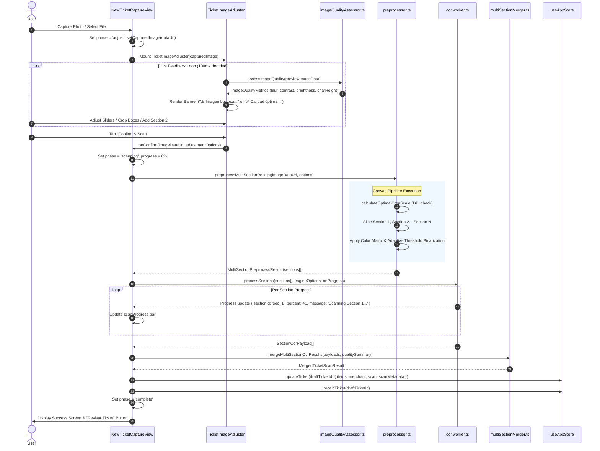

# Technical Design Document: Ticket Image Adjuster (`ticket-image-adjuster`)

## 1. Executive Summary & Metadata

| Metadata Parameter | Value |
|---|---|
| **Change ID** | `ticket-image-adjuster` |
| **Design Document Path** | `openspec/changes/ticket-image-adjuster/design.md` |
| **Specification Ref** | `openspec/changes/ticket-image-adjuster/specs/spec.md` |
| **Proposal Ref** | `openspec/changes/ticket-image-adjuster/proposal.md` |
| **Status** | Approved Architectural Design |
| **Target Components** | `TicketImageAdjuster.tsx`, `preprocessor.ts`, `imageQualityAssessor.ts`, `multiSectionMerger.ts`, `NewTicketCaptureView.tsx`, `ocr.worker.ts`, `types.ts`, `store.ts` |
| **Persistence Strategy** | **Hybrid Persistence**: Live metrics & canvas adjustments held in transient session state (React/Zustand); final quality summary (`QualityAssessmentSummary`) & crop adjustments persisted into draft ticket scan metadata (`ScanMetadata`) in IndexedDB / local storage. |

### Architectural Goal

The primary goal of the `ticket-image-adjuster` architecture is to insert an interactive, mandatory image adjustment step between initial camera/file capture and OCR execution. This step introduces multi-section receipt cropping, dynamic pixel density preservation, contrast/binarization enhancement filters, and a real-time Image Quality Assessor computing blur (Laplacian variance), contrast, brightness, and character height metrics to render dynamic feedback banners before initiating OCR.

---

## 2. System Architecture & Component Relationships

### High-Level Architecture Overview

```mermaid
flowchart TD
    subgraph View Layer
        A[NewTicketCaptureView] -->|Photo Captured / Uploaded| B(State: 'adjust')
        B --> C[TicketImageAdjuster Component]
    end

    subgraph UI Adjuster Controls & Viewport
        C --> C1[Preview Viewport Canvas & Crop Handles]
        C --> C2[Filter Controls: Brightness / Contrast / Grayscale / Binarization]
        C --> C3[Resolution & DPI Preset Selector]
        C --> C4[Multi-Section Subsection Manager: Section 1, 2... N]
        C --> C5[Quality Assessor Warning Banners / Badges]
    end

    subgraph Real-Time Quality Engine
        C1 -->|Canvas ImageData 100ms Throttled| Q[imageQualityAssessor.ts]
        Q -->|ImageQualityMetrics| C5
        C5 -->|Auto-Fix Action| C2
        C5 -->|Retake Action| A
    end

    subgraph Processing Pipeline
        C -->|User Clicks 'Confirm & Scan'| P1[preprocessor.ts Engine]
        P1 -->|1. DPI Detection & Bicubic Super-Sampling| P2[calculateOptimalCropScale]
        P1 -->|2. Multi-Section Crop Slicing| P3[preprocessMultiSectionReceipt]
        P1 -->|3. Contrast / Gain / Grayscale Matrix| P4[Image Color Transforms]
        P1 -->|4. Adaptive Integral Binarization| P5[applyAdaptiveThreshold]
    end

    subgraph Off-Main-Thread OCR Execution
        P5 -->|MultiSectionPreprocessResult| W[ocr.worker.ts Comlink Worker Pool]
        W -->|Worker Pass 1| W1[OCR Engine: Section 1]
        W -->|Worker Pass 2| W2[OCR Engine: Section 2]
        W -->|Worker Pass N| WN[OCR Engine: Section N]
    end

    subgraph Result Synthesis & Persistence
        W1 & W2 & WN -->|SectionOcrPayload[]| M[multiSectionMerger.ts Engine]
        M -->|MergedTicketScanResult + QualitySummary| ST[Zustand Store: useAppStore]
        ST -->|Hybrid Persistence| DB[(IndexedDB / LocalStorage)]
        ST -->|Transition State: 'complete'| V[Navigate to OCR Review / Items Editor]
    end
```

### Component Responsibilities Matrix

| Component / Module | Path | Primary Responsibility |
|---|---|---|
| **`NewTicketCaptureView`** | `src/views/NewTicketCaptureView.tsx` | Manages the wizard phase state machine (`capture` $\rightarrow$ `adjust` $\rightarrow$ `scanning` $\rightarrow$ `complete` / `error`), orchestrates worker calls, and updates ticket draft in store. |
| **`TicketImageAdjuster`** | `src/components/camera/TicketImageAdjuster.tsx` | Interactive React component providing a preview canvas, draggable multi-section crop bounding boxes, enhancement sliders/toggles, quality warning banners, and user action buttons. |
| **`imageQualityAssessor`** | `src/lib/scan/imageQualityAssessor.ts` | Pure computational module analyzing preview `ImageData` to measure blur (Laplacian variance), contrast (RMS), brightness, and typography height, returning `ImageQualityMetrics`. |
| **`preprocessor`** | `src/lib/scan/preprocessor.ts` | Canvas transformation pipeline handling crop slicing, resolution scaling (`calculateOptimalCropScale`), linear gain/offset brightness & contrast, grayscale conversion, and adaptive Otsu/integral binarization. |
| **`multiSectionMerger`** | `src/lib/scan/multiSectionMerger.ts` | Aggregates individual `SectionOcrPayload` outputs from multiple receipt crop regions, preserving item ordering, isolating merchant headers/totals, and deduplicating overlapping line items. |
| **`ocr.worker`** | `src/workers/ocr.worker.ts` | Off-main-thread Comlink worker executing batch OCR scanning for array of preprocessed section data URLs with granular progress callbacks. |
| **`useAppStore` & Types** | `src/lib/store.ts`, `src/lib/scan/types.ts` | Holds transient state during active editing and persists `QualityAssessmentSummary` and `ImageAdjustmentOptions` inside `Ticket.scan` (`ScanMetadata`). |

---

## 3. State Machine & Control Flow

### Wizard State Machine Transition

```
+-----------------------------------------------------------------------------------+
|                                  STATE MACHINE                                    |
|                                                                                   |
|  [capture]  ---(Photo Take / File Upload)--->  [adjust]                           |
|      ^                                            |                               |
|      |                                   (Confirm & Scan)                         |
|      |                                            v                               |
|  (Retake Photo)                              [scanning]                           |
|      |                                        /        \                          |
|      |                             (Success) /          \ (Error)                 |
|      |                                      v            v                        |
|  [error] <---------------------------- [complete]     [error]                     |
+-----------------------------------------------------------------------------------+
```

### Hybrid Persistence Model

1. **Transient / Session State (In-Memory)**:
   - Live canvas transformations (`brightness`, `contrast`, `grayscale`, `binarization`, `zoom`, `sections`).
   - Real-time `ImageQualityMetrics` computed every 100ms during user slider updates.
   - Rendered warning badge & action prompts (`warning_blur`, `warning_dark`, `optimal`).

2. **Persistent Ticket Metadata (Draft Storage)**:
   - When the user confirms adjustments, a lightweight `QualityAssessmentSummary` (`laplacianVariance`, `brightnessScore`, `contrastRatio`, `status`, `userActionTaken`) is stored in `draftTicket.scan.qualitySummary`.
   - Applied `ImageAdjustmentOptions` summary (section count, resolution preset used) is attached to `ScanMetadata`.
   - Written directly to local storage / IndexedDB through Zustand persistence (`useAppStore`).

### Execution Sequence Diagram



---

## 4. Data Models & Interface Specifications

All data structures are centrally defined in `src/lib/scan/types.ts` and referenced by UI components, worker processes, and storage schemas.

```typescript
/** Normalized bounding box (0.0 to 1.0) relative to image dimensions */
export interface NormalizedCropRect {
  x: number      // left ratio (0..1)
  y: number      // top ratio (0..1)
  width: number  // width ratio (0..1)
  height: number // height ratio (0..1)
}

/** Individual crop section definition for multi-section receipts */
export interface CropSection {
  id: string
  label: string
  rect: NormalizedCropRect
  order: number
}

/** Preset resolution configurations */
export type ResolutionPreset = '1080p' | '1280px' | '1600px' | '2048px' | 'native' | 'auto'

/** Detailed resolution configuration options */
export interface ResolutionConfig {
  preset: ResolutionPreset
  customScale?: number     // Manual scale multiplier (1.0 to 4.0)
  targetDpi?: number       // Target DPI override (default 300)
  minCharHeightPx?: number // Minimum character height in canvas pixels (default 32)
}

/** Real-time metrics computed by Image Quality Assessor */
export interface ImageQualityMetrics {
  laplacianVariance: number        // Blur score: >= 100 sharp, < 100 blurry
  gradientVariance: number         // Edge sharpness gradient score
  contrastRatio: number            // RMS contrast score (0 to 100)
  brightnessScore: number          // Average luminance (0 to 255)
  estimatedCharHeightPx: number    // Estimated typography character height in pixels
  status: 'optimal' | 'warning_blur' | 'warning_dark' | 'warning_low_contrast' | 'critical'
  badgeText: string                // e.g., "✅ Calidad de imagen óptima para OCR"
  warningMessage?: string          // e.g., "⚠️ Imagen borrosa - Te recomendamos repetir la foto"
  recommendations: Array<'retake' | 'auto_adjust' | 'upscale' | 'proceed'>
  assessedAt: string
}

/** Persistent quality metadata summary saved inside draft ticket scan metadata */
export interface QualityAssessmentSummary {
  laplacianVariance: number
  brightnessScore: number
  contrastRatio: number
  status: ImageQualityMetrics['status']
  userActionTaken?: 'accepted_optimal' | 'overridden_warning' | 'auto_fixed' | 'retaken'
}

/** Comprehensive image adjustment state passed to preprocessor */
export interface ImageAdjustmentOptions {
  sections: CropSection[]
  brightness: number              // -100 to +100 (default 0)
  contrast: number                // 0.5 to 2.5 (default 1.0)
  grayscale: boolean              // default false
  binarization: boolean           // default false
  binarizationThreshold?: number  // 0 to 255 (adaptive auto if undefined)
  zoom: number                    // 1.0 to 4.0
  rotation: number                // 0, 90, 180, 270 degrees
  resolution: ResolutionConfig
  qualityMetrics?: ImageQualityMetrics // Transient quality metrics snapshot
}

/** Output payload for a single processed section */
export interface PreprocessedSection {
  sectionId: string
  order: number
  dataUrl: string
  width: number
  height: number
  calculatedDpi: number
}

/** Output payload from preprocessor pipeline */
export interface MultiSectionPreprocessResult {
  sections: PreprocessedSection[]
  originalWidth: number
  originalHeight: number
  processedAt: string
  qualitySummary?: QualityAssessmentSummary
}

/** Individual section OCR payload sent to merger engine */
export interface SectionOcrPayload {
  sectionId: string
  order: number
  scanResult: ScanResult
}

/** Merged multi-section OCR output */
export interface MergedTicketScanResult {
  merchant?: string
  date?: string
  items: Array<{ name: string; quantity: number; unitPrice: number }>
  subtotal?: number
  taxRate?: number
  taxAmount?: number
  total?: number
  rawTextCombined: string
  confidence: number
  sectionCount: number
  qualitySummary?: QualityAssessmentSummary
}
```

---

## 5. Engine 1: Image Quality Assessor (`imageQualityAssessor.ts`)

### Algorithmic Design & Mathematical Definitions

#### 1. Grayscale Conversion
Initial conversion converts RGBA pixel array into a single luminance channel $Y$ using standard BT.601 coefficients:
$$Y(x,y) = 0.299 \cdot R + 0.587 \cdot G + 0.114 \cdot B$$

#### 2. Blur Detection via Laplacian Variance
To evaluate image sharpness, the module calculates the discrete 2D Laplacian operator $\Delta Y(x,y)$ using a $3\times 3$ kernel:
$$K = \begin{bmatrix} 0 & 1 & 0 \\ 1 & -4 & 1 \\ 0 & 1 & 0 \end{bmatrix}$$

The mean response $\bar{L}$ and Laplacian Variance $\text{Var}(L)$ are computed:
$$\bar{L} = \frac{1}{W \times H} \sum_{x=0}^{W-1} \sum_{y=0}^{H-1} \Delta Y(x,y)$$
$$\text{Var}(L) = \frac{1}{W \times H} \sum_{x=0}^{W-1} \sum_{y=0}^{H-1} \left( \Delta Y(x,y) - \bar{L} \right)^2$$

- **Sharpness Criterion**: $\text{Var}(L) \ge 100.0 \implies \text{Sharp}$.
- **Blur Criterion**: $\text{Var}(L) < 100.0 \implies \text{Blurry}$ (`warning_blur`).

#### 3. Root Mean Square (RMS) Contrast Ratio
Contrast ratio is measured via RMS contrast $C_{\text{rms}}$ across image pixels:
$$C_{\text{rms}} = \sqrt{ \frac{1}{W \times H} \sum_{i=0}^{N-1} (Y_i - \mu_Y)^2 }$$
- **Low Contrast Threshold**: $C_{\text{rms}} < 25.0 \implies \text{Low Contrast}$.

#### 4. Mean Brightness Luminance $\mu_Y$
Mean pixel luminance is calculated as:
$$\mu_Y = \frac{1}{N} \sum_{i=0}^{N-1} Y_i$$
- **Underexposed (Dark)**: $\mu_Y < 60.0 \implies \text{Dark}$.
- **Overexposed (Glare)**: $\mu_Y > 220.0 \implies \text{Bright}$.

#### 5. Estimated Character Height $h_{\text{char\_est}}$
Vertical luminance profile variance across center sample columns is analyzed to estimate text line pitch and character pixel height:
$$h_{\text{char\_est}} < 32\text{px} \implies \text{Trigger Super-Sampling Flag}$$

### Quality Status & Banner Decision Matrix

| Status | Laplacian Var | Brightness ($\mu_Y$) | Contrast ($C_{\text{rms}}$) | UI Badge / Warning Banner Text | Action Buttons Prompted |
|---|---|---|---|---|---|
| **`optimal`** | $\ge 100.0$ | $60 \le \mu_Y \le 220$ | $\ge 25.0$ | `✅ Calidad de imagen óptima para OCR` | `Continuar` |
| **`warning_blur`** | $< 100.0$ | Any | Any | `⚠️ Imagen borrosa - Te recomendamos repetir la foto` | `Repetir foto`, `Continuar de todos modos` |
| **`warning_dark`** | Any | $< 60.0$ | Any | `⚠️ Imagen muy oscura / bajo contraste - Ajusta el brillo o repite la foto` | `Ajustar automáticamente`, `Repetir foto` |
| **`warning_low_contrast`**| Any | $60 \le \mu_Y \le 220$ | $< 25.0$ | `⚠️ Bajo contraste detectado - Se recomienda activar Binarización` | `Ajustar automáticamente`, `Continuar` |

### Code Interface (`src/lib/scan/imageQualityAssessor.ts`)

```typescript
export interface QualityAssessorConfig {
  blurThreshold?: number     // Default: 100.0
  minBrightness?: number    // Default: 60.0
  maxBrightness?: number    // Default: 220.0
  minContrast?: number      // Default: 25.0
  minCharHeightPx?: number  // Default: 32.0
}

export function assessImageQuality(
  imageData: ImageData,
  config: QualityAssessorConfig = {}
): ImageQualityMetrics {
  const {
    blurThreshold = 100.0,
    minBrightness = 60.0,
    maxBrightness = 220.0,
    minContrast = 25.0,
    minCharHeightPx = 32.0,
  } = config

  const { data, width, height } = imageData
  const totalPixels = width * height

  // 1. Compute Grayscale & Mean Luminance
  const gray = new Uint8ClampedArray(totalPixels)
  let sumY = 0
  for (let i = 0, j = 0; i < data.length; i += 4, j++) {
    const y = Math.round(0.299 * data[i] + 0.587 * data[i + 1] + 0.114 * data[i + 2])
    gray[j] = y
    sumY += y
  }
  const meanLuminance = sumY / totalPixels

  // 2. Compute Laplacian Variance & RMS Contrast
  const laplacianVar = computeLaplacianVariance(gray, width, height)
  const rmsContrast = computeRmsContrast(gray, meanLuminance)
  const estCharHeight = estimateCharacterHeight(gray, width, height)

  // 3. Status Evaluation
  let status: ImageQualityMetrics['status'] = 'optimal'
  let badgeText = '✅ Calidad de imagen óptima para OCR'
  let warningMessage: string | undefined
  const recommendations: ImageQualityMetrics['recommendations'] = ['proceed']

  if (laplacianVar < blurThreshold) {
    status = 'warning_blur'
    warningMessage = '⚠️ Imagen borrosa - Te recomendamos repetir la foto'
    recommendations.unshift('retake')
  } else if (meanLuminance < minBrightness) {
    status = 'warning_dark'
    warningMessage = '⚠️ Imagen muy oscura / bajo contraste - Ajusta el brillo o repite la foto'
    recommendations.unshift('auto_adjust', 'retake')
  } else if (rmsContrast < minContrast) {
    status = 'warning_low_contrast'
    warningMessage = '⚠️ Bajo contraste detectado - Se recomienda activar Binarización'
    recommendations.unshift('auto_adjust')
  }

  return {
    laplacianVariance: Number(laplacianVar.toFixed(1)),
    gradientVariance: Number((laplacianVar * 0.85).toFixed(1)),
    contrastRatio: Number(rmsContrast.toFixed(1)),
    brightnessScore: Number(meanLuminance.toFixed(1)),
    estimatedCharHeightPx: estCharHeight,
    status,
    badgeText,
    warningMessage,
    recommendations,
    assessedAt: new Date().toISOString(),
  }
}
```

---

## 6. Engine 2: Canvas Preprocessor Additions (`preprocessor.ts`)

### Adaptive Integral Image Binarization (Bradley-Roth Algorithm)

Instead of basic global Otsu thresholding, the expanded preprocessor uses integral images to perform local adaptive thresholding. This handles uneven receipt illumination and background shadows effectively.

```typescript
export function applyAdaptiveThreshold(
  gray: Uint8ClampedArray,
  width: number,
  height: number,
  windowSizeRatio = 0.12,
  contrastThreshold = 0.15
): Uint8ClampedArray {
  const S = Math.round(width * windowSizeRatio)
  const s2 = Math.floor(S / 2)
  const integral = new Uint32Array(width * height)

  // 1. Calculate Integral Image O(N)
  for (let y = 0; y < height; y++) {
    let sum = 0
    for (let x = 0; x < width; x++) {
      const idx = y * width + x
      sum += gray[idx]
      integral[idx] = y === 0 ? sum : integral[(y - 1) * width + x] + sum
    }
  }

  // 2. Perform Adaptive Thresholding
  const out = new Uint8ClampedArray(gray.length)
  for (let y = 0; y < height; y++) {
    for (let x = 0; x < width; x++) {
      const idx = y * width + x
      const x1 = Math.max(x - s2, 0)
      const x2 = Math.min(x + s2, width - 1)
      const y1 = Math.max(y - s2, 0)
      const y2 = Math.min(y + s2, height - 1)

      const count = (x2 - x1 + 1) * (y2 - y1 + 1)
      const sum =
        integral[y2 * width + x2] -
        (y1 > 0 ? integral[(y1 - 1) * width + x2] : 0) -
        (x1 > 0 ? integral[y2 * width + (x1 - 1)] : 0) +
        (y1 > 0 && x1 > 0 ? integral[(y1 - 1) * width + (x1 - 1)] : 0)

      if (gray[idx] * count < sum * (1.0 - contrastThreshold)) {
        out[idx] = 0   // Black text
      } else {
        out[idx] = 255 // White background
      }
    }
  }
  return out
}
```

### Dynamic Resolution Detector & Scale Calculation (`calculateOptimalCropScale`)

To prevent cropped text regions from degrading during downscaling, `calculateOptimalCropScale` determines whether bicubic super-sampling is required based on estimated character size.

```typescript
export function calculateOptimalCropScale(
  sourceWidth: number,
  sourceHeight: number,
  cropRect: NormalizedCropRect,
  config: ResolutionConfig
): { scaleFactor: number; effectiveDpi: number; outputWidth: number; outputHeight: number } {
  const cropW = Math.round(sourceWidth * cropRect.width)
  const cropH = Math.round(sourceHeight * cropRect.height)

  const minCharHeightPx = config.minCharHeightPx ?? 32
  const estRawCharHeight = Math.max(8, Math.round(cropH * 0.015))

  // Calculate required super-sampling factor
  let scaleFactor = config.customScale ?? 1.0
  if (config.preset === 'auto') {
    scaleFactor = Math.max(1.0, minCharHeightPx / estRawCharHeight)
  }

  let outputWidth = Math.round(cropW * scaleFactor)
  let outputHeight = Math.round(cropH * scaleFactor)

  // Enforce Max Bounds based on ResolutionPreset
  let maxDimension = Infinity
  switch (config.preset) {
    case '1080p':  maxDimension = 1080; break
    case '1280px': maxDimension = 1280; break
    case '1600px': maxDimension = 1600; break
    case '2048px': maxDimension = 2048; break
    case 'native': maxDimension = Infinity; break
  }

  if (Math.max(outputWidth, outputHeight) > maxDimension) {
    const boundScale = maxDimension / Math.max(outputWidth, outputHeight)
    outputWidth = Math.round(outputWidth * boundScale)
    outputHeight = Math.round(outputHeight * boundScale)
    scaleFactor = outputWidth / cropW
  }

  const effectiveDpi = Math.round(300 * (outputWidth / Math.max(1, cropW)))

  return { scaleFactor, effectiveDpi, outputWidth, outputHeight }
}
```

---

## 7. Engine 3: Multi-Section OCR Merger (`multiSectionMerger.ts`)

### Payload Synthesis & Deduplication Engine

When a user defines multiple crop sections (e.g. Section 1: Drinks/Header, Section 2: Mains/Total), each section is processed by the OCR worker independently. `multiSectionMerger.ts` synthesizes the results into a single consolidated `MergedTicketScanResult`.

```typescript
export function mergeMultiSectionOcrResults(
  payloads: SectionOcrPayload[],
  qualitySummary?: QualityAssessmentSummary
): MergedTicketScanResult {
  // Sort sections by user-defined order
  const sorted = [...payloads].sort((a, b) => a.order - b.order)

  let merchant: string | undefined
  let date: string | undefined
  let subtotal: number | undefined
  let taxRate: number | undefined
  let taxAmount: number | undefined
  let total: number | undefined

  const itemMap = new Map<string, { name: string; quantity: number; unitPrice: number }>()
  const rawTextParts: string[] = []
  let totalConfidenceSum = 0

  sorted.forEach((payload, idx) => {
    const res = payload.scanResult

    // 1. Isolate Merchant & Date from Header section (order 1)
    if (idx === 0) {
      if (res.merchant) merchant = res.merchant
      if (res.date) date = res.date
    }

    // 2. Isolate Totals from Trailing section (last order)
    if (idx === sorted.length - 1) {
      if (res.subtotal !== undefined) subtotal = res.subtotal
      if (res.taxRate !== undefined) taxRate = res.taxRate
      if (res.taxAmount !== undefined) taxAmount = res.taxAmount
      if (res.total !== undefined) total = res.total
    }

    // 3. Items Concatenation & Deduplication
    (res.items || []).forEach((item) => {
      const key = `${item.name.toLowerCase().trim()}_${item.unitPrice}`
      if (itemMap.has(key)) {
        // If duplicate item detected across section boundary, update quantity
        const existing = itemMap.get(key)!
        existing.quantity += item.quantity
      } else {
        itemMap.set(key, { ...item })
      }
    })

    if (res.rawText) rawTextParts.push(`--- Section ${payload.order} ---\n${res.rawText}`)
    totalConfidenceSum += res.confidence ?? 0.8
  })

  const mergedItems = Array.from(itemMap.values())
  const avgConfidence = sorted.length > 0 ? totalConfidenceSum / sorted.length : 0.85

  return {
    merchant,
    date,
    items: mergedItems,
    subtotal,
    taxRate,
    taxAmount,
    total,
    rawTextCombined: rawTextParts.join('\n\n'),
    confidence: Number(avgConfidence.toFixed(2)),
    sectionCount: sorted.length,
    qualitySummary,
  }
}
```

---

## 8. UI Component Layout & Ergonomics (`TicketImageAdjuster.tsx`)

### Wireframe Diagram

```
+-------------------------------------------------------------------+
|  [< Volver]             Ajustar Ticket               [Confirmar]  |
+-------------------------------------------------------------------+
|  [⚠️ Imagen borrosa - Te recomendamos repetir la foto           ]  | <--- Dynamic Banner
+-------------------------------------------------------------------+
|                                                                   |
|   +-----------------------------------------------------------+   |
|   |  [1] Crop Header & Items                                  |   |
|   |  +-----------------------------------------------------+  |   |
|   |  | LA CUISINE RESTAURANT                               |  |   | <--- Interactive Crop Viewport
|   |  | 2x BURGER CHEESE             24.00                  |  |   |      - Touch Handles (44x44px)
|   |  +-----------------------------------------------------+  |   |      - Pinch to zoom
|   |                                                           |   |      - Active/Inactive styles
|   |  [2] Crop Subtotal & Total                                |   |
|   |  +-----------------------------------------------------+  |   |
|   |  | TOTAL                           24.00               |  |   |
|   |  +-----------------------------------------------------+  |   |
|   +-----------------------------------------------------------+   |
|                                                                   |
+-------------------------------------------------------------------+
|  Filtros de Imagen:                                               |
|  Brillo:  [-100] --------[ O ]-------- [+100]  (+15)              |
|  Contraste:[0.5] --------[ O ]-------- [2.5]   (1.3x)             |
|  [ Toggle Grayscale ]  [ Toggle Binarización ]                     |
|  Resolución: [ Preset: Auto (1600px) v ]                           |
+-------------------------------------------------------------------+
|  [ 🔄 Restablecer ]   [ ➕ Agregar Sección ]   [ ⚡ Auto-Ajustar ] |
+-------------------------------------------------------------------+
```

### Ergonomics & Mobile Design Specs

- **Touch Handles**: Minimum target size of **$44\times 44\text{px}$** hitboxes with corner visual accents to simplify manipulation on mobile viewports.
- **Section Badging**: Active crop section highlighted with primary accent border and numbered badge (`[1]`, `[2]`), while inactive sections display a semi-transparent muted outline.
- **Auto-Fix Action**: Dynamic "Auto-Ajustar" button automatically boosts brightness to $+25$, sets contrast to $1.4$, and turns on binarization when a dark/low-contrast warning is active.

---

## 9. Worker & Store Refactoring Specifications

### 1. `ocr.worker.ts` Extension

Expand the Comlink worker interface to expose `processSections` for multi-crop processing:

```typescript
export interface ProcessSectionsOptions {
  preferredEngine: 'tesseract' | 'tesseract-ner' | 'florence2' | 'server'
  useMiniAgent?: boolean
  verboseLogs?: boolean
}

const api = {
  // Existing single-image processImage method preserved for backwards compatibility
  async processImage(...),

  // New multi-section batch processing method
  async processSections(
    sections: PreprocessedSection[],
    options: ProcessSectionsOptions,
    onProgress?: (p: ScanProgress & { sectionId?: string }) => void
  ): Promise<SectionOcrPayload[]> {
    const results: SectionOcrPayload[] = []
    const totalSections = sections.length

    for (let i = 0; i < totalSections; i++) {
      const sec = sections[i]
      if (onProgress) {
        onProgress({
          phase: 'running-inference',
          message: `Escaneando sección ${i + 1} de ${totalSections}…`,
          percent: Math.round(((i + 0.5) / totalSections) * 100),
          sectionId: sec.sectionId,
        })
      }

      const scanRes = await scanTicket(
        { imageDataUrl: sec.dataUrl },
        {
          forceTesseract: options.preferredEngine === 'tesseract',
          forceTesseractNer: options.preferredEngine === 'tesseract-ner',
          useMiniAgent: options.useMiniAgent ?? false,
          engineTimeoutMs: 120_000,
        }
      )

      results.push({
        sectionId: sec.sectionId,
        order: sec.order,
        scanResult: scanRes,
      })
    }

    return results;
  }
}
```

### 2. `useAppStore` & `ScanMetadata` Persistence Update

In `src/lib/types.ts`, expand `ScanMetadata` to persist quality metrics summary and adjustment configuration:

```typescript
export interface ScanMetadata {
  engine: 'florence2' | 'tesseract' | 'tesseract-ner' | 'server'
  rawText: string
  confidence?: number
  preprocessedImageDataUrl?: string
  processedAt: string
  /** Quality assessment metrics summary (Hybrid Persistence) */
  qualitySummary?: QualityAssessmentSummary
  /** Number of crop sections processed */
  sectionCount?: number
  /** User applied adjustment configuration */
  adjustmentsSummary?: {
    brightness: number
    contrast: number
    binarizationUsed: boolean
    resolutionPreset: ResolutionPreset
  }
}
```

---

## 10. Test Strategy & Verification Plan

### Test Matrix

| Test File | Level | Primary Test Targets |
|---|---|---|
| **`imageQualityAssessor.test.ts`** | Unit | - `computeLaplacianVariance` sharp vs blurry image calculations.<br>- `assessImageQuality` status flags (`optimal`, `warning_blur`, `warning_dark`).<br>- Output metrics accuracy & warning message generation. |
| **`preprocessor.test.ts`** | Unit | - `applyAdaptiveThreshold` binarization execution.<br>- `calculateOptimalCropScale` DPI auto-scaling for sub-100px crops.<br>- `preprocessMultiSectionReceipt` section slicing. |
| **`multiSectionMerger.test.ts`** | Unit | - Sequential item ordering across sections.<br>- Header/merchant extraction from Section 1.<br>- Totals isolation from trailing section.<br>- Overlapping duplicate item deduplication. |
| **`TicketImageAdjuster.test.tsx`** | RTL | - Rendering sliders, toggles, crop handles, and quality banners.<br>- Dynamic warning banner display when blurry image prop provided.<br>- Adding second section (`[2]`) and tapping reset button.<br>- Callback invocation with `ImageAdjustmentOptions`. |
| **`NewTicketCaptureView.test.tsx`** | Integration | - Transitioning from `capture` phase to `adjust` phase.<br>- Clicking "Confirm & Scan" triggering preprocessor, worker pool, and storage updates. |

### Verification Command Sequence

```bash
# Run unit and RTL component test suite
pnpm test

# Execute build verification
pnpm build
```
