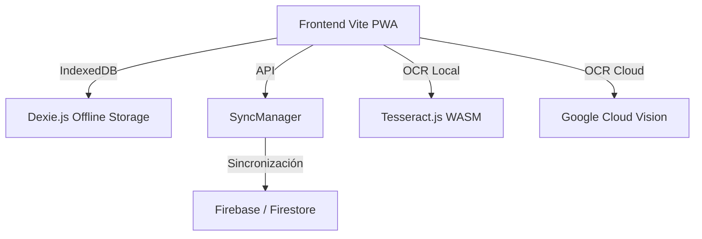
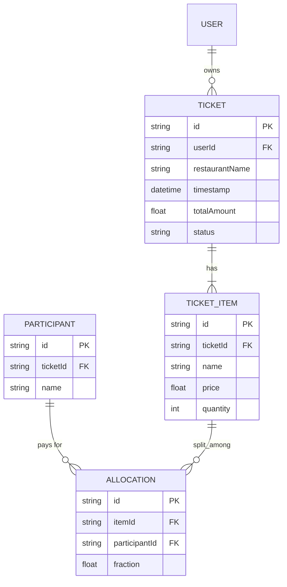

## Índice

0. [Ficha del proyecto](#0-ficha-del-proyecto)
1. [Descripción general del producto](#1-descripción-general-del-producto)
2. [Arquitectura del sistema](#2-arquitectura-del-sistema)
3. [Modelo de datos](#3-modelo-de-datos)
4. [Especificación de la API](#4-especificación-de-la-api)
5. [Historias de usuario](#5-historias-de-usuario)
6. [Tickets de trabajo](#6-tickets-de-trabajo)
7. [Pull requests](#7-pull-requests)

---

## 0. Ficha del proyecto

### **0.1. Tu nombre completo:**

(Desarrollador)

### **0.2. Nombre del proyecto:**

SplitEat

### **0.3. Descripción breve del proyecto:**

SplitEat es una aplicación web para la digitalización de tickets de restaurantes y el reparto equitativo de cuentas, con soporte offline (IndexedDB), sincronización en la nube (Firebase/Firestore) y lectura OCR.

### **0.4. URL del proyecto:**

> Puede ser pública o privada, en cuyo caso deberás compartir los accesos de manera segura. Puedes enviarlos a [alvaro@lidr.co](mailto:alvaro@lidr.co) usando algún servicio como [onetimesecret](https://onetimesecret.com/).

### 0.5. URL o archivo comprimido del repositorio

[Repositorio Local]

### **0.6. URLs de despliegue (verificación del trabajo realizado)**

Despliegues de producción generados automáticamente mediante GitHub Actions desde la rama `feature/feature-entrega2-ADLC` (frontend Vite PWA):

| Plataforma | URL de producción |
| --- | --- |
| **Netlify** | [https://spliteat-cuadra.netlify.app](https://spliteat-cuadra.netlify.app) |
| **Vercel** | [https://spliteat-bytelovers-projects.vercel.app](https://spliteat-bytelovers-projects.vercel.app) |

---

## 1. Descripción general del producto

### **1.1. Objetivo:**

Facilitar el reparto equitativo de los gastos en restaurantes, permitiendo a los usuarios escanear los tickets físicos, asignar cada ítem a personas o familias, y visualizar los totales individuales de forma rápida y sencilla, incluso sin conexión a internet.

### **1.2. Características y funcionalidades principales:**

- **Escaneo OCR Híbrido**: Procesamiento local mediante Tesseract.js (WASM) en modo offline, con fallback a Google Cloud Vision en la nube cuando hay red.
- **Sincronización Offline-First**: Almacenamiento local mediante IndexedDB (vía Dexie.js) con sincronización transparente a la nube a través de Firebase/Firestore.
- **Reparto avanzado**: Asignación de ítems por individuos, soporte para propinas, redondeo y dinámicas de gamificación ("quién paga la ronda").
- **Exportación**: Generación de informes de saldos para compartir en formato PDF o por mensajería.

### **1.3. Diseño y experiencia de usuario:**

Aplicación diseñada con foco en la movilidad (PWA), desarrollada en Vite. Cuenta con flujos claros paso a paso: Subida/Captura de imagen -> Revisión de Ítems detectados por el OCR -> Asignación de participantes a cada producto -> Visualización de resúmenes.

### **1.4. Instrucciones de instalación:**

1. Clonar el repositorio.
2. Ejecutar `npm install` para instalar dependencias.
3. Configurar variables de entorno basándose en `.env.example`, incluyendo las credenciales de Firebase en `VITE_FIREBASE_*`.
4. Ejecutar el entorno de desarrollo mediante `npm run dev`.
5. Compilar a producción mediante `npm run build`.

---

## 2. Arquitectura del Sistema

### **2.1. Diagrama de arquitectura:**

La arquitectura **Offline-First** elegida usa IndexedDB para la persistencia de datos inmediata. Dado que la app se utilizará en interiores de restaurantes donde la conexión móvil suele fallar, esta arquitectura garantiza que la aplicación no bloquee al usuario. Firebase Firestore se usa como backend cloud para respaldar la información de forma segura.

### **2.2. Descripción de componentes principales:**

- **Frontend App**: PWA construida con Vite, gestionando la interacción.
- **SyncManager**: Servicio de sincronización en segundo plano encargado de coordinar datos entre Dexie.js (local) y Firestore (remoto).
- **Módulo OCR**: Módulo adaptativo que selecciona el motor Tesseract o Cloud Vision según el contexto y red.

### **2.3. Descripción de alto nivel del proyecto y estructura de ficheros**

- `/frontend`: Código fuente de la aplicación PWA (Vite, UI, componentes, lógica de presentación).
- `/backend`: Funciones serverless, servicios de la nube, sincronización remota y lógica de negocio.
- `/db`: Scripts de configuración local (IndexedDB), reglas de Firestore y esquemas de datos.
- `/docs/user-stories`: Documentación ágil de la fase de producto con Historias de Usuario y Tareas Técnicas integradas.

### **2.4. Infraestructura y despliegue**

El despliegue está planificado para **Firebase Hosting**, integrando CI/CD básico con GitHub Actions para el build y deploy del empaquetado final generado por Vite.

### **2.5. Seguridad**

- **Reglas de Seguridad de Firestore**: Definidas en `firestore.rules`. El acceso se filtra por UID, garantizando que un usuario (autenticado anónimamente o por email) sólo lea/escriba sus propios tickets (ej. `request.auth.uid == resource.data.uid`).
- **Variables de Entorno**: Secretos del cliente excluidos del control de versiones.

### **2.6. Tests**

- Pruebas unitarias de las utilidades matemáticas de reparto y redondeo (asegurar que las sumas coincidan con el subtotal).
- Test de lógica del SyncManager.

---

## 3. Modelo de Datos

### **3.1. Diagrama del modelo de datos:**

### **3.2. Descripción de entidades principales:**

- **Ticket**: Documento maestro del gasto. Contiene metadatos (restaurante, fecha, monto total validado).
- **Ticket_Item**: Elemento extraído por el OCR (ej. "Refresco"). Tiene precio y cantidad.
- **Participant**: Cada comensal en la mesa.
- **Allocation**: Entidad pivote que representa qué porcentaje de un ítem paga determinado participante.

---

## 4. Especificación de la API

La aplicación al ser BaaS interactúa directamente mediante Firebase Client SDK.
Una función Serverless (Firebase Cloud Functions) se expone para el procesamiento OCR de alta fidelidad:

- **`processOcr` (Callable Function)**
  - Request: `{ base64Image: string }`
  - Response: `{ items: [{ name: string, price: number, qty: number }] }`

---

## 5. Historias de Usuario

**Historia de Usuario 1 (US-01): Captura de Ticket**
Como comensal, quiero tomar una foto del ticket de la cena para que la aplicación extraiga automáticamente los conceptos y precios sin tener que teclearlos.

**Historia de Usuario 2 (US-02): Soporte Offline**
Como comensal en un local con mala cobertura, quiero poder hacer el reparto y guardar el ticket localmente para que se sincronice en la nube cuando recupere la conexión.

**Historia de Usuario 3 (US-03): Asignación Fraccionada**
Como comensal, quiero asignar un mismo plato a varias personas indicando que lo hemos compartido, para que el sistema divida su coste automáticamente de manera equitativa.

---

## 6. Tickets de Trabajo

**Ticket 1 (Frontend): TSK-1.1 - Interfaz de captura de imagen**
Crear vista en Vite/React que habilite el uso de la cámara nativa vía MediaDevices API o subida de archivo. Debe incluir compresión y previsualización.

**Ticket 2 (Base de Datos): TSK-3.7 - Reglas de seguridad de Firestore**
Desarrollar y probar `firestore.rules` limitando operaciones (read/write) en la colección `tickets` a `auth != null && auth.uid == resource.data.uid`.

**Ticket 3 (Backend): TSK-2.1 - Implementación del SyncManager**
Configurar `Dexie.js` y acoplar observadores a la colección local. Detectar eventos `online/offline` del navegador y ejecutar rutinas de subida a Firestore de las entradas marcadas como pendientes de sincronización.

---

## 7. Pull Requests

> Documenta 3 de las Pull Requests realizadas durante la ejecución del proyecto

**Pull Request 1**

**Pull Request 2**

**Pull Request 3**
