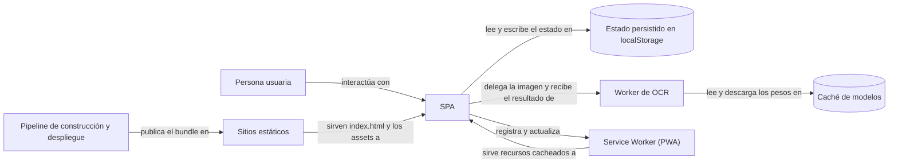
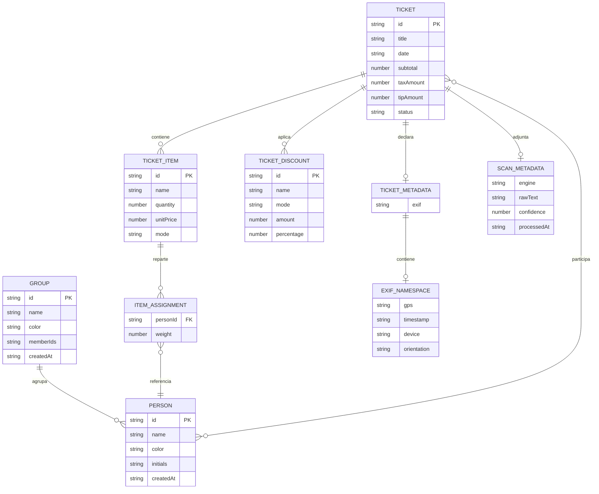

# SplitEat

## Índice

0. [Ficha del proyecto](#0-ficha-del-proyecto)
1. [Descripción general del producto](#1-descripción-general-del-producto)
2. [Arquitectura del sistema](#2-arquitectura-del-sistema)
3. [Modelo de datos](#3-modelo-de-datos)
4. [Especificación de la API](#4-especificación-de-la-api)
5. [Historias de usuario](#5-historias-de-usuario)
6. [Tickets de trabajo](#6-tickets-de-trabajo)
7. [Pull requests](#7-pull-requests)
8. [Cómo verificar este documento](#8-cómo-verificar-este-documento)
9. [Referencias](#9-referencias)

---

## 0. Ficha del proyecto

### **0.1. Tu nombre completo:**

(Desarrollador)

### **0.2. Nombre del proyecto:**

SplitEat

### **0.3. Descripción breve del proyecto:**

SplitEat es una PWA de cliente: digitaliza tickets de restaurante y reparte la cuenta. El OCR se
ejecuta en el dispositivo y los datos se guardan en el navegador. No hay backend, ni cuentas de
usuario, ni servicio de nube.

### **0.4. URL del proyecto:**

El repositorio remoto es `bytelovers/AI4Devs-finalproject`, según `git remote -v`. Puede ser
público o privado; si el acceso no es público, las credenciales se comparten de manera segura.
Puedes enviarlas a [alvaro@lidr.co](mailto:alvaro@lidr.co) usando un servicio como
[onetimesecret](https://onetimesecret.com/).

### **0.5. URL o archivo comprimido del repositorio:**

Repositorio en GitHub: `bytelovers/AI4Devs-finalproject`. La rama de integración es
`feature/feature-entrega2-ADLC`; la entrega vigente está etiquetada como `v0.2.0`.

### **0.6. URLs de despliegue (verificación del trabajo realizado)**

El bundle estático se publica en dos destinos desde el mismo repositorio, mediante los flujos de
GitHub Actions `deploy-netlify.yml` y `deploy-vercel.yml`. Ambas URL se midieron el 2026-09-22.

| Plataforma | URL de producción | Respuesta observada | Fecha de medición |
| :--- | :--- | :--- | :--- |
| **Netlify** | [https://spliteat-cuadra.netlify.app](https://spliteat-cuadra.netlify.app) | HTTP 200 | 2026-09-22 |
| **Vercel** | [https://spliteat-bytelovers-projects.vercel.app](https://spliteat-bytelovers-projects.vercel.app) | HTTP 200 | 2026-09-22 |

Una respuesta 200 prueba que la URL responde, no que el contenido desplegado sea correcto: no
verifica la versión publicada, ni el comportamiento del OCR, ni el reparto. La medición reproducible
y su comando están en [docs/traceability/evidence.md](/docs/traceability/evidence.md), que es la
fuente canónica de esta evidencia.

### **0.7. Límites de este documento:**

| Límite | Qué implica |
| :--- | :--- |
| El frontmatter se declara en YAML | GitHub lo renderiza como una tabla al principio de la página. Es el precio de cumplir el esquema obligatorio del estándar en la puerta de entrada del repositorio, y se asume de forma explícita y revisable |
| Este archivo no es fuente canónica de ningún hecho | Enlaza las fuentes en cada apartado. El índice del conjunto es [docs/README.md](/docs/README.md); el estado de cada documento vive en su propio frontmatter |
| El estado se declara con el vocabulario cerrado del estándar | `entregado`, `parcial`, `latente`, `descartado`, `planificado` y `mixto` son los únicos términos admitidos; las definiciones están en [docs/DOC-STANDARD.md](/docs/DOC-STANDARD.md) |
| Las rutas se citan de dos formas | Enlace Markdown relativo a la raíz con barra inicial, como `[docs/README.md](/docs/README.md)`; ruta de código en texto sin barra inicial, como `frontend/src/lib/store.ts` |
| El alcance de este documento | La entrega del MVP. El alcance que se planificó y se descartó no se reescribe aquí: su registro histórico está en [docs/data/scope-evolution.md](/docs/data/scope-evolution.md) |

---

## 1. Descripción general del producto

### **1.1. Objetivo:**

Facilitar el reparto equitativo de los gastos en restaurantes: la persona fotografía el ticket, la
aplicación extrae las líneas, cada comensal o familia recibe las suyas y el total individual se ve
al instante. El producto funciona sin conexión porque todo el cálculo y toda la persistencia
ocurren en el dispositivo, y funciona sin registro porque solo hay un dispositivo implicado.

### **1.2. Características y funcionalidades principales:**

| Característica | Qué entrega el producto | Fuente canónica |
| :--- | :--- | :--- |
| Escaneo OCR en el dispositivo | Tesseract.js sobre WebAssembly y el modelo Florence-2 con `@huggingface/transformers` (WebGPU o WASM de reserva), dentro de un worker aislado con Comlink. No hay servicio de OCR remoto | [docs/architecture/overview.md](/docs/architecture/overview.md) |
| Edición manual y revisión | Corrección de las líneas detectadas y alta manual cuando el OCR no basta | [docs/product/backlog.md](/docs/product/backlog.md) |
| Persistencia local | Zustand con el middleware `persist` sobre `localStorage`, con la clave `spliteat-app-v1`; el historial completo vive en el navegador | [docs/data/local-model.md](/docs/data/local-model.md) |
| Reparto y cuadre | Asignación por persona, pesos por línea, propina y verificación de que la suma de las partes coincide con el total del ticket | [docs/architecture/overview.md](/docs/architecture/overview.md) |
| Alertas de descuadre | Detección de líneas sin asignar y de diferencias de cuadre antes de cerrar el ticket | [docs/product/backlog.md](/docs/product/backlog.md) |
| Dictado al camarero | Vista de resumen para leer los totales en voz alta | [docs/product/backlog.md](/docs/product/backlog.md) |
| Copia de seguridad | Exportación e importación del historial completo en JSON, con validación estructural al importar | [docs/data/local-model.md](/docs/data/local-model.md) |
| Tema visual | Selector de tema Sage & Amber | [docs/product/backlog.md](/docs/product/backlog.md) |

### **1.3. Diseño y experiencia de usuario:**

La aplicación está diseñada como PWA con prioridad móvil y de uso sin conexión, y sigue un flujo
lineal: captura de la imagen, revisión de las líneas detectadas, selección de participantes,
asignación de cada línea y resumen del reparto.

| Hecho | Valor |
| :--- | :--- |
| Capa de estilo | Tailwind CSS v4, a través del plugin `@tailwindcss/vite` |
| Primitivas de interfaz | 47 componentes de estilo shadcn sobre 27 paquetes `@radix-ui/*`, más el auxiliar `cn()` de `clsx` y `tailwind-merge` |
| Animación y transiciones | `framer-motion`, con la clave de transición tomada de la ruta actual |
| Enrutado | `react-router-dom` v7 con `createBrowserRouter`, en `frontend/src/main.tsx` |
| Internacionalización | La interfaz está en español; no hay capa de traducción |

### **1.4. Instrucciones de instalación:**

La aplicación vive completa en `frontend/` y no necesita configuración previa: no hay credenciales
que rellenar ni variables de entorno que declarar. El gestor de paquetes es `pnpm`, como indica el
lockfile `frontend/pnpm-lock.yaml`; la versión mínima de Node es 22.13, según el campo `engines` de
`frontend/package.json`.

| Paso | Comando | Qué hace |
| :--- | :--- | :--- |
| 1 | `git clone git@github.com:bytelovers/AI4Devs-finalproject.git` | Descarga el repositorio |
| 2 | `cd frontend` | Entra en el directorio de la aplicación |
| 3 | `pnpm install` | Instala las dependencias declaradas en `frontend/package.json` |
| 4 | `pnpm dev` | Levanta el servidor de desarrollo de Vite |
| 5 | `pnpm build` | Ejecuta `tsc -b && vite build` y deja el bundle en `frontend/dist` |
| 6 | `pnpm test` | Ejecuta `vitest run` |
| 7 | `pnpm lint` | Ejecuta `eslint . --report-unused-disable-directives --max-warnings 0` |

La configuración de la aplicación es el propio código: no existe un archivo de ejemplo de variables
de entorno ni lectura de variables en el cliente.

---

## 2. Arquitectura del Sistema

### **2.1. Diagrama de arquitectura:**

Vista de contenedores del sistema entregado. Los siete contenedores viven en el dispositivo salvo
los dos de servicio estático, y sus nodos y relaciones son los mismos que los de
[docs/architecture/overview.md](/docs/architecture/overview.md).



<!-- mermaid-companion: readme-contenedores-entregados -->

| Nodo | Descripción |
| :--- | :--- |
| `Persona usuaria` | Quien fotografía el ticket y reparte la cuenta |
| `SPA` | Aplicación React 18 con TypeScript, empaquetada por Vite |
| `Estado persistido en localStorage` | Estado de la aplicación serializado en JSON bajo la clave `spliteat-app-v1` |
| `Worker de OCR` | Web Worker con preprocesado, motores de OCR, NER y parseo |
| `Caché de modelos` | Cache Storage donde se guardan los pesos ONNX ya descargados |
| `Service Worker (PWA)` | Respuesta desde caché cuando no hay red |
| `Sitios estáticos` | Netlify y Vercel sirviendo el mismo bundle estático |
| `Pipeline de construcción y despliegue` | Flujos de GitHub Actions que ejecutan lint, build, test, despliegue y release |

| Origen | Relación | Destino |
| :--- | :--- | :--- |
| `Persona usuaria` | interactúa con | `SPA` |
| `SPA` | lee y escribe el estado en | `Estado persistido en localStorage` |
| `SPA` | delega la imagen y recibe el resultado de | `Worker de OCR` |
| `Worker de OCR` | lee y descarga los pesos en | `Caché de modelos` |
| `SPA` | registra y actualiza | `Service Worker (PWA)` |
| `Service Worker (PWA)` | sirve recursos cacheados a | `SPA` |
| `Pipeline de construcción y despliegue` | publica el bundle en | `Sitios estáticos` |
| `Sitios estáticos` | sirven `index.html` y los assets a | `SPA` |

La arquitectura se explica con una sola decisión de fondo: el MVP se cerró como aplicación 100 %
local, sin cuenta de usuario y sin nube. Esa decisión elimina el backend y arrastra las demás: la
persistencia pasa al navegador, el OCR se ejecuta en un worker y el reparto se resuelve en funciones
puras. Los contenedores que el documento anterior declaraba y que no existen están registrados,
con su motivo, como alcance descartado en [docs/data/scope-evolution.md](/docs/data/scope-evolution.md),
que es su fuente canónica.

### **2.2. Descripción de componentes principales:**

| Componente | Responsabilidad | Ubicación |
| :--- | :--- | :--- |
| `Router` | Resuelve la URL y monta la vista correspondiente, incluido el asistente de ticket nuevo en rutas anidadas | `frontend/src/main.tsx` |
| `AppShell` | Envoltura de las vistas con la navegación inferior y las transiciones | `frontend/src/components/layout/AppShell.tsx` |
| `Vistas` | Pantallas del producto: inicio, tickets, asistente de captura, contactos, grupos, detalle de ticket y ajustes | `frontend/src/views/` |
| `Estado global` | Fuente única del estado, con `persist` hacia `localStorage` y normalización de formas heredadas | `frontend/src/lib/store.ts` |
| `Capa de dominio` | Cálculo de importes, reparto por persona y verificación del cuadre | `frontend/src/lib/calc.ts` |
| `Worker de OCR` | Encadena preprocesado, motor y parseo, y decide el motor dentro del dispositivo | `frontend/src/workers/ocr.worker.ts`, `frontend/src/lib/scan/` |
| `Service Worker` | Precarga el shell y responde a las navegaciones desde caché sin red | `frontend/public/sw.js` |

El detalle de los componentes del worker y del algoritmo de reparto está en
[docs/architecture/overview.md](/docs/architecture/overview.md), que es la fuente canónica de la
vista de contenedores y de componentes.

### **2.3. Descripción de alto nivel del proyecto y estructura de ficheros**

| Ruta | Qué contiene |
| :--- | :--- |
| `frontend/` | La aplicación completa: React 18, TypeScript y Vite |
| `frontend/src/components/` | Componentes de interfaz, cámara, escaneo y ticket |
| `frontend/src/views/` | Pantallas del producto y vistas del asistente de ticket |
| `frontend/src/lib/` | Estado global, tipos, capa de dominio y pipeline de OCR |
| `frontend/src/workers/` | El worker de OCR |
| `frontend/public/` | `sw.js`, `manifest.webmanifest`, `offline.html` e `icon.svg` |
| `backend/` | Carpeta vestigial: solo `.keep` y una nota de ubicación. Nunca contuvo código |
| `db/` | Carpeta vestigial: solo `.keep` y una nota de ubicación. Nunca contuvo código |
| `docs/` | Documentación por dominios; la puerta de entrada es [docs/README.md](/docs/README.md) |
| `openspec/` | Artefactos de cambio del proceso de desarrollo; queda fuera del conjunto documental |
| `odd/` | Seguimiento de las tareas del proyecto |

Las tres carpetas de código y las dos de proceso están descritas en el documento de entrega; las
dos vestigiales se conservan solo como registro de la capa que se planificó y no se construyó.

### **2.4. Infraestructura y despliegue**

El despliegue es estático en dos plataformas y se dispara desde GitHub Actions. No hay
infraestructura de servidor ni despliegue de backend porque no hay backend.

| Flujo | Disparador | Qué hace |
| :--- | :--- | :--- |
| `ci.yml` | push y pull request a la rama de integración | lint, build con typecheck y test sobre `frontend/` |
| `deploy-netlify.yml` | push con cambios en `frontend/**` o ejecución manual | construye y despliega en Netlify desde `frontend/dist` |
| `deploy-vercel.yml` | push con cambios en `frontend/**` o ejecución manual | construye y despliega en Vercel |
| `release-staging.yml` | push a `release/**` o ejecución manual | prueba y publica la release de staging |
| `release.yml` | etiquetas `v*` o ejecución manual | crea la release de GitHub |

Las URL publicadas y su medición están en el apartado 0.6; el inventario de flujos y el modelo de
ramas son canónicos en
[docs/process/delivery-and-branching.md](/docs/process/delivery-and-branching.md).

### **2.5. Seguridad**

La superficie de seguridad del producto es pequeña por construcción: no hay servidor, no hay
cuentas y no hay secretos en el cliente. Lo que sí existe se declara en la tabla siguiente.

| Área | Estado real | Evidencia |
| :--- | :--- | :--- |
| Autenticación y autorización | Sin capa alguna: no hay registro, ni sesión, ni roles que comprobar | `frontend/src/lib/types.ts` describe el perfil local como marca de cuenta local, sin credenciales |
| Aislamiento de los datos | Los datos permanecen en el perfil del navegador del dispositivo; no se transmiten a ningún servidor | `frontend/src/lib/store.ts` escribe en `localStorage` |
| Secretos y credenciales | Ninguno: no hay variables de entorno ni archivo de ejemplo que las declare | `grep -rnE 'VITE_[A-Z_]+' frontend/src` → 0 resultados; `grep -rn 'import\.meta\.env' frontend/src` → 0 resultados |
| Reglas de servidor | Ninguna: no hay servidor que las aplique y no existe archivo de reglas en el repositorio | `test -f firestore.rules` → no existe |
| Consumos de red salientes | Exactamente dos, ambos para descargar activos que luego se usan en el dispositivo: los pesos ONNX y los activos de Tesseract.js | [docs/integrations/contracts.md](/docs/integrations/contracts.md) |
| Riesgo principal | Cualquier script servido por el mismo origen puede leer la clave `spliteat-app-v1`; un XSS en el bundle alcanzaría todo el historial local | `frontend/src/lib/store.ts` |
| Mitigación entregada | Copia de seguridad en JSON para restaurar tras un borrado o un desalojo del almacenamiento | [docs/data/local-model.md](/docs/data/local-model.md) |

No se declaran controles que no existan: no hay cabeceras de seguridad gestionadas por el
repositorio, ni cifrado del almacén local, ni auditoría de accesos, porque ninguna de las tres
piezas tiene dónde aplicarse en un producto de cliente.

### **2.6. Tests**

| Hecho | Valor |
| :--- | :--- |
| Runner | `vitest`, invocado con `pnpm test` |
| Archivos de prueba | 23 (`find frontend/src -name '*.test.*'`) |
| Qué cubren | El cálculo del reparto y el cuadre, la persistencia y la normalización del estado heredado, los hooks de tema y cámara, la importación de la copia de seguridad y el selector de motor de OCR |
| Qué no cubren | No hay pruebas de extremo a extremo ni de accesibilidad, y ninguna prueba ejercita una capa de sincronización, que no existe |

La estrategia de pruebas, su alcance y lo que queda fuera son canónicos en
[docs/quality/testing-strategy.md](/docs/quality/testing-strategy.md).

---

## 3. Modelo de Datos

### **3.1. Diagrama del modelo de datos:**

Las entidades persistidas son las que declara [docs/data/local-model.md](/docs/data/local-model.md),
que es la fuente canónica del esquema. El estado completo se guarda como una sola instantánea JSON
bajo la clave `spliteat-app-v1`, no como una entrada por entidad ni como una base de datos
relacional.



<!-- mermaid-companion: readme-modelo-de-datos-entregado -->

| Entidad | Campos en el producto | Qué guarda |
| :--- | :--- | :--- |
| `Person` | `id`, `name`, `color`, `initials`, `createdAt` | Contacto del dispositivo |
| `Group` | `id`, `name`, `color`, `memberIds`, `createdAt` | Grupo de personas, con sus miembros por identificador |
| `Ticket` | `id`, `title`, `date`, `merchant`, `image`, `items`, `discounts`, `subtotal`, `taxRate`, `taxAmount`, `taxMode`, `tipMode`, `tipAmount`, `taxDistribution`, `tipDistribution`, `participantIds`, `paidBy`, `status`, `createdAt`, `updatedAt`, `metadata`, `scan` | Ticket completo, con sus líneas, descuentos, impuestos y propina |
| `TicketItem` | `id`, `name`, `quantity`, `unitPrice`, `mode`, `assignments` | Línea del ticket y el reparto de esa línea |
| `ItemAssignment` | `personId`, `weight` | Peso relativo de una persona dentro de una línea |
| `TicketDiscount` | `id`, `name`, `mode`, `amount`, `percentage` | Descuento del ticket, por importe o por porcentaje |
| `TicketMetadata` | `exif` | Metadatos declarados del ticket; ningún camino de código los escribe |
| `ExifNamespace` | `gps`, `timestamp`, `device`, `orientation` | Metadatos de la imagen dentro de `TicketMetadata` |
| `ScanMetadata` | `engine`, `rawText`, `confidence`, `preprocessedImageDataUrl`, `processedAt`, `qualitySummary`, `sectionCount`, `adjustmentsSummary` | Resultado del escaneo que se adjunta al ticket |

| Origen | Relación | Destino |
| :--- | :--- | :--- |
| `GROUP` | agrupa a | `PERSON` |
| `TICKET` | contiene | `TICKET_ITEM` |
| `TICKET` | aplica | `TICKET_DISCOUNT` |
| `TICKET_ITEM` | reparte entre | `ITEM_ASSIGNMENT` |
| `ITEM_ASSIGNMENT` | referencia por `personId` a | `PERSON` |
| `TICKET` | referencia por `participantIds` a | `PERSON` |
| `TICKET` | declara | `TICKET_METADATA` |
| `TICKET_METADATA` | contiene | `EXIF_NAMESPACE` |
| `TICKET` | adjunta | `SCAN_METADATA` |

### **3.2. Descripción de entidades principales:**

El modelo entregado no tiene una entidad de persona usuaria separada: quien usa la aplicación es el
mismo comensal al que se asigna la línea, y su identidad se declara en el dispositivo. Tampoco hay
una entidad de reparto independiente: el reparto vive dentro de cada línea, en `ItemAssignment`,
como el peso de cada persona y no como un porcentaje almacenado aparte.

| Hecho | Valor |
| :--- | :--- |
| Motor de almacenamiento | `localStorage` del navegador |
| Clave de la base de datos | `spliteat-app-v1` |
| Granularidad | Una sola entrada con la instantánea completa del estado |
| Índices y transacciones | Ninguno; las búsquedas y los filtros recorren los arrays en memoria |
| Alcance | Un solo dispositivo: sin cuentas y sin sincronización entre dispositivos |
| Detalle canónico | [docs/data/local-model.md](/docs/data/local-model.md) |

---

## 4. Especificación de la API

El producto no expone ninguna API de servidor: no hay endpoints, ni REST ni de función invocable, y
este apartado no describe ninguno. Lo que sí existe son dos contratos internos y dos consumos de red
salientes.

| Contrato | Interfaz real | Dónde vive |
| :--- | :--- | :--- |
| API de servidor | Ninguna. No hay endpoints ni cliente HTTP en el frontend | [docs/integrations/contracts.md](/docs/integrations/contracts.md) |
| Contrato interno del OCR | El worker expone `processImage` y `processSections` a través de Comlink; la entrada es la imagen y la salida son líneas estructuradas | `frontend/src/workers/ocr.worker.ts` |
| Contrato de persistencia | Una sola clave de `localStorage` con el sobre JSON del estado completo | [docs/data/local-model.md](/docs/data/local-model.md) |
| Consumo de red: pesos ONNX | Descarga bajo demanda de los pesos del modelo desde HuggingFace Hub; la primera ejecución necesita red y las siguientes usan la caché | [docs/integrations/contracts.md](/docs/integrations/contracts.md) |
| Consumo de red: activos de Tesseract.js | Descarga del núcleo WASM y de los datos de idioma desde el CDN de la librería | [docs/integrations/contracts.md](/docs/integrations/contracts.md) |

La afirmación anterior de este archivo sobre un servicio de OCR en la nube invocado desde el
cliente no describe ningún servicio vigente; su resolución canónica, con las dos descripciones
incompatibles que se habían escrito, está en
[docs/integrations/contracts.md](/docs/integrations/contracts.md).

---

## 5. Historias de Usuario

Los títulos y los identificadores son los del registro canónico, cuyo propietario es
[docs/product/backlog.md](/docs/product/backlog.md). Este archivo no reproduce ese registro
—prioridad, complejidad, estado ni narración—: cita tres historias del MVP y enlaza su detalle
funcional, que vive en [docs/product/user-stories/](/docs/product/user-stories/).

| id | Título canónico | Qué resuelve |
| :--- | :--- | :--- |
| `US-01` | Escaneo OCR inteligente de tickets | Extrae las líneas del ticket desde una fotografía, sin teclearlas |
| `US-02` | Edición manual y OCR fallback | Permite corregir a mano lo que el OCR no reconoce bien |
| `US-03` | Asignación unitaria visual | Asigna cada línea a una persona en una mesa de reparto |

El detalle funcional de cada historia y de sus tareas técnicas está en los archivos del directorio
de historias; este documento no lo duplica para que no vuelva a divergir.

---

## 6. Tickets de Trabajo

El espacio de nombres `TSK-x.y` pertenece a [docs/product/backlog.md](/docs/product/backlog.md).
Los tres ejemplos siguientes son tickets del registro, con su título canónico, y sirven de muestra
del nivel de detalle que vive en los archivos de tarea.

| id | Título canónico | Detalle canónico |
| :--- | :--- | :--- |
| `TSK-1.1` | Inicialización del proyecto, entorno de tests y tokens CSS | [docs/product/user-stories/epic-1-core/TSK-1.1.md](/docs/product/user-stories/epic-1-core/TSK-1.1.md) |
| `TSK-1.3` | Servicio de OCR offline (Tesseract.js local WASM) | [docs/product/user-stories/epic-1-core/TSK-1.3.md](/docs/product/user-stories/epic-1-core/TSK-1.3.md) |
| `TSK-2.1` | Cuadre del reparto (plan: ajuste de céntimos; entregado: pesos y verificación) | [docs/product/user-stories/epic-2-advanced/TSK-2.1.md](/docs/product/user-stories/epic-2-advanced/TSK-2.1.md) |

Dos precisiones que este archivo debe a la corrección de sus propias afirmaciones anteriores:

| Identificador | Qué designa | Qué no designa |
| :--- | :--- | :--- |
| `TSK-2.1` | El cuadre del reparto: los pesos por persona y la verificación de que la suma coincide con el total | No designa una capa de sincronización: el producto no tiene ninguna |
| `TSK-1.1` | La inicialización del proyecto, su entorno de pruebas y los tokens CSS | No designa una vista de captura de imagen, que es otra tarea |

---

## 7. Pull Requests

Tres pull requests reales del historial de integración. La evidencia es el commit de merge de cada
uno, que es verificable con `git log --merges`.

| Pull request | Rama de origen | Commit de merge | Fecha | Qué entregó |
| :--- | :--- | :--- | :--- | :--- |
| #4 | `feature/entrega2/ocr-pipeline-rewrite` | `f6acd8c` | 2026-07-12 | El pipeline de OCR completo: Tesseract, NER, Florence-2 y el parser de tickets |
| #11 | `refactor/routing` | `3994bec` | 2026-07-25 | El enrutado por URL con `react-router-dom` v7, con las rutas anidadas del asistente, y las correcciones de la revisión adversarial |
| #33 | `release/v0.2.0` | `98aa781` | 2026-09-04 | La promoción de la release `v0.2.0` a la rama de integración |

El ciclo de trabajo, sus puertas de aprobación y la revisión adversarial de cada cambio están
documentados en [docs/process/ai-workflow.md](/docs/process/ai-workflow.md).

---

## 8. Cómo verificar este documento

Checklist ejecutable desde la raíz del repositorio. Comprueba la coherencia del archivo con el
código, no la corrección funcional del producto.

- [ ] Frontmatter completo:

```bash
for k in doc_id title domain audience status source_of_truth_for last_verified verified_against; do
  grep -q "^$k:" readme.md && echo "OK: $k" || echo "FALLO: $k"
done
```

- [ ] Estado dentro del vocabulario cerrado del estándar:

```bash
grep -qE '^status: (entregado|parcial|latente|descartado|planificado|mixto)$' readme.md \
  && echo "OK: status" || echo "FALLO: status"
```

- [ ] El H1 repite el campo `title`:

```bash
grep -n '^# ' readme.md
```

- [ ] Cada diagrama tiene su acompañamiento textual:

```bash
m=$(grep -c '^```mermaid' readme.md); c=$(grep -c '^<!-- mermaid-companion' readme.md)
[ "$m" = "$c" ] && echo "OK: $m/$c" || echo "FALLO: $m diagramas / $c acompañamientos"
```

- [ ] Los ocho nodos del diagrama de arquitectura aparecen en su acompañamiento:

```bash
for n in "Persona usuaria" SPA "Estado persistido en localStorage" "Worker de OCR" "Caché de modelos" "Service Worker (PWA)" "Sitios estáticos" "Pipeline de construcción y despliegue"; do
  grep -qF "\`$n\`" readme.md && echo "OK: $n" || echo "FALLO: $n"
done
```

- [ ] Las nueve entidades del diagrama de datos aparecen en su acompañamiento:

```bash
for n in Person Group Ticket TicketItem ItemAssignment TicketDiscount TicketMetadata ExifNamespace ScanMetadata; do
  grep -qF "| \`$n\` |" readme.md && echo "OK: $n" || echo "FALLO: $n"
done
```

- [ ] El índice de documentación es alcanzable desde este archivo:

```bash
grep -c '](/docs/README.md)' readme.md
```

- [ ] Los títulos de historia y de tarea coinciden con el backlog canónico:

```bash
grep -n 'Edición manual y OCR fallback' readme.md
grep -n 'Cuadre del reparto (plan: ajuste de céntimos; entregado: pesos y verificación)' readme.md
```

- [ ] No queda ninguna afirmación de nube ni de almacén de datos alternativo presentada como
  vigente: el cuerpo anterior al checklist no menciona ninguno.

```bash
awk '/^## 8\. Cómo verificar/{exit} {print}' readme.md \
  | grep -niE 'firebase|firestore|dexie|indexeddb|vanilla|hosting' | grep -vE 'test -f'
```

→ sin salida.

- [ ] Los archivos de configuración que nunca existieron no se presentan como existentes, y su
  única mención en el cuerpo declara su ausencia.

```bash
test -f firestore.rules || echo "OK: firestore.rules no existe"
test -f .env.example || echo "OK: .env.example no existe"
test -f frontend/.env.example || echo "OK: frontend/.env.example no existe"
awk '/^## 8\. Cómo verificar/{exit} {print}' readme.md \
  | grep -nE 'firestore\.rules|\.env\.example' | grep -c ''
```

→ tres líneas `OK` y `1`: la fila de `2.5` que declara que el archivo de reglas no existe.

- [ ] No hay expresiones ambiguas ni enlaces que suban directorios:

```bash
grep -rniE 'previsto|se usará|está definido|planificado para|se implementará|\[Pending\]|\bReady\b' readme.md | grep -viE '«|»|`'
grep -n '](\.\./' readme.md
```

## 9. Referencias

- [docs/README.md](/docs/README.md) — índice maestro de la documentación: puerta de entrada por dominios, estado de cada documento y alcance del producto
- [docs/DOC-STANDARD.md](/docs/DOC-STANDARD.md) — estándar de escritura dual: frontmatter, vocabulario de estado, acompañamiento de diagramas y convención de rutas
- [docs/architecture/overview.md](/docs/architecture/overview.md) — arquitectura del sistema entregado, con las vistas de contexto, contenedores, componentes y la cadena de construcción
- [docs/architecture/stack.md](/docs/architecture/stack.md) — stack entregado y motivo de cada elección tecnológica
- [docs/data/local-model.md](/docs/data/local-model.md) — fuente canónica del esquema persistido y de los límites de la base de datos del cliente
- [docs/data/scope-evolution.md](/docs/data/scope-evolution.md) — registro histórico del alcance de datos planificado y descartado
- [docs/product/backlog.md](/docs/product/backlog.md) — registro canónico de epics, identificadores `US-xx` y `TSK-x.y`, prioridad y estado
- [docs/product/prd.md](/docs/product/prd.md) — funciones del producto y supuestos de negocio
- [docs/integrations/contracts.md](/docs/integrations/contracts.md) — fuente canónica de los dos consumos de red y de la ausencia de API de servidor
- [docs/quality/testing-strategy.md](/docs/quality/testing-strategy.md) — runner, suite real y alcance de las pruebas
- [docs/process/delivery-and-branching.md](/docs/process/delivery-and-branching.md) — modelo de ramas y flujos de GitHub Actions
- [docs/traceability/evidence.md](/docs/traceability/evidence.md) — medición reproducible del despliegue
- [docs/process/ai-workflow.md](/docs/process/ai-workflow.md) — ciclo de trabajo asistido por IA y revisión adversarial de cada cambio
- `AGENTS.md` — registro de skills del repositorio
